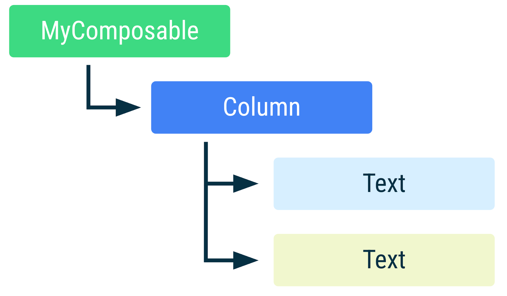
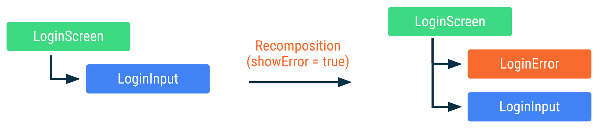
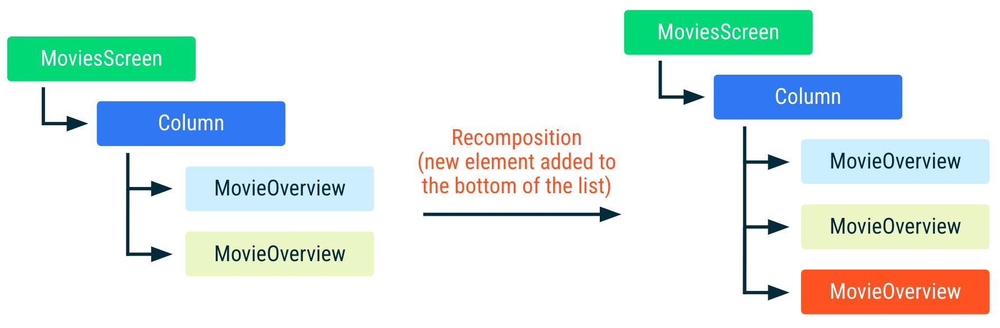
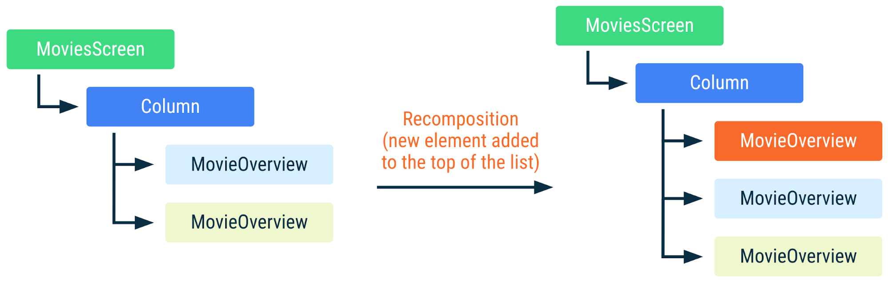

# Composable 생명주기

---

## 개요

Composition은 composable들을 실행하여 생성되며, 앱의 UI를 설명합니다. 또한, Composable들의 트리 구조 입니다.

### Composition

Compose가 [initial Composition](../용어.md#초기-컴포지션initial-composition)을 실행하는 동안, UI를 그리기 위해 호출한 composable들을 Composition에
저장합니다.   
그런 다음 App의 상태가 변경되면, Compose는 ReComposition(이하 재구성)을 실행합니다.

Composition은 오직 `initial Composition`에 의해 생성되고 재구성에 의해 업데이트될 수 있습니다.  
Composition을 수정하는 유일한 방법은 재구성을 통한 것입니다.

### 재구성 (ReComposition)

재구성이란, Compose가 상태 변경에 반응할 수 있도록 상태가 변경된 composable들을 다시 실행하고, 변경 사항을 반영하기 위해 Composition을 업데이트하는 과정입니다.

재구성은 일반적으로 **`State<T>` 객체의 변경에 의해 트리거**됩니다.  
Compose는 `State<T>`를 추적하고, 해당 `State<T>`를 읽는 Composition 내부 중 건너뛸 수 없는 모든 상위 및 하위 Composable들을 재구성합니다.

### Composable 생명주기 단계


| 단계              | 설명                                                                                                                                                                                           |
|-----------------|----------------------------------------------------------------------------------------------------------------------------------------------------------------------------------------------|
| Composition 진입  | - Composable이 Composition에 처음 추가될 때 시작됩니다. </br>- Composable이 Composition에 진입하면 Compose는 이 Composable의 구성을 기억하고 상태 변화를 추적합니다.                                                                |
| N회 재구성          | - 앱의 상태가 변하면, Compose는 이러한 변경 사항에 응답할 수 있도록 관련된 Composable을 재구성합니다.</br> - 이 단계에서는 Composable이 계속해서 실행되고 상태 변화를 반영하도록 업데이트됩니다.</br> - 재구성은 0번 이상 발생할 수 있으며, 이는 앱 상태가 얼마나 자주 변경되는지에 따라 달라집니다. |
| Composition 떠나기 | - Composable이 Composition 트리에서 제거되면, 그 생명주기는 끝나게 됩니다. </br> - 이 단계에서는 Composable이 더 이상 실행되지 않으며, Composition에서 제거됩니다.                                                                        |

다시 말해, Composable의 생명주기는 Composition에 진입하여 시작되고, 상태 변화에 따라 재구성되며, 최종적으로 Composition에서 제거되면서 종료됩니다.

> Composable의 생명주기는 `View`, `Activity`, `Fragment`의 생명주기보다 간단합니다.  
> Composable이 더 복잡한 생명주기를 가진 외부 리소스를 관리하거나 상호작용해야 하는 경우, `effects`를 사용해야 합니다.

만약 Composable이 여러 번 호출된다면, Composition에는 여러 인스턴스가 배치됩니다.
각 호출은 Composition에서 자체적인 생명주기를 가집니다.

```kotlin
@Composable
fun MyComposable() {
    Column {
        Text("Hello")
        Text("World")
    }
}
```



위 코드는 `MyComposable`이 Composition에서 어떻게 표현되는지를 보여줍니다.  
위처럼 서로 다른 텍스트를 가진 Composable들은 별개의 인스턴스입니다.


---

## Composition 내부의 Composable 구조

### Composition 내의 Composable 인스턴스 식별

Composable 인스턴스는 호출 위치(Call Site)에 의해 식별됩니다.  
동일한 Composable이지만 다른 위치에서 호출되면 Composition 내에서는 다른 인스턴스로 간주됩니다.

호출 위치는 Composable이 Composition 내에서 어디에 위치할지, 그리고 결국 UI 트리가 어떻게 형성될지에 큰 영향을 미칩니다.

### 재구성과 인스턴스 식별 관리

Compose는 Composable 함수의 실행을 추적하고, Composable 함수가 어떤 다른 Composable 함수를 호출하는지를 기록합니다.  
상태 변화로 인한 재구성이 발생하면, Compose는 이전 Composition과 비교해 어떤 Composable이 추가/제거/변경되었는지 파악합니다.  
이전 Composition과 동일하게 호출된 Composable은 입력값이 변하지 않았다면 재구성을 피하게 됩니다. 이를 통해 불필요한 함수 실행을 최소화하고 성능을 향상시킵니다.

### Side-Effect 관리

Composable 인스턴스의 `Identity(식별성)`유지는 `Side-Effect`를 관리하는데 중요합니다.  
`Identity`가 유지되면 각 인스턴스는 자신의 `Side-Effect`를 올바르게 관리하고 추적할 수 있습니다.   
이로 인해 상태 변경에도 `Side-Effect` 작업이 중단되거나 재시작되는 것을 방지하고, 성공적으로 완료될 수 있게 됩니다.

아래 예를 보시죠.

```kotlin
@Composable
fun LoginScreen(showError: Boolean) {
    if (showError) {
        LoginError()
    }
    LoginInput() // 이 호출 위치는 LoginInput이 Composition 내에서 배치되는 위치에 영향을 미칩니다
}

@Composable
fun LoginInput() { /* ... */
}

@Composable
fun LoginError() { /* ... */
}
```

위의 코드에서, `LoginScreen`은 조건문을 통해 `LoginError`를 호출하고 항상 `LoginInput`을 호출합니다.   
각 호출은 **고유한 호출 위치와 소스 위치**를 가지며, **컴파일러는 이것을 통해 고유하게 식별**합니다.



상태가 변경되고 재구성이 발생할 때 Composition 내의 `LoginScreen`의 표현입니다. (같은 색상은 재구성되지 않았음을 의미합니다.)

위 그림을 보면 비록 `LoginInput`이 처음 호출된 위치에서 두 번째로 호출된 위치로 변경되었지만,  
`LoginInput`은 재구성을 거쳐도 입력 매개변수가 변경되지 않았기 때문에, `LoginInput`에 대한 호출은 Compose에 의해 건너뛰어집니다.  
즉, `LoginInput` 인스턴스는 재구성을 거쳐도 유지됩니다.

## 효율적인 재구성을 위한 참고정보 추가

### Composable 인스턴스의 구분
Composable 함수를 여러 번 호출하면 해당 Composable의 인스턴스가 여러 개 Composition에 추가됩니다.   
같은 위치에서 Composable 함수를 여러 번 호출하는 경우, Compose는 각각의 Composable 호출을 식별할 수 있는 충분한 정보를 가지지 못합니다.
이 때문에 호출 위치 외에도 실행 순서를 사용하여 각 인스턴스를 구분합니다.

아래 코드를 보죠.

```kotlin
@Composable
fun MoviesScreen(movies: List<Movie>) {
    Column {
        for (movie in movies) {
            // MovieOverview Composable은 for 루프 내의
            // index 위치에 따라 Composition에 배치됩니다
            MovieOverview(movie)
        }
    }
}
```

위 코드에서, Compose는 호출 위치 외에도 실행 순서를 사용하여 Composition에서 인스턴스를 구분합니다.  
새로운 `movie`가 리스트의 하단에 추가되면, Compose는 그들의 호출 위치가 변경되지 않았다는걸 알고 있고,  
이에따라 그 인스턴스에 대한 `movie` 입력이 동일하기 때문에 이미 Composition에 있는 인스턴스를 재사용할 수 있습니다.



위 이미지는 새로운 요소가 추가될 때 Composition 내의 `MoviesScreen`입니다.   
`MovieOverview` Composable은 Composition에서 재사용될 수 있습니다.   
`MovieOverview`에서 같은 색상은 Composable이 재구성되지 않았음을 의미합니다.

그러나, `movies` 리스트가 항목을 상단이나 중간에 추가하거나, 항목을 제거하거나 순서를 변경함으로써 변경되면,  
목록에서 위치가 변경된 입력 매개변수를 가진 모든 `MovieOverview` 호출에 재구성이 발생합니다.

예를 들어, `MovieOverview`가 `Side-Effect`를 사용하여 영화의 이미지를 가져오는 경우에 매우 중요합니다.  
재구성이 진행 중인 동안 `Side-Effect`가 발생하면, `Side-Effect`는 취소되고 다시 시작됩니다.

```kotlin
@Composable
fun MovieOverview(movie: Movie) {
    Column {
        // 만약 MovieOverview가 재구성되면서 이미지를 가져오는 중이라면,
        // 이는 취소되고 다시 시작됩니다.
        val image = loadNetworkImage(movie.url)
        MovieHeader(image)

        /* ... */
    }
}
```


리스트에 새로운 요소가 추가될 때 Composition 내의 `MoviesScreen`의 표현입니다.   
`MovieOverview` Composable은 재사용될 수 없고 모든 `Side-Effect`들이 다시 시작됩니다. (다른 색상은 재구성 되었음을 의미)

---

### Key Composable

Compose는 RunTime 환경에서 구성 트리의 특정 부분을 식별하는 데 사용하고 싶은 값을 알려주는 방법으로 `key` Composable을 제공합니다.

- `key` Composable은 Composition에서 Composable 인스턴스를 식별하는 데 사용되는 정보를 제공합니다.
- `key` Composable을 사용하려면, 인자로 전달하는 하나 이상의 값들로 Composable 인스턴스를 구별하는 식별자를 생성할 수 있습니다.
- `key`는 전역적으로 고유할 필요는 없으며, 같은 호출 위치에서 Composable을 호출하는 경우에만 고유해야 합니다.

```kotlin
@Composable
fun MoviesScreenWithKey(movies: List<Movie>) {
    Column {
        for (movie in movies) {
            key(movie.id) { // `movie`에 대한 고유 ID
                MovieOverview(movie)
            }
        }
    }
}
```



위와 같이 영화 목록의 순서가 바뀌더라도, 각 `MovieOverview` Composable 인스턴스를 재사용하고, 그것들의 `side-effect`들을 계속 실행할 수 있습니다.  
즉, 리스트의 순서가 변경되어도, 각 `MovieOverview` 인스턴스가 그대로 유지되며, 재구성을 피할 수 있게 됩니다.

만약, `List<T>`형태의 타입일 경우 다음과 같이 사용할 수 있습니다.

```kotlin
@Composable
fun MoviesScreenLazy(movies: List<Movie>) {
    LazyColumn {
        items(movies, key = { movie -> movie.id }) { movie ->
            MovieOverview(movie)
        }
    }
}
```

---

## 입력값이 변경되지 않은 경우 재구성 건너뛰기

Composable이 이미 Composition에 있고 모든 입력값이 Stable(안정적)이고 변경되지 않는다면 재구성을 건너뛸 수 있습니다.

> 안정적인 타입은 변경이 예측 가능하고 일관된 방식으로 행동하는 데이터의 한 유형입니다.

안정적인 타입은 다음의 규약을 준수해야 합니다.

| 규약         | 설명                                                                                                                                                                     |
|------------|------------------------------------------------------------------------------------------------------------------------------------------------------------------------|
| 동일성        | 같은 두 인스턴스에 대해 `equals` 메소드의 결과는 항상 동일해야 합니다.</br>이 규약은 값의 안전성과 일관성을 보장합니다.                                                                                             |
| 변경 통보      | 타입의 공개 속성이 변경될 때마다 Compose에 알려야 합니다. </br>예를 들어, Compose에서 관리하는 `MutableState`는 값을 변경할 때마다 Compose에 알립니다. 이는 Compose가 어떤 값이 변경되었는지를 알고, 필요한 경우에만 해당 부분을 재구성할 수 있게 합니다. |
| 속성 타입의 안정성 | 모든 공개 속성 타입 역시 안정적이어야 합니다. </br>예를 들어, 클래스의 모든 속성이 불변 타입인 경우, 그 클래스는 안정적인 것으로 간주할 수 있습니다.                                                                              |

이러한 규약은 Compose가 성능 최적화를 할 수 있게 돕습니다. Compose는 값이 변경되었는지 확인하고, 변경이 없다면 재구성을 건너뛸 수 있습니다.   
이는 불필요한 작업을 최소화하고 앱의 성능을 향상시키는 데 중요합니다.

Compose 컴파일러는 몇가지 타입들이 안정적이라고 판단하며, 이는 `@Stable` 어노테이션을 사용하여 명시적으로 표시하지 않아도 됩니다.  
Compose 컴파일러에서 안정적으로 판단되는 몇 가지 중요한 타입으로 다음과 같이 있습니다.
- 모든 기본 값 타입: `Boolean`, `Int`, `Long`, `Float`, `Char` 등
- 문자열 (`String`)
- 모든 함수 타입 (lambda)

이러한 타입들은 모두 불변(immutable)하기 때문에 안정적 규약을 따르기에 Composition에 변경 사항을 알릴 필요가 없어 이 규약을 따르는 것이 좋습니다.

> 모든 Immutable Type은 안정적인 타입으로 간주될 수 있습니다.

불변성을 가진 타입이 아닌데도 안정적으로 간주되는 특별한 타입이 하나 있습니다.  
바로 Compose의 `MutableState` 타입으로 만약 값이 `MutableState`에 보관되면, 상태 객체 전체가 안정적으로 간주됩니다.   
왜냐하면 Compose는 `State`의 `.value` 프로퍼티에 대한 모든 변경사항을 알림 받기 때문입니다.

Composable에 파라미터가 전달될 때, 이 파라미터 값들은 UI 구성 트리에서 Composable 위치에 따라 동일성 비교가 이루어집니다.   
이전 호출 이후로 값이 변경되지 않았다면, 재구성은 건너뜁니다.

다시 말해서, 만약 Composable 함수에 전달된 모든 인자들이 안정적인 타입이라면, 
이 인자들의 값은 이전 호출과 비교해서 동일한지 확인하게 됩니다. 
만약 모든 인자들의 값이 변하지 않았다면, Compose는 해당 Composable 함수를 다시 실행하지 않고 건너뛰게 됩니다. 
이로 인해 불필요한 재구성을 최소화하고, 성능을 향상시키는 효과를 얻을 수 있습니다.

> Compose는 모든 입력이 안정적이고 변경되지 않았다면 Composable의 재구성을 건너뜁니다. 비교는 `equals` 메서드를 사용합니다.

### @Stable 어노테이션을 통한 안정성 강제

Compose는 타입이 안정적임을 증명할 수 있을 때만 그 타입을 안정적으로 간주합니다.  
일반적으로 Compose는 `interface`를 안정적이지 않은 타입으로 취급합니다.
왜냐하면 `interface`는 그 자체로 구현이 없으며, 여러 다른 구현체들이 있을 수 있기 때문입니다.
이 때문에 Compose는 `interface`의 내용이 언제든지 바뀔 수 있다고 생각합니다.

만약 Compose가 타입이 안정적임을 추론할 수 없지만, 개발자가 Compose가 그것을 안정적으로 취급하도록 강제하고 싶다면 해당 타입에 `@Stable` 어노테이션을 표시해야 합니다.

`interface`에 `@Stable` 어노테이션 붙으면, Compose는 이 인터페이스를 안정적이라고 판단합니다.   
즉, 이 `interface`의 구현체들은 바뀌지 않는다고 가정하게 되는 것입니다.

```kotlin
@Stable
interface UiState<T : Result<T>> {
    val value: T?
    val exception: Throwable?

    val hasError: Boolean
        get() = exception != null
}
```

위 코드에서 `@Stable` 어노테이션이 붙은 `UiState`는, Compose에게 이 인터페이스를 안정적이라고 알리는 역할을 합니다. 
이로 인해 Compose는 `UiState`가 매개변수 타입으로 사용될 때 모든 구현체를 안정적으로 간주합니다. 
즉, `UiState`를 구현하는 모든 클래스들의 인스턴스는 변경되지 않는다는 가정하에 Compose는 재구성을 수행하게 됩니다.

> Compose가 타입의 안정성을 추론할 수 없다면, `@Stable` 어노테이션을 사용하여 스마트한 재구성을 가능하게 합니다.