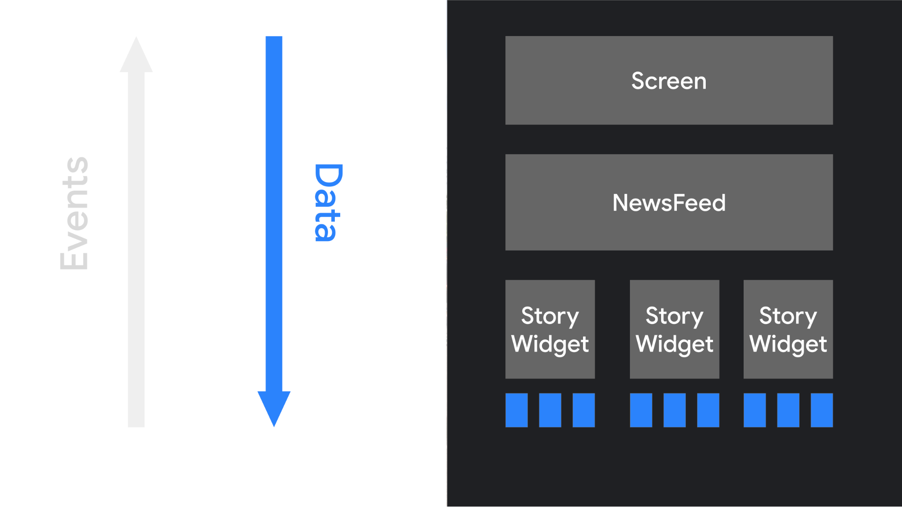
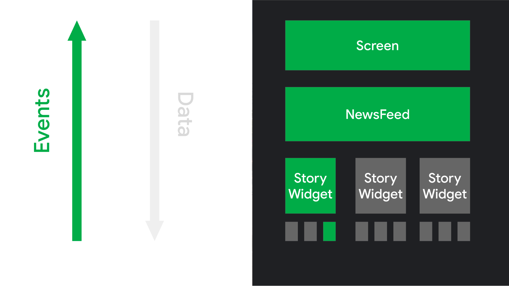

## 선언형 패러다임의 변화

---

명령형 프로그래밍과 선언형 프로그래밍의 차이는 '무엇을' 할 것인지만 명시하는지, '어떻게' 할 것인지를 명시하는지에 있습니다.   
UI 개발에서 이런 패러다임의 전환은 코드의 가독성과 유지 관리성을 크게 향상시킵니다.

기존의 명령형 UI 툴킷에서는 위젯 트리를 인스턴스화하여 UI를 초기화하고, 각 위젯은 자체적인 내부 상태를 유지합니다.

이 내부 상태를 업데이트하기 위해선 `getter`와 `setter` 메소드를 통해 직접 조작해야 합니다.
```kotlin
button.text = "click"
button.setOnClickListener { /* ... */ }
```

반면에, Compose에서는 UI가 상태를 가진 함수로 구성되며, UI를 변경하려면 상태를 변경하면 됩니다.   
상태 변경은 시스템에 의해 자동으로 감지되며, 상태가 변경될 때마다 UI를 다시 구성하는 함수가 호출됩니다.
```kotlin
@Composable
fun SimpleButton(text: String, onClick: () -> Unit) {
    Button(onClick = onClick) {
        Text(text = text)
    }
}
```

이러한 선언형 접근 방식을 사용하면, UI의 레이아웃과 동작을 간결하고 직관적으로 표현할 수 있습니다.  
또한, UI를 구성하는 함수가 순수 함수(pure function)으로 되있기에, 테스트와 재사용이 용이하다는 장점이 있습니다.

이 함수는 입력 상태만을 기반으로 UI를 구성하므로, 동일한 입력 상태에 대해 항상 동일한 UI를 출력하게 됩니다.
이는 UI의 동작을 예측 가능하게 하고, 단위 테스트를 쉽게 작성할 수 있게 합니다.

### 데이터 흐름과 UI 구성


앱 로직은 `Data`를 Top-level Composable에 제공합니다.  
이 함수는 `Data`를 사용하여 UI를 설명하고, 그에 따른 다른 Composable들을 호출합니다.
이때, 해당 함수에는 적절한 `Data`가 전달되며, 이 과정은 계층 구조를 따라 아래로 이어집니다.

### 사용자 상호작용과 이벤트 발생


사용자가 UI와 상호작용하면 `onClick`과 같은 `Event`가 발생합니다.  
이 `Event`는 앱 로직에 알림을 보내고 그 결과로 앱의 상태가 변경될 수 있습니다.
만약 이때, 상태 변경이 발생하면, Composable은 변경된 상태에 따른 새로운 `Data`와 함께 다시 호출됩니다.
이 과정을 **Recomposition**이라고 하며, 이를 통해 UI 요소들이 다시 그려집니다.

이러한 전체 과정은 선언적 UI에서 중요한 원칙을 반영합니다.  
UI는 앱의 현재 상태를 반영하며, 앱의 상태가 변경될 때 마다 UI는 자동으로 업데이트 됩니다.   
이렇게 함으로써, UI 코드는 더욱 간결하고 이해하기 쉬워지게 됩니다.