# Constraints and modifier order

> - Modifier는 single modifier 또는 레이아웃 노드를 감쌀 수 있음
> - Layout 단계에서 wrapper modifier 노드를 방문하여 single modifier 또는 레이아웃 노드의 크기 요구 사항과 배치를 변경할 수 있음
> - Layout 단계는 `자식 측정 -> 자신의 크기 결정 -> 자식 배치` 순서의 알고리즘을 따름
>   - 자식 측정 동안 제약 조건은 부모에서 자식으로 전달되며 DFS로 UI 트리를 순회하여 크기를 결정하고 측정을 완료함
>   - `Modifier.Elements`는 Modifier를 통한 동작들을 정렬되고 변하지 않는 목록으로 나타내며 이를 통해 동작을을 순서대로 실행할 수 있음
> - Modifier 체인이 길어지는 경우 변수로 선언하여 재사용하는 경우 성능 향상을 기대할 수 있음
>   - Re-Composition 시 modifier도 재생성되는데 이를 방지함
>   - 컴포즈 런타임에 Modifier 체인을 매번 생성하고 비교하는 작업을 방지함

컴포즈에서는 여러 `modifier`를 체인하여 컴포저블의 모양과 느낌을 변경할 수 있습니다.

이런 `modifier` 체인은 컴포저블에 전달되는 제약 조건에 영향을 줄 수 있습니다. 제약 조건은 Width, Height의 경계를 정의합니다.

## Modifiers in the UI tree

Composition 단계에서 생성되는 UI 트리를 이해하는 것은 컴포즈에서 `modifier`가 어덯게 동작하는지 이해하는데 도움이 됩니다.  
UI 트리에서 `modifier`는 레이아웃 노드를 감싸는 래퍼 노드로 시각화 할 수 있습니다.

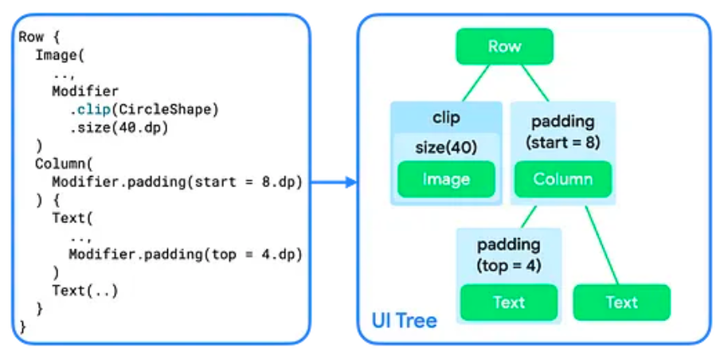

컴포저블에 둘 이상의 modifier를 추가하면 modifier 체인이 생성됩니다.

여러 modifier를 체인할 때 각 modifier 노드가 나머지 체인과 내부의 레이아웃 노드를 감싸게 됩니다.  
예를 들어 `clip`과 `size` modifier를 체인하면 `clip` modifier 노드가 `size` modifier 노드를 감싸고, 이는 `Image` 레이아웃 노드를 감쌉니다.

Layout 단계에서 트리를 탐색하는 알고리즘은 동일하게 유지되지만 각 modifier 노드도 방문됩니다.  
이렇게 하면 modifier가 감싸는 modifier 또는 레이아웃 노드의 크기 요구 사항과 배치를 변경할 수 있습니다.

위 그림에서 `Image`와 `Text` 컴포저블의 구현은 단일 레이아웃 노드를 감싸는 modifier 체인으로 구성됩니다.  
`Row`와 `Column`의 구현은 자녀를 배치하는 방법을 설명하는 레이아웃 노드일 뿐입니다.

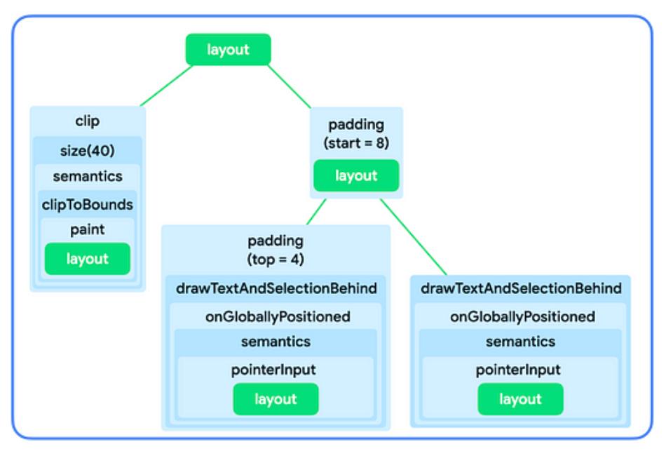

위는 UI 트리에서 컴포저블들이 modifier 체인으로 시각화된 이미지 입니다.

---

## Constraints in the layout phase

Layout 단계는 각 레이아웃 노드의 Width, Height, x, y 좌표를 찾기 위해 3가지 알고리즘을 따릅니다.

1. 자식 측정 : 레이아웃 노드에 자식이 있다면 그 자식들을 측정합니다.
2. 자신의 크기 결정 : 그 측정 값을 기반으로 레이아웃 노드는 자신의 크기를 결정합니다.
3. 자식 배치 : 각각의 자식 노드는 자신의 위치에 상대적으로 배치됩니다.

제약 조건은 알고리즘의 1단계와 2단계 동안 노드의 적절한 크기를 찾는 데 도움을 줍니다.  
제약 조건은 노드의 width, height에 대한 최소 및 최대 경계를 정의합니다.  
노드가 크기를 결정할 때, 측정된 크기는 이 크기 범위 내에 있어야 합니다.

### Types of constraints

제약 조건은 아래 중 하나 일 수 있습니다.

- Bounded : 노드는 최대와 최소의 width, height를 가집니다.
    
    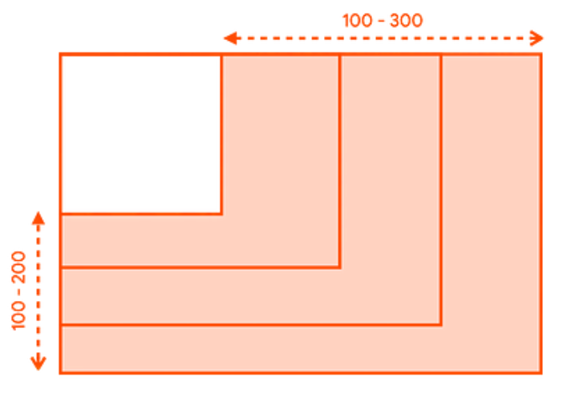

- Unbounded : 노드는 어떠한 크기의 제약도 받지 않습니다. 최대 width, height의 경계는 무한대로 설정됩니다. 

    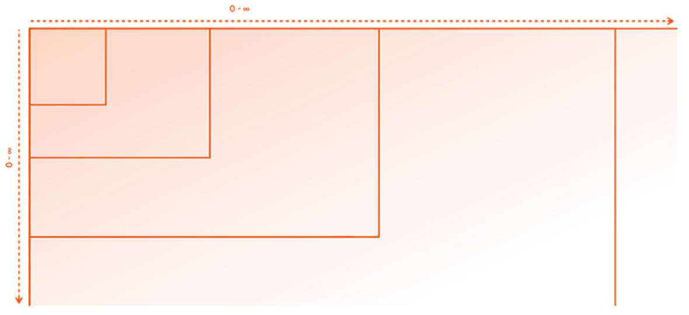

- Exact : 노드는 정확한 크기 요구사항을 따르도록 요청받습니다. 최소와 최대 경계는 동일한 값으로 설정됩니다.
  
  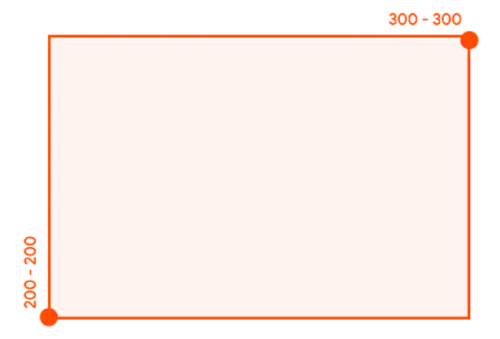

- Combination : 노드는 제약 조건 유형의 조합을 따릅니다.   
  예를 들어 width를 bounded하면서 최대 height는 unbounded 할 수 있으며, 정확한 width를 exact하면서 height는 bounded 할 수 있습니다. 

    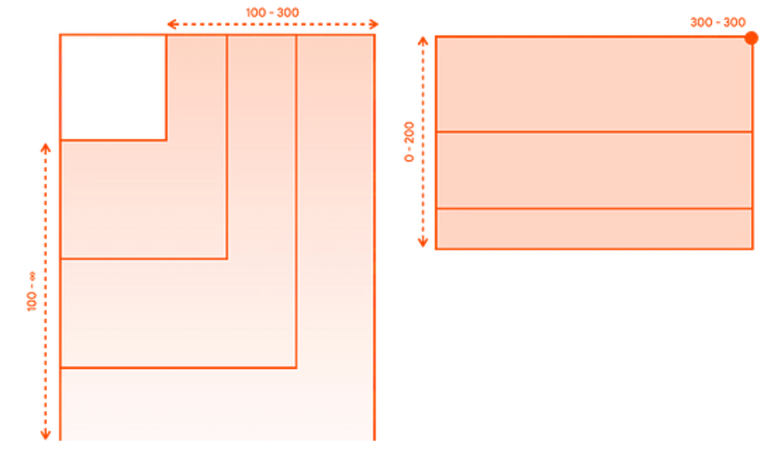

---

### How constrains are passed from parent to child

Layout 단계에서의 제약 조건에서 설명한 알고리즘의 첫 번째 단계(자식 측정) 동안, 제약 조건은 UI 트리에서 부모에서 자식으로 전달됩니다.

부모 노드가 자식을 측정할 때, 각 자식에게 얼마나 크거나 작을 수 있는지 알려주기 위해 이러한 제약 조건을 제공합니다.  
그런 다음 자신의 크기를 결정할 때, 부모로부터 전달된 제약 조건을 따릅니다.

1. 실제 차지하는 크기를 결정하기 위해 UI 트리의 루트 노드는 자식을 측정하고 동일한 제약 조건을 첫 번째 자식에게 전달합니다.
2. 만약 자식이 측정에 영향을 주지 않는 modifier라면, 다음 modifier에게 제약 조건을 전달합니다.   
측정에 영향을 주는 modifier에 도달할 떄까지 제약 조건은 그대로 modifier 체인을 따라 전달됩니다.  
그 후에는 제약 조건이 그에 따라 크기가 조정됩니다.
3. 자식이 없는 노드에 도달하면, 전달된 제약 조건을 기반으로 크기를 결정하고, 결정된 크기를 부모에게 반환합니다.
4. 부모는 자식의 측정을 기반으로 제약 조건을 '조정'하고, 조정된 제약 조건을 가지고 다음 자식을 호출 합니다.
5. 부모의 모든 자식이 측정되면, 부모 노드는 자신의 크기를 결정하고 이를 자신의 부모에게 알립니다.
6. 이렇게 하여 깊이 우선으로 전체 트리를 순회합니다. 결국 모든 노드가 자신의 크기를 결정하고, 측정 단계가 완료됩니다.

---

## Modifiers that affect constraints

일부 modifier가 제약 조건의 크기에 영향을 줄 수 있음을 알 수 있습니다. 아래는 제약 조건에 영향을 주는 특정 수식어들 입니다.

### `size` modifier

`size`는 컨텐츠의 선호되는 크기를 선언합니다.

예를 들어 아래의 UI 트리는 300x200 크기의 컨테이너 안에 렌더링되어야 하며, 
제약 조건은 경계가 있어 width : 100 ~ 300, height : 100 ~ 200 으로 허용됩니다.

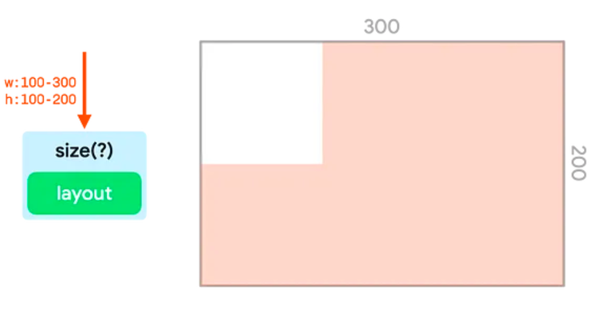

`size`는 전달된 값을 일치시키기 위해 들어오는 제약 조건을 조정합니다. 이 예시에서는 값이 150 입니다.

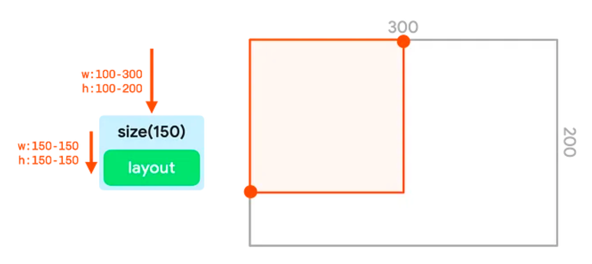

만약 width와 height가 가장 작은 제약 조건의 경계보다 작거나, 가장 큰 제약 조건의 경계보다 크다면,
modifier는 전달된 제약 족너을 최대한 가깝게 맞추면서도 들어온 제약 조건을 준수합니다.

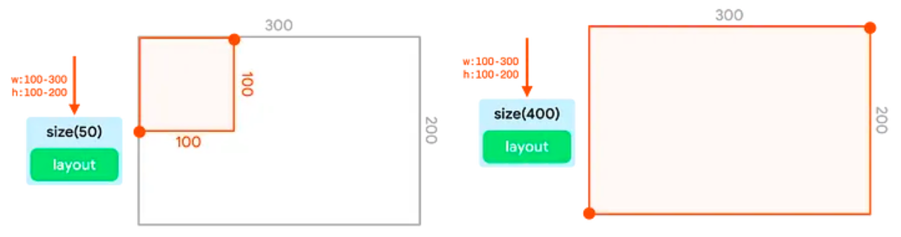

여러 `size`를 연결하는 것은 동작하지 않습니다.

첫 번째 `size`는 최소와 최대 제약 조건을 고정된 값으로 설정합니다.
두 번째 `size`가 더 작거나 더 큰 크기로 요청하더라도, 전달된 정확한 경계를 준수해야 하므로 그 값을 덮어 쓰지 않습니다.

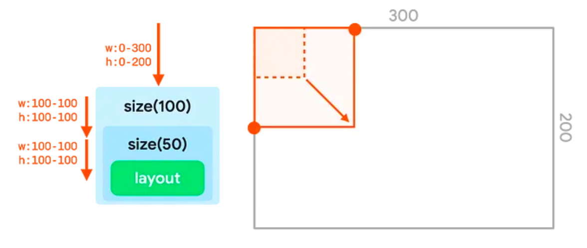

---

###  requiredSize modifier

노드가 들어오는 제약 조건을 덮어쓰길 원한다면, `size` -> `requiredSize`를 사용하면 됩니다.  
`requiredSize`는 들어오는 제약 조건을 대체하고 지정한 크기를 정확한 경계로 전달합니다.

크기가 트리를 거슬러 올라갈 때, 자식 노드는 사용 가능한 공간에서 가운데로 배치됩니다.

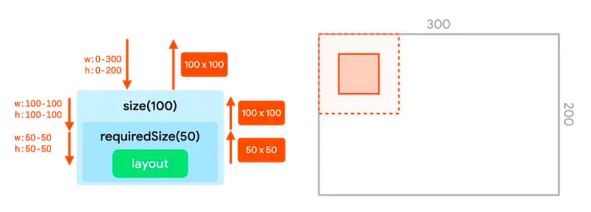

---

### width and height modifiers

`size`는 제약 조건의 width, height를 모두 조정합니다. width, height를 개별적으로 조정하려면 `width`와 `height`를 사용하면 됩니다.

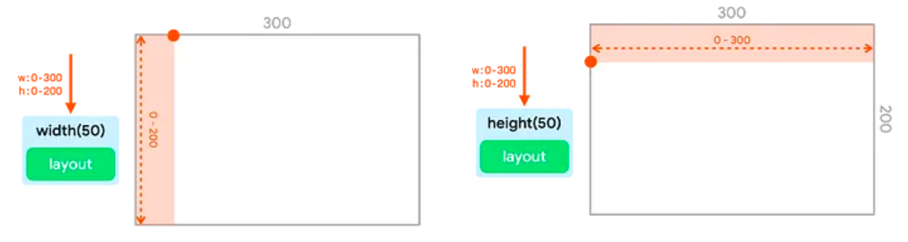

---

### sizeIn modifier

`sizeIn`은 widht, height에 대한 정확한 최소 및 최대 제약 조건을 설정할 수 있게 해줍니다.


---

## Extracting and reusing modifiers

여러 modifier 노드를 체인하면, 컴포저블을 꾸미거나 확장할 수 있습니다.  
이 체인은 단일 `Modifier.Elements`의 정렬된, 변하지 않는 목록을 나타내는 `Modifier` 인터페이스를 통해 생성 됩니다.

각 `Modifier.Element`는 개별적인 동작을 나타냅니다.

예를 들어 레이아웃, 그리기 및 그래픽 동작, 모든 제스처 관련, 초점 및 의미 동작, 장치 입력 이벤트 등이 있습니다.  
이들의 순서는 중요하며 먼저 추가된 modifier가 먼저 적용됩니다.

때로 동일한 modifier 체인 인스턴스를 여러 컴포저블에서 재사용하는 것이 유용할 수 있습니다.  
이를 변수로 추출하고 더 높은 스코프로 끌어올림으로써 코드의 가독성을 높이거나 앱의 성능을 향상 시킬 수 있습니다.

- Re-Composition이 발생할 때 modifier의 경우도 새로 생성되는데, 체인 인스턴스를 재사용하면 이를 방지할 수 있습니다.
- modifier 체인은 잠재적으로 매우 길고 복잡할 수 있으므로, 체인 인스턴스를 재사용하면 컴포즈 런타임이 체인을 매번 새로 생성하고 비교하는 작업을 피할 수 있습니다.

### Best practices for reusing modifiers

`Modifier`는 데이터와 유사한 객체이기에, `Modifier`를 재사용하는 것은 데이터를 재사용하는 것과 유사한 방식으로 수행됩니다.

```kotlin
val reusableModifier = Modifier
    .fillxMaxWidht()
    .background(Color.Red)
    .padding(12.dp)
```

#### Extracting and reusing modifiers when observing frequently changing state

컴포저블 내부에서 애니메이션 상태나 `scrollState`와 같이 빈번하게 변하는 상태를 관찰할 때, 상당한 양의 Re-Composition이 발생될 수 있습니다.
이 경우 `Modifier`는 모든 Re-Composition과 가능하면 모든 프레임에 대해 할당될 수 있습니다.

```kotlin
@Composable
fun LoadingWheelAnimation() {
    val animatedState = animateFloatAsState(/*...*/)
  
  LoadingWheel(
    modifier = Modifier
      .padding(12.dp)
      .background(Color.Gray)
    animatedState = animatedState
  )
}
```

위와 같이 구현하는 대신, 동일한 `Modifier`의 인스턴스를 만들어 추출하고 재사용하여 컴포저블에 전달할 수 있습니다.

```kotlin
// Modifier의 할당은 여기서 일어남
val reusableModifier = Modifier
  .padding(12.dp)
  .background(Color.Gray)

@Composable
fun LoadingWheelAnimation() {
    val animatedState = animateFloatAsState(/*...*/)
    
    LoadingWheel(
        // 할당 없이 동일한 인스턴스 재사용
        modifier = reusableModifier,
        animatedState = animatedState
    )
}
```

#### Extracting and reusing unscoped modifiers

`Modifier`는 특정 컴포저블에 스코프를 지정하거나 지정하지 않을 수 있습니다.  
스코프르 지정하지 않은 경우, 간단한 변수로써 어떠한 컴포저블 밖에서도 쉽게 추출할 수 있습니다.

```kotlin
val reusableModifier = Modifier
  .fillMaxWidht()
  .background(Color.Red)
  .padding(12.dp)

@Composable
fun AuthorField() {
    HeaderText(
        modifier = reusableModifier,
        // ...
    )
  
    SubtitleText(
        modifier = reusableModifier,
        // ...
    )
}
```

아래와 같이 Lazy 레이아웃과 결합할 때 유용할 수 있습니다.  
대부분의 경우 상당한 양의 아이템이 정확히 동일한 `Modifier`를 가질 수 있습니다.

```kotlin
val reusableItemModifier = Modifier
  .padding(bottom = 12.dp)
  .size(210.dp)
  .cilp(CircleShape)

@Composable
private fun AuthorList(authors: List<Author>) {
    LazyColumn {
        items(authors) {
            AsyncImage(
                modifier = reusableItemModifier,
                // ...
            )
        }
    }
}
```

#### Extracting and reusing scoped modifiers

특정 컴포저블의 스코프가 지정된 `Modifier`를 다룰 때, 가장 높은 수준까지 추출하고 적절한 위치에서 재사용할 수 있습니다.

```kotlin
Column(/*...*/) {
    val reusableItemModifier = Modifier
      .padding(bottom = 12.dp)
      .align(Aligment.CenterHorizontally)
      .weight(1f)
  
    Text(
        modifier = reusableItemModifier,
        // ...
    )
  
    Text(
        modifier = reusableItemModifier,
        // ...
    )
}
```

또한 추출된 스코프가 지정된 `Modifier`는 동일한 스코프의 직접적인 자식에만 전달해야 합니다.

```kotlin
Column(modifier = Modifier.fillMMaxWidth()) {
    // weight modifier는 Column composable의 스코프에 지정됨
    val reusableItemModifier = Modifier.weight(1f)

    Text(
      // 이 Text는 Column의 직접적인 자식이므로 weight가 할당됨
      modifier = reusableItemModifier,
        // ...
    )
  
    Box(
      Text(
        // 이 Text는 Column의 직접적인 자식이 아니므로 weight가 할당되지 않음
        modifier = reusableItemModifier,
        // ...
      )
    )   
}
```

#### Further chaining of extracted modifiers

추출한 modifier 체인에 `then`을 호출하여 추가적으로 연결하거나 확장할 수 있습니다.

```kotlin
// 기존에 추출한 Modifier 
val reusableModifier = Modifier
  .padding(12.dp)
  .background(Color.Gray)

// 추가적인 Modifier 연결

val extendedModifier = reusableModifier.then(
    Modifier.border(2.dp, Color.Black)
)
```

---

## Example

```kotlin
Image(
    modifier = Modifier
      .fillMaxSize()
      .wrapContentSize()
      .size(50.dp)
)
```


- `fillMaxSize`는 제약 조건을 조정ㄹ하여 최소 너비와 높이를 최대 값으로 설정합니다.
- `wrapContentSize`는 최소 제약 조건을 '재설정'합니다. 
  - 이는 `fillMaxSize`가 고정된 제약 조건을 생성한 반면, `wrapContentSize`는 이를 다시 경계 있는 제약 조건으로 재설정합니다.
  - 다음 노드는 이제 다시 전체 공간을 차지하거나 전체 공간보다 작을 수 있습니다.
- `size`는 제약 조건을 50의 최소 및 최대 경계로 설정합니다.
- `Image`는 50x50으로 결정되며 `size`는 그것을 전달합니다.
- `warpContentSize`는 특별한 속성이 있는데, 자식을 가져와 전달된 최소 경계의 중앙에 위치시킵니다.

---

```kotlin
Image(
  modifier = Modifier
    .clip(CircleShape)
    .padding(10.dp)
    .size(100.dp)
)
```


- `clip`은 제약 조건을 변경하지 않습니다.
- `padding`은 최대 제약 조건을 낮춥니다.
- `size`는 모든 제약조건을 100으로 설정합니다.
- `Image`는 위 제약조건을 준수하고 100x100으로 상위 노드에 알립니다.
- `padding`은 모든 크기에 10만큼 추가하므로 보고된 너비와 높이를 20씩 증가시킵니다.
  - Drawing 단계에서 `clip`은 120x120의 캔버스에서 작동됩니다. 따라서 해당 크기의 원형 마스크를 생성합니다.
- `padding`은 안에 래핑된 노드의 모든 크기에 10씩 더하므로 캔버스 크기를 100x100으로 줄입니다.
- `Image`는 그 캔버스 안에 그려집니다. 이미지는 원래 120의 원을 기반으로 잘려나가므로 출력은 둥글지 않은 결과가 됩니다.