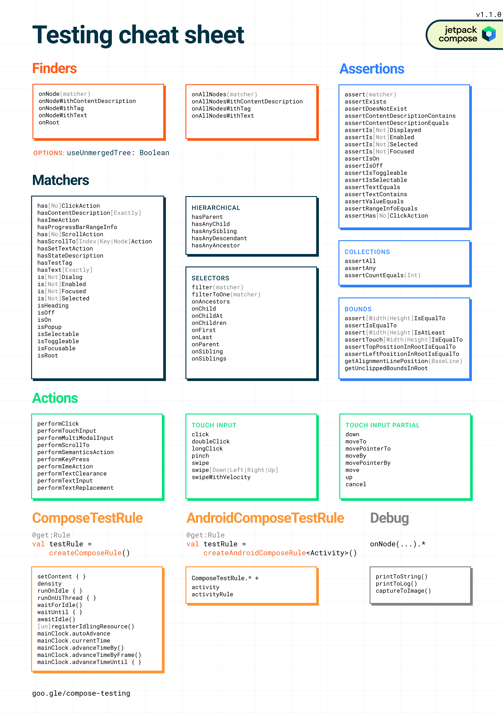

# Testing compose Layout

## Semantics

Compose에서의 UI Test는 UI 계층과 상호작용하기 위해 `Semantics`를 사용합니다.

`Semantics`는 이름과 같이, UI의 일부분에 의미를 부여합니다.
여기에서 'UI의 일부분'은 단일 Composable부터 전체 화면에 이르기까지 다양한 것을 의미합니다.

`Semantics` 트리는 UI 계층과 함께 생성되며, UI 계층을 설명합니다.


**그림1. UI 계층 구조와 그에 대한 Semantics 트리**

`Semantics` 프레임워크는 주로 접근성을 위해 사용되므로, Test는 `Semantics`가 UI 계층에 대해 노출하는 정보를 활용합니다.
여기에서 개발자는 노출할 정보와 얼마나 노출할지를 결정합니다.


**그림2. 아이콘과 텍스트를 포함하는 일반적인 버튼**

예를 들어, 이런 아이콘과 텍스트 요소로 구성된 버튼이 있을 때, 기본 `Semantics` 트리에는 "Like" 텍스트 레이블만 포함됩니다.

이는 `Text`과 같은 일부 Composable이 `Semantics` 트리에 일부 속성을 노출하기 때문입니다.
`Modifier`를 사용하여 `Semantics` 트리에 속성을 추가할 수 있습니다.

```kotlin
MyButton(
    modifier = Modifier.semantics { 
        contentDescription = "Add to Favorites"
    }
)
```

---

## Set Up

```groovy
// Test rules and transitive dependencies:
androidTestImplementation("androidx.compose.ui:ui-test-junit4:$compose_version")
// Needed for createAndroidComposeRule, but not createComposeRule:
debugImplementation("androidx.compose.ui:ui-test-manifest:$compose_version")
```

이 모듈에는 `ComposeTestRule`과 `AndroidComposeTestRule`라는 Android 구현체가 포함되어 있습니다.
이 규칙을 통해 Compose 컨텐츠를 설정하거나 `Activity`에 접근할 수 있습니다.

```kotlin
// file: app/src/androidTest/java/com/package/MyComposeTest.kt

class MyComposeTest {

    @get:Rule
    val composeTestRule = createComposeRule()
    // 액티비티에 접근이 필요하면 createAndroidComposeRule<YourActivity>() 사용

    @Test
    fun myTest() {
        // Start the app
        composeTestRule.setContent {
            MyAppTheme {
                MainScreen(uiState = fakeUiState, /*...*/)
            }
        }

        composeTestRule.onNodeWithText("Continue").performClick()

        composeTestRule.onNodeWithText("Welcome").assertIsDisplayed()
    }
}
```

---

## Testing API

요소와 상호작용하는 주요 방법은 3가지가 있습니다.



- Finders를 사용하면 하나 이상의 요소(또는 `Semantics` 트리의 노드)를 선택하여 그들에 대한 `assertion` 또는 `action`을 수행할 수 있습니다.
- Assertions은 요소가 존재하거나 특정 속성을 가지고 있는지 확인하는데 사용합니다.
- Action은 클릭이나 다른 제스쳐와 같은 시뮬레이트된 사용자 이벤트를 요소에 주입합니다.

이러한 API 중 일부는 하나 이상의 `Semantics` 트리 노드를 참조하기 위해 `SemanticsMatcher`를 받습니다.

### Finders

하나 또는 여러 노드를 선택하기 위해 `onNode` 또는 `onAllNodes`를 사용할 수 있지만, 
`onNodeWithText` 또는 `onAllNodesWithText`와 같은 가장 일반적인 검색을 위한 편의성 검색기를 사용할 수도 있습니다.

#### 단일 노드 선택

```kotlin
composeTestRule.onNode(<<SemanticsMatcher>>, useUnmergedTree = false) : SemanticsNodeInteraction

// Example
composeTestRule.onNode(hasText("Button")) // == onNodeWithText("Button")
```

#### 여러 노드 선택

```kotlin
composeTestRule.onAllNodes(<<SemanticsMatcher>>): SemanticsNodeInteractionCollection

// Example
composeTestRule.onAllNodes(hasText("Button")) // == onAllNodesWithText("Button")
```

#### 병합되지 않은 트리 사용

일부 노드는 자식의 `Semantics` 정보를 병합합니다.

아래 예처럼 2개의 `Text` 요소가 있는 버튼은 그들의 레이블을 병합합니다.

```kotlin
MyButton {
    Text("Hello")
    Text("World")
}
```

Test에서는 `printToLog()`를 사용하여 `Semantics` 트리를 출력할 수 있습니다.

```kotlin
composeTestRule.onRoot().printToLog("TAG")
```

위 코드는 다음과 같은 트리 형태를 출력합니다.

```text
Node #1 at (...)px
 |-Node #2 at (...)px
   Role = 'Button'
   Text = '[Hello, World]'
   Actions = [OnClick, GetTextLayoutResult]
   MergeDescendants = 'true'
```

병합되지 않은 트리의 노드를 일치시키리면 `useUnmergedTree`를 `true`로 설정할 수 있습니다.

```kotlin
composeTestRule.onRoot(useUnmergedTree = true).printToLog("TAG")
```

아래는 변경된 트리 형태입니다.

```text
Node #1 at (...)px
 |-Node #2 at (...)px
   OnClick = '...'
   MergeDescendants = 'true'
    |-Node #3 at (...)px
    | Text = '[Hello]'
    |-Node #5 at (83.0, 86.0, 191.0, 135.0)px
      Text = '[World]'
```

`useUnmergedTree` 파라미터는 모든 `Finders API`에서 사용할 수 있습니다.
예를 들어 아래 코드는 `onNodeWithText`에서 `useUnmergedTree` 파라미터를 사용합니다.

```kotlin
composeTestRule.onNodeWithText("World", useUnmergedTree = true).assertIsDisplayed()
```

---

### Assertions

`Finder API`가 반환하는 `SemanticsNodeInteraction`에 `assert()`를 호출하여 하나 또는 여러 `matcher`를 확인합니다.

```kotlin
// Single matcher:
composeTestRule
    .onNode(matcher)
    .assert(hasText("Button")) // hasText is a SemanticsMatcher

// Multiple matchers can use and / or
composeTestRule
    .onNode(matcher).assert(hasText("Button") or hasText("Button2"))
```

일반적인 `assertion`에 대해 다음과 같은 함수를 사용할 수 있습니다.

- `assertIsDisplayed()`
- `assertExists()`
- `assertTextEquls()`

또한, 노드의 컬렉션에 대한 `Assertion`을 확인하는 함수는 다음과 같습니다.

```kotlin
// 일치하는 노드의 수 
composeTestRule.onAllNodesWithContentDescription("Beatle").assertCountEquals(4)
// 최소한 하나가 일치 
composeTestRule.onAllNodesWithContentDescription("Beatle").assertAny(hasTestTag("Drummer"))
// 모두 일치
composeTestRule.onAllNodesWithContentDescription("Beatle").assertAll(hasClickAction())
```

---

### Actions

노드에 `action`을 주입하려면 `perform...()`을 호출하면 됩니다.

```kotlin
composeTestRule.onNode(...).performClick()
```

`perform`함수 내에서 `action`을 연결하여 사용하는 것이 아닌 여러 `perform()`을 호출해야 합니다.

```kotlin
performClick()
performSemanticsAction(key)
performKeyPress(keyEvent)
performGesture { swipeLeft() }
```

---

### Matchers

#### 계층형(Hierarchical) matcher

계층형 `matcher` 사용 시 `Semantics` 트리를 위아래로 이동하고 간단한 `matcher`를 수행할 수 있습니다.

```kotlin
fun hasParent(matcher: SemanticsMatcher): SemanticsMatcher
fun hasAnySibling(matcher: SemanticsMatcher): SemanticsMatcher
fun hasAnyAncestor(matcher: SemanticsMatcher): SemanticsMatcher
fun hasAnyDescendant(matcher: SemanticsMatcher):  SemanticsMatcher
```

```kotlin
composeTestRule
    .onNode(hasParent(hasText("Button")))
    .assertIsDisplayed()
```

#### Selectors

Test를 생성하는 또 다른 방법은 몇몇 Test를 더 읽기 쉽게 만들 수 있는 `selector`를 사용하는 것입니다.

```kotlin
composeTestRule.onNode(hasTestTag("Players"))
    .onChildren()
    .filter(hasClickAction())
    .assertCountEquals(4)
    .onFirst()
    .assert(hasText("John"))
```

---

## 동기화(synchronization)

Compose 테스트는 기본적으로 UI와 동기화 됩니다.

`ComposeTestRule`을 통해 `assertion` 또는 `action`을 호출하면, UI 트리가 비동기적으로 동기화되기 전까지 기다립니다.

보통은 별도의 조치를 취할 필요가 없으나, 몇가지 주의 사항이 있습니다.

테스트가 동기화되면 Compose 앱이 가상 시계를 사용하여 시간이 지남에 따라 진행됩니다. 
이는 Compose 테스트가 실제 시간대로 실행되지 않으므로 가능한 빨리 통과할 수 있습니다.

그러나 테스트를 동기화하하는 메서드를 사용하지 않으면, 재구성이 발생하지 않고, UI가 일시 중지된 것처럼 보일 수 있습니다.

```kotlin
@Test
fun counterTest() {
    val myCounter = mutableStateOf(0) // 재구성을 일으킬 수 있는 상태
    var lastSeenValue = 0
    
    composeTestRule.setContent {
        Text(myCounter.value.toString()) // Composable
        lastSeenValue = myCounter.value
    }
    
    myCounter.value = 1 // 상태가 변경되지만, 재구성은 발생하지 않음

    // 재구성을 유발하지 않았기에 실패
    assertTrue(lastSeenValue == 1)

    // `assertion`이 재구성을 일으키기에 통과
    composeTestRule.onNodeWithText("1").assertExists()
}
```

이러한 요구사항은 Compose 계층에만 적용되며 앱의 나머지 부분에는 적용되지 않습니다.


### 자동 동기화 비활성화(Disabling automatic synchronization)

`assertExists()`와 같은 `ComposeTestRule`을 통해 `assertion` 또는 `action`을 호출하면 테스트가 Compose UI와 동기화됩니다.

경우에 따라 이 동기화를 중지하고 직접 시간을 제어하고 싶은 경우가 있을 수 있습니다.  
예를 들어, UI 여전히 바쁘게 동작하는 지점에서 애니메이션의 정확한 스크린샷을 찍을 수 있도록 시간을 제어하고 싶은 경우가 그렇습니다.

자동 동기화를 비활성화하려면 `mainClock`의 `autoAdvance` 속성을 `false`로 설정하면 됩니다.

```kotlin
composeTestRule.mainClock.autoAdvance = false
```

위 속성을 적용하고 직접 시간을 진행 시킵니다.
- advanceTimeByFrame() : 한 프레임만큼 시간을 진행시킵니다.
- advanceTimeBy() : 지정된 시간만큼 시간을 진행시킵니다.

```kotlin
composeTestRule.mainClock.advanceTimeByFrame()
composeTestRule.mainClock.advanceTimeBy(milliseconds)
```

> `MainTestClock`은 모든 재구성, 애니메이션, 제스처를 제어하지만, Android의 measure과 draw pass를 제어하지는 않습니다.

### 유휴 자원(Idling resources)

Compose는 테스트와 UI를 동기화하며, 이를 통해 모든 작업과 검증(assertion)이 유휴 상태에서 실행될 수 있으며 필요에 따라 시간을 대기하거나 전진시키기도 합니다. 
그러나 UI 상태에 영향을 주는 일부 비동기 작업들은 테스트가 인지하지 못하는 상태에서 백그라운드에서 실행될 수 있습니다.

이러한 유휴 자원을 테스트에 만들어서 등록함으로써, 테스트 대상 앱이 바쁜 상태인지 아니면 유휴 상태인지 판단할 때 이를 고려하게 할 수 있습니다. 
예를 들어, Espresso나 Compose와 동기화되지 않는 백그라운드 작업을 실행하는 경우, 추가적인 유휴 자원을 등록해야 할 필요가 있습니다.

테스트 대상이 유휴 상태인지 아니면 바쁜 상태인지를 나타내는 Espresso의 Idling Resources와 매우 유사합니다. 

`IdlingResource`의 구현체를 `ComposeTestRule`에 등록하면 됩니다.

```kotlin
composeTestRule.registerIdlingResource(idlingResource)
composeTestRule.unregisterIdlingResource(idlingResource)
```

### 수동 동기화(Manual synchronization)

특정 상황에서는 테스트 중인 앱의 다른 부분이나 테스트 자체와 Compose UI를 수동으로 동기화해야 할 수 있습니다.

`waitForIdle`은 Compose가 유휴 상태가 될 때까지 대기하는데, 이는 `autoAdvance` 속성에 따라 달라집니다.

```kotlin
composeTestRule.mainClock.autoAdvance = true // default
composeTestRule.waitForIdle() // Compose가 유휴 상태가 될 때까지 시간을 진행

composeTestRule.mainClock.autoAdvance = false
composeTestRule.waitForIdle() // 유휴 자원이 유휴 상태가 될 때까지만 대기
```

두 경우 모두, `waitForIdle`은 보류 중인 draw와 layout pass를 대기합니다.

또한, 특정 조건이 충족될 때까지 `advanceTimeUntil()`을 통해 시간을 진행시킬 수 있습니다.

```kotlin
// condition은 Compose 상태 값만 작동됨
composeTestRule.mainClock.advanceTimeUntil(timeoutMs) { condition }
```

### 조건 대기(Waiting for conditions)

외부 작업에 의존하는 조건(예: 데이터 로딩, Android의 measure 또는 draw 등)은 더 일반적인 개념인 `waitUntil()`을 사용해야 합니다.

```kotlin
composeTestRule.waitUntil(timeoutMs) { condition }
```

또한, 아래와 같이 `waitUntil` 헬퍼를 사용할 수 있습니다.

```kotlin
composeTestRule.waitUntilAtLeastOneExists(matcher, timeoutMs)
composeTestRule.waitUntilDoesNotExist(matcher, timeoutMs)
composeTestRule.waitUntilExactlyOneExists(matcher, timeoutMs)
composeTestRule.waitUntilNodeCount(matcher, count, timeoutMs)
```

> 테스트에서 외부 CountDownLatch와 같은 메커니즘을 사용하는 경우, `waitUntil` API를 사용하지 않으면, 테스트 시간이 진행되지 않을 수 있어 예기치 않게 동작될 수 있습니다.

---

## 일반적인 패턴 (Common patterns)

### 독립 테스트 (Test in isolation)

`ComposeTestRule`를 사용하면 전체 앱, 단일 화면, 작은 요소 등 어떤 Composable이든 `Activity`을 시작해 화면에 표시할 수 있습니다.
또한, Composable이 올바르게 캡슐화되어 독립적으로 작동하는지 확인 할 수 있고 이를 통해 더 쉽고 집중적인 UI 테스트를 가능하게 합니다.

### 사용자 지정 컨텐츠 설정 후 Activity 및 Resource 접근 

대부분의 경우 `composeTestRule.setContent`를 통해 테스트 컨텐츠를 설정하고, 동시에 Activity 리소스에 접근해야 합니다.

예를 들어, 화면에 표시된 텍스트가 문자열 리소스와 일치하는지 확인해야 할 수 있습니다.
그러나, Activity가 이미 `setContent`를 호출한 경우, `createAndroidComposeRule()`로 생성된 규칙에서 `setContent`를 호출 할 수 없습니다.

이를 해결하기 위해서는 `ComponentActivity`와 같은 빈 Activity를 사용하여 `AndroidComposeTestRule`을 생성하는 것입니다.

```kotlin
class MyComposeTest {

    @get:Rule
    val composeTestRule = createAndroidComposeRule<ComponentActivity>()

    @Test
    fun myTest() {
        // Start the app
        composeTestRule.setContent {
            MyAppTheme {
                MainScreen(uiState = exampleUiState, /*...*/)
            }
        }
        val continueLabel = composeTestRule.activity.getString(R.string.next)
        composeTestRule.onNodeWithText(continueLabel).performClick()
    }
}
```

### Custom semantics properties

테스트에 필요한 정보를 제공하기 위해 custom semantics property를 만들 수 있습니다.
이를 위해 새로운 `SemanticsPropertyKey`를 정의하고 `SemanticsPropertyReceiver`를 통해 사용할 수 있습니다.

```kotlin
val PickedDateKey = SemanticsPropertyKey<Long>("PickedDate")
var SemanticsPropertyReceiver.pickedDate by PickedDateKey
```

아래와 같이 `semantics`를 통해 해당 속성을 사용할 수 있습니다.

```kotlin
val datePickerValue by remember { mutableStateOf(0L) }
MyCustomDatePicker(
    modifier = Modifier
        .semantics { pickedDate = datePickerValue }
)
```

테스트에서는 `SemanticsMatcher.expectValue`를 사용하여 속성의 값을 확인 할 수 있습니다.

```kotlin
composeTestRule
    .onNode(SemanticsMatcher.expectValue(PickedDateKey, 1445378400)) // 2015-10-21
    .assertExists()
```

> 특정 항목을 일치시키기 어려울 때만 custom semantics property를 사용해야 합니다.
> color, font size, shape 등을 공개하기 위해 custom semantics property를 사용하는 것은 권장되지 않습니다.  
> 이는 Product 코드를 더럽히며, 잘못된 구현으로 인해 찾기 어려운 버그가 발생될 수 있습니다.

### 상태 복원 검증(Verify state restoration)

`Activity` 또는 `Process`가 다시 생성될 때 Compose 요소의 상태가 올바르게 복원되는지 확인해야 합니다.

`StateRestorationTester`를 사용하면 Activity 재생성에 의존하지 않고 이러한 검사를 수행할 수 있습니다.
또한, Composable의 재생성을 시뮬레이션 할 수 있습니다. 이는 `rememberSaveable`의 구현을 확인하는 데 특히 유용합니다.

```kotlin

class MyStateRestorationTests {

    @get:Rule
    val composeTestRule = createComposeRule()

    @Test
    fun onRecreation_stateIsRestored() {
        val restorationTester = StateRestorationTester(composeTestRule)

        restorationTester.setContent { MainScreen() }

        // TODO: 상태 변경 작업 실행 

        // 재생성 트리거
        restorationTester.emulateSavedInstanceStateRestore()

        // TODO: 상태 복원 검증
    }
}
```
