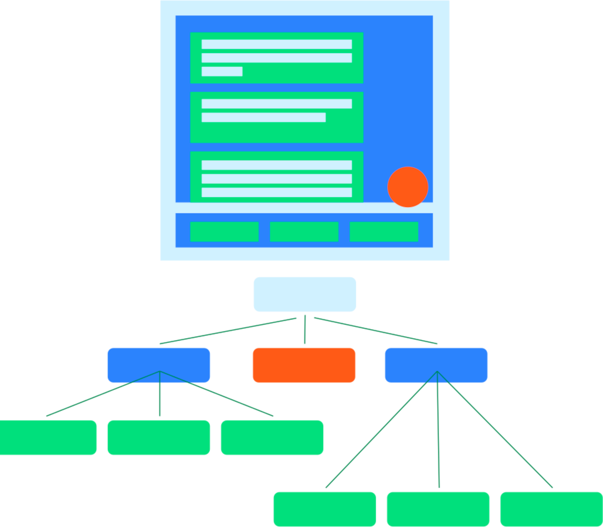

# Testing compose Layout

## Semantics

Compose에서의 UI Test는 UI 계층과 상호작용하기 위해 `Semantics`를 사용합니다.

`Semantics`는 이름과 같이, UI의 일부분에 의미를 부여합니다.
여기에서 'UI의 일부분'은 단일 Composable부터 전체 화면에 이르기까지 다양한 것을 의미합니다.

`Semantics` 트리는 UI 계층과 함께 생성되며, UI 계층을 설명합니다.



**그림1. UI 계층 구조와 그에 대한 Semantics 트리**

`Semantics` 프레임워크는 주로 접근성을 위해 사용되므로, Test는 `Semantics`가 UI 계층에 대해 노출하는 정보를 활용합니다.
여기에서 개발자는 노출할 정보와 얼마나 노출할지를 결정합니다.


**그림2. 아이콘과 텍스트를 포함하는 일반적인 버튼**

예를 들어, 이런 아이콘과 텍스트 요소로 구성된 버튼이 있을 때, 기본 `Semantics` 트리에는 "Like" 텍스트 레이블만 포함됩니다.

이는 `Text`과 같은 일부 Composable이 `Semantics` 트리에 일부 속성을 노출하기 때문입니다.
`Modifier`를 사용하여 `Semantics` 트리에 속성을 추가할 수 있습니다.

```kotlin
MyButton(
    modifier = Modifier.semantics { 
        contentDescription = "Add to Favorites"
    }
)
```
