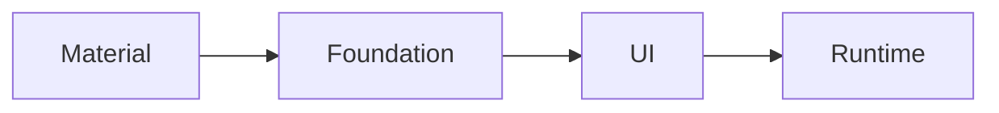

# Compose architectural layer

컴포즈는 단일 프로젝트가 아닌, 여러 모듈들이 모여 완전한 스택을 형성합니다.  
컴포즈를 구성하는 다양한 모듈을 이해하면 아래 내용을 이해하는데 도움이 됩니다.

- 앱이나 라이브러리를 구축하기 위해 적절한 수준의 추상화를 사용할 수 있습니다.
- 더 많은 제어 또는 사용자 정의를 위해 낮은 수준으로 내려갈 수 있는 시점을 이해할 수 있습니다.
- 의존성을 최소화할 수 있습니다.

## Layer

> - Compose 4개 계층은 하위 계층 순으로 `Runtime`, `UI`, `Foundation`, `Material`으로 구성
>   - `Runtime` : UI 관리가 아닌, Composable 트리 구조 및 상태 관리
>   - `UI` : UI 요소 기본 설정 및 개념 제공
>   - `Foundation` : 특정 디자인 시스템 종속이 아닌, 자체적인 디자인 시스템 구축 기반 제공
>   - `Material` : Material 디자인 적용을 위한 구현체 제공

---

컴포즈는 다음과 같이 4개의 계층으로 구성되어 있습니다.



각 계층은 하위 수준 위에 구축되어, 기능을 결합하여 상위 수준의 컴포넌트를 만듭니다.  
또한 하위 계층의 API를 기반으로 모듈의 경계를 검증하고 필요한 경우에 어떤 계층이든 교체할 수 있도록 합니다. 

### Runtime

이 모듈은 `remember`, `mutableStateOf`, `@Composable`, `SideEffect`와 같은 컴포즈 런타임의 기본적인 부분을 제공합니다.
UI가 아닌, 컴포즈의 트리를 관리하는 기능만 필요한 경우, 이 계층 위에 직접 구축하는 것을 고려할 수 있습니다.

### UI

UI 계층은 여러 모듈(`ui-text`, `ui-graphics`, `ui-tooling` 등)로 구성됩니다.  
이 모듈들은 `LayoutNode`, `Modifier`, 입력 핸들러, 사용자 정의 레이아웃, 그리기 등 UI 툴킷의 기본 개념들을 구현합니다.

이와 같이 UI 툴킷의 기본 개념들만 필요한 경우, 이 계층 위에 직접 구축하는 것을 고려할 수 있습니다.

### Foundation

이 모듈은 디자인 시스템에 독립적인 컴포즈 UI의 빌딩 블록을 제공합니다.  
예를 들어 `Row`, `Column`, `LazyColumn`, 특정 제스처 인식 등이 포함됩니다.

자체적인 디자인 시스템을 만들고 싶은 경우에 `Foundation` 계층 위에 구축하는 것을 고려할 수 있습니다.

### Material

이 모듈은 컴포즈 UI를 위한 Material 디자인 시스템의 구현체를 제공합니다.  
여기에는 테마 시스템, 스타일이 적용된 컴포넌트, 리플 효과, 아이콘 등이 포함됩니다.

앱에서 Material 디자인을 사용하고자 할 때 이 계층을 기반으로 구축하는 것을 고려할 수 있습니다.

---

## 설계 원칙(Design Principles)

Compose는 조립하거나 구성할 수 있는 작은, 특정 기능들을 제공하는 것이 주 목표이며, 이런 접근 방식은 여러가지 장점을 가집니다.

### Control

고수준의 컴포넌트는 많은 기능을 자동으로 처리해주지만, 그로 인해 개발자들이 직접 컨트롤 할 수 있는 범위가 제한됩니다.
만약 더 많은 제어가 필요하다면, 저수준의 컴포넌트를 사용하여 처리하면 됩니다.

예를 들어, 컴포넌트의 색상을 애니메이션으로 변경하려고 할 때, 고수준의 `animateColorAsState`를 사용하면 됩니다.

```kotlin
val color = animateColorAsState(
    if (condition) Color.Green else Color.Red
)
```

그러나 컴포넌트의 색이 매번 회색으로 시작하길 원한다면, 다음과 같이 저수준의 `Animatable`를 사용하면 됩니다.

```kotlin
val color = remember { Animatable(Color.Gray) }

LaunchedEffect(condition) {
    color.animateTo(
        if (condition) Color.Green else Color.Red
    )
}
```

이처럼 고수준의 `animateColorAsState`는 저수준의 `Animatable`를 바탕으로 만들어졌습니다.
저수준의 API를 사용하면 보다 복잡하지만, 더 많은 제어가 가능합니다. 즉, 개발 시 필요에 의한 수준을 선택하여 개발하면 됩니다.

### Customization

작은 블록들로부터 고수준 컴포넌트를 구성하는 것은 컴포넌트를 필요에 따라 커스터마이징하는 것을 훨씬 간단하게 만듭니다.

다음은 [Material Layer](#material)에서 제공하는 `Button`의 구현입니다.

```kotlin
@Composable
fun Button(
    // …
    content: @Composable RowScope.() -> Unit
) {
    Surface(/* … */) {
        CompositionLocalProvider(/* … */) {
            ProvideTextStyle(MaterialTheme.typography.button) {
                Row(
                    // …
                    content = content
                )
            }
        }
    }
}
```

`Button`은 4개의 컴포넌트로 구성되어 있습니다.

| 컴포넌트                     | 역할                                     |
|--------------------------|----------------------------------------|
| Surface                  | Background, Shape, Click Event 처리 등 제공 |
| CompositionLocalProvider | 버튼이 활성화되거나 비활성화될 때 컨텐츠의 알파값을 변경        |
| ProvideTextStyle         | 기본 텍스트 스타일 설정                          |
| Row                      | 버튼의 컨텐츠를 배치하는 기본 정책 제공                 |

`Button` 컴포넌트는 어떤 매개변수를 개발자에게 제공할 지 결정하는 것에 대한 명확한 방침이 있습니다.
이는 일반적으로 필요한 커스텀 기능을 가능하게 하면서, 너무 많은 매개변수로 인해 컴포넌트 사용의 복잡성이 늘어나는 것을 방지하기 위함입니다.

즉, `Button` 컴포넌트는 이 컴포넌트를 사용하는 개발자가 커스텀하게 변경할 수 있는 부분을 제한하고, 이를 통해 이 컴포넌트의 사용성과 일관성을 유지합니다.

[Material Design](#material) 컴포넌트들은 Material Design 시스템에 정의된 커스텀 기능을 제공하므로, Material Design 원칙을 쉽게 따를 수 있습니다.

그러나, 만약 컴포넌트의 매개변수 이상으로 커스텀 기능이 필요하다면, 레벨을 내려 기존 컴포넌트를 분기하고 자신만의 컴포넌트를 만들 수 있습니다.

예를 들어, Material Design에서는 `Button`이 단색 배경을 가져야 한다고 지정했습니다.
그러나 디자이너가 `Button`에 gradient background가 필요하다고 한다면
`Button`의 매개변수로는 이를 지원하지 않기에 Material `Button`의 구현을 참조하여 `Custom Button` 컴포넌트를 만들 수 있습니다.

```kotlin
@Composable
fun GradientButton(
    // …
    background: List<Color>,
    modifier: Modifier = Modifier,
    content: @Composable RowScope.() -> Unit
) {
    Row(
        // …
        modifier = modifier
            .clickable(onClick = {})
            .background(
                Brush.horizontalGradient(background)
            )
    ) {
        CompositionLocalProvider(/* … */) { // set material LocalContentAlpha
            ProvideTextStyle(MaterialTheme.typography.button) {
                content()
            }
        }
    }
}
```

구현한 `GradientButton` 컴포넌트는 여전히 [Material Layer](#material)의 컴포넌트를 사용하고 있습니다.
즉, Material의 현재 컨텐츠 알파값과 현재 텍스트 스타일 등의 개념을 계속 사용하고 있습니다.
그러나 `Surface` 대신에 `Row`를 사용하고, 이를 원하는 방식대로 스타일링함으로써 원하는 모양을 만들어내고 있습니다.

> 주의점
> 더 낮은 레이어로 내려가 컴포넌트를 커스터마이징할 때, 접근성 지원을 무시하는 등의 기존 컴포넌트의 기능을 저하시키지 않도록 주의해야 합니다.
> 따라서, 컴포넌트를 커스터마이징 시 기존 컴포넌트를 참고로 사용해야 합니다.

만약, Material 디자인 시스템의 개념을 전혀 사용하지 않고 자신만의 맞춤형(bespoke) 디자인 시스템을 구축하고 싶다면
완전히 [Foundation Layer](#foundation) 컴포넌트만을 사용하여 컴포넌트를 구축 할 수 있습니다.

```kotlin
@Composable
fun BespokeButton(
    // …
    backgroundColor: Color,
    modifier: Modifier = Modifier,
    content: @Composable RowScope.() -> Unit
) {
    Row(
        // …
        modifier = modifier
            .clickable(onClick = {})
            .background(backgroundColor)
    ) {
        // No Material components used
        content()
    }
}
```

위의 코드 예시를 보면, `BespokeButton`은 Material에서 제공되는 컴포넌트를 전혀 사용하지 않고 `Row`를 기본으로 사용하여 `Button`을 구현하고 있습니다.
이는 자신만의 맞춤형 버튼 디자인을 만들고 싶을 때 사용할 수 있는 방법입니다.

Compose에서는 가장 높은 레벨의 컴포넌트에 가장 간단한 이름을 사용하도록 예약하고 있습니다.  
예를 들어, `androidx.compose.material.Text`는 `androidx.compose.foundation.text.BasicText`에 기반을 두고 구축 되었습니다.
이렇게 함으로써, 개발자가 더 높은 레벨의 컴포넌트를 대체하고 싶은 경우, 가장 쉽게 발견 할 수 있는 이름으로 자신의 맞춤형 디자인 컴포넌트를 제공할 수 있게 됩니다.

> 주의할 점은, 컴포넌트를 자신만의 컴포넌트를 만들어 내게 되면, 원래의 컴포넌트에서 이루어지는 향후 추가 기능이나 버그 수정 등의 이점을 받을 수 없게 됩니다.

### 적절한 추상화 선택

Compose는 재사용 가능한 컴포넌트를 계층적으로 구성하는 철학을 가지고 있기 때문에, 항상 최하위 단계의 컴포넌트를 사용해야 하는 것은 아닙니다.

많은 상위 수준의 컴포넌트들은 더 많은 기능을 제공할 뿐 아니라, **접근성 지원**과 같은 효과적인 방법을 구현하는 경우가 많습니다.

> 접근성 지원 : UI에 대해 장애를 가진 사람들에게도 사용하기 쉽게 만드는 원칙이며, "스크린 리더를 통한 내용 읽기 지원", "색약, 색맹 등의 색상에 민감한 사람들을 위한 색상 지원" 등

예를 들어, 사용자 정의 컴포넌트에 '제스처 지원'을 추가하려면 `Modifier.pointerInput`을 사용해 처음부터 만들 수 있습니다.
그러나 이를 기반으로 한 상위 수준의 컴포넌트들은 더 나은 시작점을 제공할 수 있으며 다음과 같은 예시가 있습니다.

- `Modifier.draggable`
- `Modifier.scrollable`
- `Modifier.swipeable`

일반적으로, 자신이 필요로 하는 기능을 제공하는 가장 높은 수준의 컴포넌트를 기반으로 구축하는 것이 좋습니다.
이렇게 하면 해당 **컴포넌트가 포함하는 Best Practices**를 활용할 수 있게 됩니다.