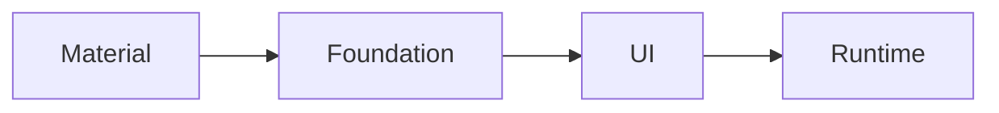

# Compose architectural layer

- [Layer](#layer)
- [Design Principles](#design-principles)

컴포즈는 단일 프로젝트가 아닌, 여러 모듈들이 모여 완전한 스택을 형성합니다.  
컴포즈를 구성하는 다양한 모듈을 이해하면 아래 내용을 이해하는데 도움이 됩니다.

- 앱이나 라이브러리를 구축하기 위해 적절한 수준의 추상화를 사용할 수 있습니다.
- 더 많은 제어 또는 사용자 정의를 위해 낮은 수준으로 내려갈 수 있는 시점을 이해할 수 있습니다.
- 의존성을 최소화할 수 있습니다.

## Layer

> - Compose 4개 계층은 하위 계층 순으로 `Runtime`, `UI`, `Foundation`, `Material`으로 구성
>   - `Runtime` : UI 관리가 아닌, Composable 트리 구조 및 상태 관리
>   - `UI` : UI 요소 기본 설정 및 개념 제공
>   - `Foundation` : 특정 디자인 시스템 종속이 아닌, 자체적인 디자인 시스템 구축 기반 제공
>   - `Material` : Material 디자인 적용을 위한 구현체 제공

---

컴포즈는 다음과 같이 4개의 계층으로 구성되어 있습니다.



각 계층은 하위 수준 위에 구축되어, 기능을 결합하여 상위 수준의 컴포넌트를 만듭니다.  
또한 하위 계층의 API를 기반으로 모듈의 경계를 검증하고 필요한 경우에 어떤 계층이든 교체할 수 있도록 합니다.

### Runtime

이 모듈은 `remember`, `mutableStateOf`, `@Composable`, `SideEffect`와 같은 컴포즈 런타임의 기본적인 부분을 제공합니다.
UI가 아닌, 컴포즈의 트리를 관리하는 기능만 필요한 경우, 이 계층 위에 직접 구축하는 것을 고려할 수 있습니다.

### UI

UI 계층은 여러 모듈(`ui-text`, `ui-graphics`, `ui-tooling` 등)로 구성됩니다.  
이 모듈들은 `LayoutNode`, `Modifier`, 입력 핸들러, 사용자 정의 레이아웃, 그리기 등 UI 툴킷의 기본 개념들을 구현합니다.

이와 같이 UI 툴킷의 기본 개념들만 필요한 경우, 이 계층 위에 직접 구축하는 것을 고려할 수 있습니다.

### Foundation

이 모듈은 디자인 시스템에 독립적인 컴포즈 UI의 빌딩 블록을 제공합니다.  
예를 들어 `Row`, `Column`, `LazyColumn`, 특정 제스처 인식 등이 포함됩니다.

자체적인 디자인 시스템을 만들고 싶은 경우에 `Foundation` 계층 위에 구축하는 것을 고려할 수 있습니다.

### Material

이 모듈은 컴포즈 UI를 위한 Material 디자인 시스템의 구현체를 제공합니다.  
여기에는 테마 시스템, 스타일이 적용된 컴포넌트, 리플 효과, 아이콘 등이 포함됩니다.

앱에서 Material 디자인을 사용하고자 할 때 이 계층을 기반으로 구축하는 것을 고려할 수 있습니다.

---

## Design Principles

> - Compose는 작고 기능에 초점을 맞춘 조각(Composables)들을 조립하여 사용하는것을 지향하며 다음 이점을 지님
>   - Control : 낮은 수준의 컴포넌트는 더 자유로운 구현이 가능함
>   - Customization : 낮은 수준의 컴포넌트들은 더 쉬운 커스텀마이징이 가능함
>   - Picking the right abstraction : 높은 수준의 컴포넌트가 제공하는 BestPractice를 제공받으며 조립이 가능함

---

컴포즈의 지향점은 몇 개의 거대한 모놀리식 컴포넌트 대신,
작고 초점이 맞춰진 기능성 조각들을 제공하고 이를 조립(혹은 구성)할 수 있도록 하는 것을 지향하고 있습니다.

또한 이러한 접근 방식은 다음과 같은 이점을 지닙니다.

### Control

높은 수준의 컴포넌트는 많은 기능을 제공하지만, 직접적인 제어를 많이 할 수 없습니다.  
이처럼 컴포넌트에 더 많은 제어가 필요하다면 더 낮은 수준의 컴포넌트를 사용해야 합니다.

예를 들어, 컴포넌트의 색상을 애니메이션으로 처리하고 싶다면 `animateColorAsState`를 사용할 수 있습니다.

```kotlin
val color = animateColorAsState(
    if (condition) Color.Green else Color.Red
)
```

그러나 이후에 컴포넌트가 항상 회색으로 시작되기를 원한다면, 높은 수준의 API인 `animateColorAsState`로 구현할 수 없습니다.  
대신, 더 낮은 수준의 `Animatable`을 사용할 수 있습니다.

```kotlin
val color = remember { Animatable(Color.Gray) }

LaunchedEffect(condition) {
    color.animateTo(
        if (condition) Color.Green else Color.Red
    )
}
```

이처럼 높은 수준의 `animateColorAsState`는 낮은 수준의 `Animatable` 위에 구축되어 있습니다.  
이처럼 더 낮은 수준의 API를 사용하는 것은 더 복잡하지만 더 많은 제어를 할 수 있게됩니다.

### Customization

더 작은 컴포넌트에서 더 높은 수준의 컴포넌트를 조립함으로써, 필요에 따라 컴포넌트를 쉽게 커스텀마이징 할 수 있습니다.  
아래는 'Material 계층'에 의해 제공되는 `Button`의 구현입니다.

```kotlin
@Composable
fun Button(
    // …
    content: @Composable RowScope.() -> Unit
) {
    Surface(/* … */) {
        CompositionLocalProvider(/* … */) {
            ProvideTextStyle(MaterialTheme.typography.button) {
                Row(
                    // …
                    content = content
                )
            }
        }
    }
}
```

위 코드와 같이 `Button`은 4개의 컴포넌트로 조립됩니다.

1. `Surface` : Background, Shape, Click Event 등을 제공
2. `CompositionLocalProvider` : `Button`이 활성화되거나 비활성화될 때 `content` 알파값 변경
3. `ProvideTextStyle` : 기본 TextStyle 설정
4. `Row` : `content`에 대한 기본 레이아웃 정책 제공

`Button` 컴포넌트는 위 4개의 컴포넌트를 조립하여 구현하기에 코드 길이가 40줄 정도 밖에 되지 않으며 어떤 파라미터를 사용할 수 있는지 명확하게 제공합니다.  
이와 같이 '파라미터의 명확성'은 커스텀마이징을 가능하게 하면서, 너무 많은 파라미터로 인해 컴포넌트 사용의 복잡성이 늘어나는 것을 방지합니다.  
예를 들어 'Material 컴포넌트'들은 'Material 디자인 시스템'에 명시된 커스텀마이징을 제공하여 'Material 디자인 원칙'을 따르기 쉽게 만들어 줍니다.

그러나 컴포넌트의 파라미터를 넘어서는 커스텀마이징이 필요하다면, 더 낮은 수준의 컴포넌트를 분기(fork)해야 합니다.  
예를 들어, 'Material 디자인'은 `Button`이 단색 배경을 가져야 한다고 규정하고 있습니다.
하지만 그라데이션 배경이 필요하다면, 이는 `Button`의 파라미터로는 지원되지 않기에 `Button` 구현을 참조로 자신만의 컴포넌트를 만들어야 합니다.

```kotlin
@Composable
fun GradientButton(
    // …
    background: List<Color>,
    modifier: Modifier = Modifier,
    content: @Composable RowScope.() -> Unit
) {
    Row(
        // …
        modifier = modifier
            .clickable(onClick = {})
            .background(
                Brush.horizontalGradient(background)
            )
    ) {
        CompositionLocalProvider(/* … */) { // set material LocalContentAlpha
            ProvideTextStyle(MaterialTheme.typography.button) {
                content()
            }
        }
    }
}
```

위의 구현은 'Material 계층'의 컴포넌트들, 예를 들어 현재 `content`의 Alpha 값과 TextStyle과 같은 'Material'의 개념들을 계속 사용합니다.
그러나 'Material' `Surface`를 `Row`로 교체하고 원하는 외관을 얻기 위해 다시 스타일링 합니다.

주의할 점으로 더 낮은 계층으로 내려가 컴포넌트를 커스텀마이징 시, 원본 컴포넌트의 기능적인 측면을 유지하는 것이 중요합니다.

만약, 'Material 디자인' 개념을 전혀 사용하지 않고, 완전히 개발자 커스텀마이징 디자인 시스템을 구축하고 싶다면,
'Foundation' 계층의 컴포넌트만을 사용하여 더 낮은 수준으로 내려가야 합니다.

```kotlin
@Composable
fun BespokeButton(
    // …
    backgroundColor: Color,
    modifier: Modifier = Modifier,
    content: @Composable RowScope.() -> Unit
) {
    Row(
        // …
        modifier = modifier
            .clickable(onClick = {})
            .background(backgroundColor)
    ) {
        // No Material components used
        content()
    }
}
```

컴포즈는 가장 높은 수준의 컴포넌트들에게 가장 간단한 이름을 할당합니다.  
예를 들어 `androidx.compose.material.Text`는 `androidx.compose.foundation.text.BasicText`에 기반을 둔 것입니다.
이는 더 높은 수준의 컴포넌트를 대체하고자 할 때, 가장 발견하기 쉬운 이름으로 커스텀마이징을 제공할 수 있게 합니다.

그러나 주의할 점으로, 컴포넌트를 분기(fork) 한다는 것은 향후 상위 컴포넌트에서 이루어지는 기능 추가, 버그 수정 등의 이점을 받을 수 없게 됩니다.

### Picking the right abstraction

계층화되고 재사용 가능한 컴포넌트를 구축하는 컴포즈의 철학은 항상 더 낮은 수준의 컴포넌트를 사용해야 하는 것은 아닙니다.  
더 높은 수준의 컴포넌트들은 더 많은 기능을 제공할 뿐만 아니라 [접근성 지원](#supporting-accessibility)과 같은 Best Practices를 제공합니다.

예를 들어 커스텀마이징 컴포넌트에 제스처 기능을 추가하고 싶은 경우 `Modifier.pointerInput`을 사용해 처음부터 직접 구현할 수 있지만,
이 위에 구현된 더 높은 수준의 컴포넌트들이 이미 `Modifier.draggable`, `Modifier.scrollable` 등과 같이
더 상위 호환 기능을 제공하는 경우가 있어 더 좋은 출발점이 될 수 있습니다.

즉, 필요한 기능을 제공하는 가장 높은 수준의 컴포넌트를 기반으로 조립하여 그들이 포함하는 Best Practices 혜택을 받는 것을 선호해야 합니다.

---

---

---

### Supporting Accessibility

UI에 대해 '장애를 가진' 사람들에게도 사용하기 쉽게 만들어진 원칙

- 스크린 리더를 통한 Content 읽기
- '색약', '색맹' 등의 색상에 민감한 사람들을 위한 색상 지원 