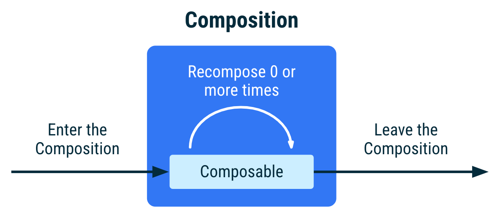
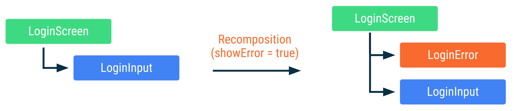
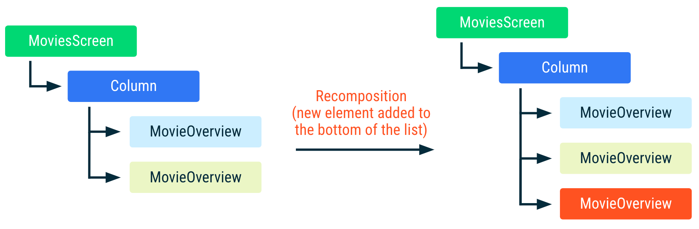
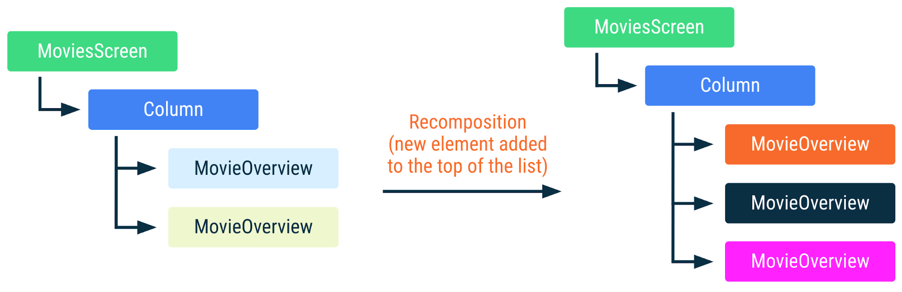
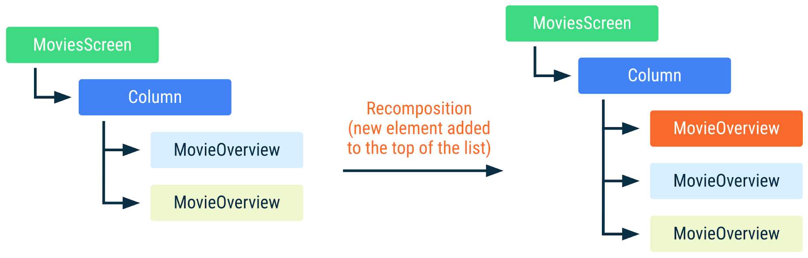

# Composable 생명주기

> - `Composition`은 'initial Composition'에 의해 생성되고, 'ReComposition'에 의해만 업데이트 될 수 있음
> - 'ReComposition'의 트리거는 `State<T>` 객체의 변경
> - 컴포즈는 `State<T>`를 읽는 `Composition`을 추적하여 Composable을 다시 실행하도록 할 수 있음
> - Composable Lifecycle
    >

1. 컴포즈는 'initial Composition' 시 `Composition`에 컴포저블을 추가

> 2. 상태 변경 시 `Composition`에 해당 상태를 사용중인 컴포저블을 추적하여 다시 실행, `Composition`을 업데이트
     >

3. 더 이상 필요하지 않거나 조건에 따라 제거되면 `Composition`을 떠남

`Composition` 단계는 컴포저블을 실행하여 앱의 UI 트리를 생성합니다.

컴포즈는 'initial composition' 단계에서 실행되는 컴포저블을 모두 추적합니다.  
그런 다음 추적되고 있는 컴포저블에 상태가 변경되면 컴포즈는 'ReComposition'을 예약합니다.

'ReComposition'은 컴포즈가 상태 변경에 응답하여 변경될 수 있는 컴포저블을 다시 실행하고, 변경 사항을 반영하여 `Composition`을 업데이트 하는 것을 말합니다.

`Composition`은 'initial Composition'에 의해만 생성되고, 'ReComposition'에 의해만 업데이트 될 수 있습니다.  
즉, `Composition`을 수정하는 유일한 방법은 'ReComposition'을 통해서만 가능합니다.



컴포저블의 생명주기는 위 표와 같이 정의될 수 있습니다.

1. Composition 진입
2. 0회 이상 ReComposition
3. Composition 떠나기

컴포저블을 'initial Composition' 시 `Composition`에 추가(enter)되고,   
그 후 상태 변경이나 다른 요인에 의해 1번 이상 재구성될 수 있습니다.(recomposed 0 or more times)  
마지막으로 더 이상 필요하지 않거나 조건에 따라 제거되어 Composition을 떠납니다. (leave)

'ReComposition'은 일반적으로 `State<T>` 객체의 변경에 의해 트리거됩니다.  
컴포즈는 `State<T>`를 추적하고, 해당 `State<T>`를 읽는 `Composition` 내의 모든 컴포저블을 실행합니다.  
그리고 그 컴포저블들이 호출하는 다른 컴포저블들 중 [건너 뛸 수 없는 컴포저블](#recomposition-시-건너-뛸-수-없는-composable)들도 실행됩니다.

> 만약 컴포저블이 더 복잡한 라이프사이클 가진 외부 리소스와 상호 작용하거나 괸리가 필요한 경우 Effects를 사용해야 합니다.

---

## Anatomy of a composable in Composition

> - Compose-Compiler는 [call site](#호출-위치call-site)를 통해 `Composition` 내부의 Composable 인스턴스를 구분함
> - 'ReComposition' 중 이전과 동일한 Composable 인스턴스는 재사용됨 (즉, 'ReComposition' 회피)
> - 'call site'로 구분되는 Composable 인스턴스는 Composable의 Identity를 유지하게 해주며, 이는 SideEffect 관리에 유용함

`Composition` 내의 컴포저블 인스턴스는 [call site](#호출-위치call-site)에 의해 식별되며 컴포즈 컴파일러는 각 'call site'를 별개로 취급합니다.  
즉, 다수의 'call site'에서 컴포저블을 호출하면 `Composition` 내에 여러 인스턴스가 생성됩니다.

'ReComposition' 중 컴포저블이 이전 `Composition` 때와 다른 컴포저블을 호출하면,
컴포즈는 어떤 컴포저블이 호출되었는지 않았는지를 파악하고, 전∙후 `Composition`에서 모두 호출된 컴포저블에 대해서 입력이 변경되지 않았다면 'ReComposition'을 회피합니다.

컴포저블 인스턴스의 'Identity' 유지는 `Side-Effect`를 관리하는데 중요합니다.
'Identity'가 유지되면 각 컴포저블은 자신의 `Side-Effect`를 올바르게 관리하고 추적할 수 있습니다.
이로 인해 'ReComposition'이 발생해도 `Side-Effect` 작업이 중단되거나 재시작되는 것을 방지하고, 성공적으로 완료될 수 있게 됩니다.

```kotlin
@Composable
fun LoginScreen(showError: Boolean) {
    if (showError) {
        LoginError()
    }
    LoginInput() // 이 호출 위치는 LoginInput이 Composition 내에서 배치되는 위치에 영향을 미칩니다
}

@Composable
fun LoginInput() { /* ... */
}

@Composable
fun LoginError() { /* ... */
}
```

위의 코드에서, `LoginScreen`은 조건문을 통해 `LoginError`를 호출하고 항상 `LoginInput`을 호출합니다.   
**각 호출은 고유한 'call site'를 지니며, 컴포즈 컴파일러는 이를 통해 고유하게 식별할 수 있습니다.**



위 그림은 `showError` 상태가 변경되어 'ReComposition'이 발생되면 `LoginScreen`을 표현한 것 입니다.  
비록 `LoginInput`의 'call site'가 변경되었지만, 상태에 영향을 받지 않기에 `LoginInput` 컴포저블의 인스턴스는 재구성을 거쳐도 유지됩니다.

---

## Add extra information to help smart recompositions

> - 동일한 'call site에서 Composable을 여러 번 호출하면 ('실행 순서'(index) + 'call site')를 통해 각 Composable의 인스턴스를 구별함
    >

- 리스트 내 'call site' 변경이 없고, 동일한 파리미터를 사용하는 새로운 요소가 리스트 하단으로 계속 추가되면 `Composition` 내의 Composable 인스턴스 재사용 가능

> - 그러나 리스트의 순서가 섞이는 순간, 리스트 내 Composable 인스턴스들의 'call site'가 변경되어 리스트에서 사용 중인 Composable 인스턴스 모두가 'ReComposition'됨
    >

- 이처럼 리스트 순서가 섞여도 Composable 인스턴스를 재사용하고 싶다면, `key` 컴포저블을 사용할 수 있음

> - `key` 컴포저블은 특정 코드 부분을 구별할 수 있는 고유 값('Identity')을 설정하도록 하는 역할
    >

- 이 고유 값은 전역적일 필요는 없고, 같은 'call site'에서 호출되는 다른 컴포저블들 사이에서만 고유하면 됨

`N`번 호출된 컴포저블은 `Composition` 내에 `N`번 추가됩니다.

만약 같은 'call site'에서 컴포저블을 여러 번 호출하면, 컴포즈는 각 호출을 고유하게 식별할 수 있는 정보가 없습니다.  
따라서 실행 순서와 'call site'를 함께 사용하여 각 컴포저블의 인스턴스를 구별합니다.

이러한 동작은 때로 필요할 수 있지만, 일부 상황에서는 원치 않는 동작을 초래할 수 있습니다.

```kotlin
@Composable
fun MoviesScreen(movies: List<Movie>) {
    Column {
        for (movie in movies) {
            // MovieOverview Composable은 for 루프 내의
            // index 위치에 따라 Composition에 배치됩니다
            MovieOverview(movie)
        }
    }
}
```

위 코드를 보면, 컴포즈는 'call site'와 실행 순서를 함께 사용하여 `Composition`에서 컴포저블 인스턴스를 구분합니다.

만약 새로운 `movie`가 리스트 하단에 추가되면, 컴포즈는 이미 `Composition` 내에 있는 컴포저블 인스턴스를 재사용할 수 있습니다.
왜냐하면 해당 컴포저블 인스턴스들의 리스트 내 'call site'가 변경되지 않았고, 따라서 그들의 `movie` 입력도 동일하기 때문입니다.



그러나 만약 영화 목록이 리스트의 상단 또는 중간에 추가되거나, 항목이 제거되거나 순서가 변경된다면, 입력 파라미터의 위치가 리스트에서 변경된 모든 `MovieOverview` 호출에서 'ReComposition'이
발생합니다.

이는 특히, `MoviewOverview`가 SideEffect를 사용하여 영화 이미지를 불러오는 경우에 중요해집니다.
만약 SideEffect 진행 중에 'ReComposition'이 발생하면, 해당 SideEffect는 취소되고 다시 새롭게 시작됩니다.

```kotlin
@Composable
fun MovieOverview(movie: Movie) {
    Column {
        // 만약 MovieOverview가 재구성되면서 이미지를 가져오는 중이라면,
        // 이는 취소되고 다시 시작됩니다.
        val image = loadNetworkImage(movie.url)
        MovieHeader(image)

        /* ... */
    }
}
```



위 그림처럼 리스트 상단에 새로운 요소가 추가될 때 `Composition` 내의 `MoviesScreen`을 나타냅니다.

리스트 상단에 추가되므로 `MoviewOverview` 컴포저블을 재사용할 수 없고 모든 SideEffect들이 다시 시작됩니다.  
또한 'ReComposition'이 일어나 모든 `MovieOverview`들이 'ReComposition' 되었음을 알 수 있습니다.

---

이상적으로 `MovieOverview` 컴포저블의 'Identity'는 해당 컴포저블 파라미터인 `movie`의 'Identity'와 연결되어야 합니다.   
즉, 영화 목록의 순서를 바꾼다면, 그에 따라 컴포저블도 새로 정렬되는 것이 좋습니다.   
이렇게 하면 각 `MovieOverview` 컴포저블을 다른 `movie` 데이터로 다시 그릴 필요가 없습니다.

이를 가능하게 하기 위해서 컴포즈에서는 `key` 컴포저블을 제공 합니다.  
`key` 컴포저블은 특정 코드 부분을 구별할 수 있는 고유한 값인 'Identity'를 설정하도록 하는 역할을 합니다.

예를 들어, `movie` 데이터를 `key` 컴포저블에 전달하면, 그 `movie` 데이터를 가지고 그려지는 `MovieOverview` 컴포저블은 그 `movie`에 고유하게 연결됩니다.   
이렇게 하면 영화 목록의 순서가 바뀌더라도, 각 `MovieOverview` 컴포저블은 자신에게 연결된 `movie` 데이터를 그대로 유지하게 됩니다.
따라서 목록 순서가 바뀌어도 다시 그릴 필요가 없게 됩니다.

이 'Identity'는 전역적으로 고유할 필요는 없고, 같은 'call site'에서 호출되는 다른 컴포저블들 사이에서만 고유하면 됩니다.

```kotlin
@Composable
fun MoviesScreenWithKey(movies: List<Movie>) {
    Column {
        for (movie in movies) {
            key(movie.id) { // `movie`에 대한 고유 ID
                MovieOverview(movie)
            }
        }
    }
}
```



위와 같이 영화 목록의 순서가 뒤바뀌더라도, 각 `MovieOverview` 컴포저블 인스턴스를 재사용하고, SideEffect를 계속 실행할 수 있습니다.

즉, 리스트의 순서가 변경되어도, 각 `MovieOverview` 컴포저블 인스턴스가 그대로 유지되며, 'ReComposition'을 피할 수 있게 됩니다.

만약, `List<T>`형태의 타입일 경우 다음과 같이 사용할 수 있습니다.

```kotlin
@Composable
fun MoviesScreenLazy(movies: List<Movie>) {
    LazyColumn {
        items(
            item = movies,
            key = { movie -> movie.id }
        ) { movie ->
            MovieOverview(movie)
        }
    }
}
```

---

## Skipping if the inputs haven't changed

> - `Composition`에 Composable이 존재하고, Composable의 모든 '입력 값이 변경되지 않았고' '안정적인 타입'이라면 'ReComposition'을 건너뛸 수 있음
> - Compose에서 'Stable Type'은 다음을 준수함
>   - 같은 두 인스턴스에 대해 `equals()` 결과가 항상 동일해야 함
>   - 'public properties type'이 변경될 때 `Composition`에 알려야 함
>   - 모든 'public properties type'이 안정적이어야 함
>   - primitive type (`Boolean`, `Int`, `Long`, `Float`, `Char` 등)
>   - 문자열 (`String`)
>   - 모든 함수 타입 (lambda)
> - Compose에서 `MutableState<T>`은 'Stable Type'으로 간주함
> - Composable의 파라미터 타입이 모두 'Stable Type'이라면, UI 트리에서 Composable 위치를 기준으로 `equlas()`를 통해 동일성을 비교하여 값에 변경이 없다면 'ReComposition' 회피 가능
> - `@Stable`을 통해 개발자가 임의의 타입을 'Stable Type'으로 Compose에게 알릴 수 있음
>   - 그럼에도 `@Stable`의 값이 변경되면 'ReComposition' 발생

이미 컴포저블이 `Composition`에 있고 모든 입력 값이 변경되지 않았고 안정적인 타입이라면 **'ReComposition'을 건너뛸 수 있습니다.**

안정적인 타입은 다음의 규약을 준수해야 합니다.

| 규약         | 설명                                                                                                                                             |
|------------|------------------------------------------------------------------------------------------------------------------------------------------------|
| 동일성        | 같은 두 인스턴스에 대해 `equals()` 결과는 항상 동일해야 합니다.</br>이 규약은 값의 안전성과 일관성을 보장합니다.                                                                        |
| 변경 통보      | 타입의 공개 속성이 변경될 때마다 `Composition`에 알려야 합니다. </br>예를 들어, `MutableState`는 값이 변경될 때 알립니다. 이는 컴포즈가 어떤 값이 변경되었는지를 알고, 필요한 경우에만 해당 부분을 재구성할 수 있게 합니다. |
| 속성 타입의 안정성 | 모든 공개 속성 타입 역시 안정적이어야 합니다. </br>예를 들어, 클래스의 모든 속성이 불변 타입인 경우, 그 클래스는 안정적인 것으로 간주할 수 있습니다.                                                      |

또한 컴포즈 컴파일러는 몇가지 타입을 안정적이라 판단하며, `@Stable`을 명시하지 않아도 괜찮습니다.

- 모든 기본 값 타입: `Boolean`, `Int`, `Long`, `Float`, `Char` 등
- 문자열 (`String`)
- 모든 함수 타입 (lambda)

이처럼 불변 타입은 절대로 변하지 않으므로, `Composition`에 변경을 알릴 필요가 없기에 안정적인 규약을 쉽게 따를 수 있습니다.

---

컴포즈의 `MutableState` 타입은 불변 타입이 아니지만, 안정적인 타입으로 간주됩니다.

만약 어떤 값이 `MutableState`에 저장되어 있다면, 컴포즈는 `State` 객체의 `.value` 속성이 변경되면 알림을 받습니다.
따라서 `MutableState` 객체는 안정적인 타입으로 간주됩니다.

또한 컴포저블에 전달되는 모든 타입이 안정적이라면, 이 값들은 UI 트리에서 컴포저블의 위치를 기준으로 동일성을 비교할 수 있습니다.
이전 호출 이후 모든 값이 변경되지 않았다면, 'ReComposition'을 건너뛸 수 있습니다.

> 컴포즈는 모든 입력 값이 안정적이고 변경되지 않았다면 컴포저블의 'ReComposition'을 건너뜁니다.   
> 이 비교에는 `equals()`을 사용합니다.

---

컴포즈는 타입이 안정적임을 증명할 수 있을 때만 그 타입을 안정적으로 간주합니다.  
일반적으로 컴포즈는 `interface`를 안정적이지 않은 타입으로 취급합니다.
왜냐하면 `interface`는 그 자체로 구현이 없으며, 여러 다른 구현체들이 있을 수 있기 때문입니다.
이 때문에 컴포즈는 `interface`의 내용이 언제든지 바뀔 수 있다고 생각합니다.

만약 컴포즈가 타입이 안정적임을 추론할 수 없지만, 개발자가 안정적으로 취급하도록 강제하고 싶다면 해당 타입에 `@Stable` 어노테이션을 붙여주면 됩니다.

`interface`에 `@Stable` 어노테이션 붙으면, 컴포즈는 이 인터페이스를 안정적이라고 판단합니다.   
즉, 이 `interface`의 구현체들이 바뀌지 않는다고 알릴 수 있습니다.

```kotlin
@Stable
interface UiState<T : Result<T>> {
    val value: T?
    val exception: Throwable?

    val hasError: Boolean
        get() = exception != null
}
```

위 코드에서 `@Stable` 어노테이션이 붙은 `UiState`는, 컴포즈에게 이 인터페이스를 안정적이라고 알리는 역할을 합니다.  
이로 인해 컴포즈는 `UiState`가 파라미터 타입으로 사용될 때 모든 구현체를 안정적으로 간주합니다.

즉, `UiState`를 구현하는 모든 클래스들의 인스턴스는 변경되지 않는다는 가정하에 컴포즈는 'ReComposition'을 수행하게 됩니다.

---

---

---

### ReComposition 시 건너 뛸 수 없는 Composable

컴포즈는 성능 최적화를 위해 불필요한 'ReComposition'을 최대한 회피하며 상태가 변경될 때 상태를 읽는 컴포저블만 'ReComposition'됩니다.

그런데 이 상태를 읽고 있는 컴포저블이 다른 컴포저블을 호출한다면, 호출되는 컴포저블도 'ReComposition'의 대상이 될 수 있습니다.  
이런 상황에서 'ReComposition'의 대상이 되는 컴포저블은 다음과 같음

1. 상태가 자식 컴포저블 내부에서 변경된 경우, 그 자식 컴포저블을 건너뛸 수 없음
2. 부모 컴포저블에서 전달되는 프로퍼티가 변경되었다면, 그 프로퍼티를 사용하는 자식 컴포저블은 건너뛸 수 없음
3. 다른 외부 조건이나 리소스에 의존하는 컴포저블인 경우

### 호출 위치(call site)

컴포저블이 호출되는 소스 코드의 위치입니다.  
'Call Site'는 컴포저블이 `Composition` 내에서 어디에 위치할지, 즉 UI 트리가 어떻게 형성될지 영향을 미칩니다.