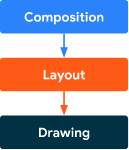

# Compose - Phases

다른 UI 툴킷과 마찬가지로, Compose는 여러 단계를 거쳐 프레임을 렌더링합니다.  
`Android View`시스템을 보면, 측정(Measure), 레이아웃(Layout), 그리기(Drawing)의 세 가지 주요 단계가 있습니다.   
Compose는 유사하게, 시작 부분에 구성(Composition)이라는 중요한 단계가 있습니다.

---

## Frame의 세 가지 단계

Compose는 세 가지 주요 단계를 가집니다.

| 단계              | 요약              | 설명                                                                                                       |
|-----------------|-----------------|----------------------------------------------------------------------------------------------------------|
| 구성(Composition) | 어떤 UI를 보여줄 것인가  | Compose는 Composable을 실행하고 UI의 설명을 생성합니다.                                                                 |
| 레이아웃(Layout)    | UI를 어디에 배치할 것인가 | 이 단계는 측정과 배치라는 두 단계로 이루어져 있습니다. 레이아웃 요소는 자신과 모든 하위 요소를 2D 좌표로 측정하고 배치합니다. 이 과정은 레이아웃 트리의 각 노드에 대해 수행됩니다. |
| 그리기(Drawing)    | 어떻게 렌더링할 것인가    | UI 요소는 보통 기기 화면인 캔버스에 그려집니다. 각 UI 요소는 캔버스에 그리는 명령을 발행하며, 이는 그래픽 드라이버가 해석하여 화면에 렌더링 됩니다.                  |



위 단계들의 순서는 대게 동일하며, `Data 입력 → Composition → Layout → Drawing` 으로 이어져 하나의 `프레임(Frame)`을 생성합니다.
이것을 [UDF](../용어.md#단방향-데이터-흐름) 라고도 합니다.  
`BoxWithConstraints`, `LazyColumn` 및 `LazyRow` 등은 예외적인 경우로 개발자들의 확인이 필요합니다.  
이들의 경우, 자식 요소의 구성(Composition)은 부모 요소의 레이아웃(Layout) 단계에 따라 달라집니다.

위 세 단계는 거의 모든 프레임에 대해 가상으로 이루어진다고 생각하면 됩니다.  
그러나 성능 최적화를 위해, Compose는 동일한 데이터 입력에서 동일한 결과를 도출하는 반복 작업을 하지 않습니다.   
Compose는 이전 결과를 재사용 할 수 있는 경우에는 Composable을 실행하지 않고, 전체 트리를 다시 레이아웃(Layout)하거나 그릴(Drawing) 필요가 없는 경우 생략합니다.

따라서 Compose는 UI 업데이트에 필요한 최소한의 작업만 수행하게 됩니다. 이러한 최적화는 Compose가 각 단계에서의 상태 변화를 추적하기 때문에 가능한 것입니다.

---

## 상태(State) 읽기
위에 나열된 3가지 단계 중 하나에서 상태(State) 값을 읽을 때, Compose는 자동으로 언제 값을 읽었는지 추적합니다.
이런 추적 덕분에 상태(State) 값이 바뀌면 읽는 코드를 다시 실행할 수 있으며, 이 덕분에 **state observability** 기반을 형성 할 수 있습니다.

- [구성](#단계-1-composition-구성) 단계에서 상태 값이 변경되면, 해당 상태를 읽는 모든 composable들이 다시 실행되어 최신 상태를 반영한 새로운 UI를 생성하게 됩니다. 
- [레이아웃](#단계-2-layout-레이아웃) 단계에서 상태 값이 변경되면, 그 변경이 레이아웃에 영향을 주는 경우 해당 레이아웃을 재계산하게 됩니다.
- [그리기](#단계-3-drawing-그리기) 단계에서 상태 값의 변경이 UI를 그리는데 영향을 줄 경우, 해당 부분을 다시 그릴 수 있습니다.

> 즉, Compose 런타임 시스템은 위 세 단계에서 상태 값의 변경을 실시간으로 감지하고 반응하여, 항상 최신의 상태를 화면에 반영하도록 합니다.

상태는 주로 [mutableStateOf()](../UI%20Architecture/State와%20Compose.md#mutablestate)를 사용하여 생성하고, `value` 속성에 직접 접근하거나, `Property delegate`를 사용하여 접근합니다.

```kotlin
// property delegate 없이 읽기
val paddingState: MutableState<Dp> = remember { mutableStateOf(8.dp) }
Text(
    text = "Hello",
    modifier = Modifier.padding(paddingState.value)
)

// property delegate 사용하여 읽기
var padding: Dp by remember { mutableStateOf(8.dp) }
Text(
    text = "Hello",
    modifier = Modifier.padding(padding)
)
```

`Property Delegate`의 내부에서는 `getter`와 `setter` 함수가 State의 `value`에 접근하고 업데이트하는 데 사용됩니다.   
이 `getter`와 `setter` 함수들은 속성을 값으로 **참조할 때만 호출**되며, **생성될 때는 호출되지 않습니다**. 그래서 위 두 가지 방법은 동등합니다.

### 재시작 범위 (re-start scope)
재시작 범위는 Compose에서 **특정 상태를 읽은** `Code Block`을 가리키며 상태 값이 변경될 때 재실행 될 수 있음을 말합니다.

각각의 `Composition`, `Layout`, `Drawing` 단계에서 상태를 읽는 모든 코드 블록을 추적하고, 해당 상태가 변경될 때 해당 코드 블록을 재실행합니다.

---

## 상태 값을 읽는 순서

Compose에는 세 가지 주요 단계가 있으며, 각 단계에서 어떤 상태가 읽혔는지를 Compose가 추적합니다. 
이를 통해 Compose는 UI의 특정 요소에 영향을 주는 작업을 수행해야 하는 특정 단계만을 알릴 수 있습니다.

> 상태 인스턴스가 어디서 생성되고 저장되는지는 단계에 거의 영향을 주지 않습니다. 중요한 것은 **상태 값을 언제, 어디서 읽는지**입니다.

### 단계 1: Composition (구성)
`@Composable` 함수 또는 람다 블록 내에서 읽힌 상태는 구성과 그 후의 단계에 영향을 줍니다.   
상태 값이 변경되면, `re-composer`는 해당 상태 값을 읽는 모든 composable 함수의 재실행을 예약합니다.   
입력이 변경되지 않았다면 런타임은 일부 또는 모든 composable 함수를 건너뛸 수 있습니다.

구성의 결과에 따라 Compose UI는 레이아웃과 그리기 단계를 실행합니다.   
내용이 동일하고 크기 및 레이아웃이 변경되지 않는다면 이러한 단계를 건너뛸 수 있습니다.

```kotlin
var padding by remember { mutableStateOf(8.dp) }
Text(
    text = "Hello",
    // modifier가 생성될 때 구성 단계에서 padding 상태를 읽음
    // padding의 변경은 재구성 호출
    modifier = Modifier.padding(padding)
)
```

### 단계 2: Layout (레이아웃)
레이아웃 단계는 측정과 배치라는 두 단계로 구성되며 각각 UI 요소의 크기와 위치를 결정합니다.

#### 측정 (Measurement)
- 이 단계에서는 각 요소의 크기가 결정됩니다. 
- `Layout` Composable에서 `measurePolicy` 함수를 실행하거나, `LayoutModifier` 인터페이스의 `MeasureScope.measure` 메서드를 실행하는 등의 방법으로 수행됩니다. 
- 측정 단계에서는 각 레이아웃 요소가 주어진 제약 조건 내에서 필요한 공간을 얼마나 차지하는지 계산합니다.

#### 배치 (Placement)
- 이 단계에서는 각 요소의 위치가 결정됩니다. 
- 레이아웃 함수의 배치 블록을 실행하거나 `Modifier.offset { … }`의 람다 블록을 실행하는 등의 방법으로 수행됩니다. 
- 배치 단계에서는 각 레이아웃 요소가 화면 상에서 어디에 위치해야 하는지 계산합니다.

이러한 각 단계에서 상태 값이 읽히면, 그 결과는 레이아웃 단계와 그 이후의 그리기 단계에 영향을 줄 수 있습니다. 
상태 값이 변경되면, Compose UI는 레이아웃 단계를 다시 수행하도록 예약합니다. 또한, 크기나 위치가 변경되었다면 그리기 단계도 실행됩니다.

측정 단계와 배치 단계는 별도의 [재시작 범위](#재시작-범위-re-start-scope)를 가지므로, 배치 단계에서 읽힌 상태는 그 이전의 측정 단계를 다시 호출하지 않습니다. 
그러나 이 두 단계는 종종 얽혀 있으므로, 배치 단계에서 읽힌 상태는 측정 단계에 속하는 다른 재시작 범위에 영향을 줄 수 있습니다.

```kotlin
var offsetX by remember { mutableStateOf(8.dp) }
Text(
    text = "Hello",
    modifier = Modifier.offset {
        // offset이 계산될 때 레이아웃 단계의 배치 단계에서 offsetX 상태를 읽음
        // offsetX 변경은 레이아웃 단계 다시 시작
        IntOffset(offsetX.roundToPx(), 0)
    }
)
```

### 단계 3: Drawing (그리기)
그리기 단계는 Compose에서 가장 마지막 단계로, 실제 화면에 UI를 렌더링하는 작업을 수행합니다.   
이 단계에서는 캔버스(Canvas)에 UI 요소를 그리는 작업이 이루어집니다.  
캔버스는 2D 그래픽을 그릴 수 있는 하나의 표면을 나타내며, 보통 디바이스 화면이 이에 해당합니다.

이 단계에서는 상태 값을 읽는 작업이 이루어집니다.  
일반적인 예로 `Canvas()`, `Modifier.drawBehind`, `Modifier.drawWithContent` 등이 있습니다.   
상태 값이 변경되면 Compose UI는 그리기 단계만을 다시 실행합니다. 이러한 동작은 상태 읽기를 통해 감지되며, 상태 값이 변경될 때마다 특정 그리기 동작이 재실행됩니다.

```kotlin
var color by remember { mutableStateOf(Color.Red) }
Canvas(modifier = modifier) {
    // 캔버스가 렌더링될 때 그리기 단계에서 `color` 상태를 읽음
    // color 변경은 그리기를 다시 시작
    drawRect(color)
}
```

