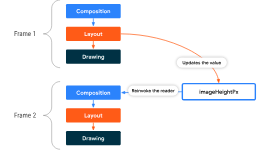

# Compose - Phases

다른 UI 툴킷과 마찬가지로, Compose는 여러 단계를 거쳐 프레임을 렌더링합니다.

Android View 시스템을 보면 아래 주요 단계가 있습니다.


위 Android View 시스템과 유사하지만, 컴포즈는 시작 부분에 `Composition` 단계가 있습니다.

---

## Frame의 세 가지 단계

> - `Composition`은 컴포저블을 실행하여 UI 요소에 속성을 설정하고 UI 트리에 요소를 추가하여 UI 트리를 출력
> - `Layout`은 UI 트리를 순회하고 각 UI 요소의 크기를 결정하고 배치
> - `Drawing`은 각 UI 요소에 `onDraw()`를 호출하여 UI 요소를 렌더링

Compose는 다음 세 가지 주요 단계를 가집니다.


위 단계처럼 `Data 입력 → Composition → Layout → Drawing → UI` 형태로 이어져 하나의 `프레임(Frame)`을 생성합니다.  
이를 [UDF](../용어.md#단방향-데이터-흐름) 라고도 합니다.

> `BoxWithConstraints`, `LazyColumn`, `LazyRow` 등의 경우  
> 자식 요소의 Composition은 부모 요소의 Layout 단계에 따라 달라질 수 있습니다.

`Composition -> Layout -> Drawing`의 단계는 대부분의 모든 프레임에 대해서 가상으로 이루어진다고 볼 수 있지만,  
**컴포즈는 성능 최적화를 위해 동일한 `Data 입력`을 통한 동일한 결과를 도출하는 작업은 하지 않습니다.**

컴포즈는 이전 결과를 재사용할 수 있으면 컴포저블을 실행을 건너뛰고, 전체 UI 트리를 다시 `Layout` 또는 `Drawing` 할 필요가 없는 경우 생략할 수 있습니다.
이런 최적화는 컴포즈가 각 단계에서 상태 변화를 추적할 수 있기 때문에 UI 업데이트 시 최소한의 작업만 할 수 있는 것 입니다.

예를 들어 컴포즈는 각 단계에서 상태를 추적하여 UI를 업데이트할 때 필요한 작업을 최소화 할 수 있습니다.

- `Composition` :  사용자가 입력한 텍스트를 읽을 수 있음
- `Layout` : 뷰의 크기를 읽을 수 있음
- `Drawing` : 뷰의 색상을 읽을 수 있음

사용자가 텍스트를 입력하면 컴포즈는 `Composition` 단계에서 상태를 확인하며, `Layout` 단계와 `Drawing` 단계에서는 이전에 확인한 상태를 재사용할 수 있습니다.
따라서 컴포즈는 `Composition` 단계에서만 상태를 확인하면 됩니다.

---

## 상태(State) 읽기

`Composition`, `Layout`, `Drawing` 단계 중 하나에서 `Snapshot state`의 값을 확인하면, 컴포즈는 상태를 확인할 때 무엇을 하고 있었는지 자동으로 추적합니다.  
이러한 상태 추적은 상태 값이 변경될 때 컴포저블 코드를 다시 실행할 수 있게 하며, 이는 컴포즈에서 상태 관찰 기능의 기반을 형성합니다.

`Snapshot State`는 일반적으로 `mutableStateOf()`를 통해 생성되고, 다음 2가지 방법 중 하나를 통해 접근할 수 있습니다.

- `value` 프로파티를 통한 직접 접근
- `by` Property Delegate를 사용

```kotlin
val paddingState: MutableState<Dp> = remember { mutableStateOf(8.dp) }
val padding: Dp by remember { mutableStateOf(8.dp) }

println(paddingState.value)
println(padding)
```

`Property Delegate`의 내부에서는 `getter`와 `setter` 함수가 State의 `value`에 접근하고 업데이트하는 데 사용됩니다.   
이 `getter`와 `setter` 는 속성을 값으로 **참조할 때만 호출**되며, **생성될 때는 호출되지 않습니다**. 그래서 위 두 가지 방법은 동등합니다.

---

## Phases state reads

> - 컴포즈는 3가지 단계에서 어떤 상태를 확인하는지 자동으로 추적할 수 있으며, 이를 통해 특정 단계만을 실행하도록 알릴 수 있음
> - 중요한 점은 `SnapshotState`가 생성되는 지점이 아닌, 어디서 확인(읽는)하는지 이며, 이를 통해 컴포즈가 상태를 추적하도록 함
> - Composable or Composable Block에서 상태를 확인하면 `Composition - Layout - Drawing` 3 단계에 영향을 미침
    >
- 상태 값이 변경된 경우 리컴포저는 해당 상태 값을 읽은 모든 컴포저블 함수를 다시 실행하도록 예약
>   - 만약 상태 값이 변경되지 않았다면 런타임은 일부 또는 모든 Composable 함수를 건너뛸 수 있음
>   - `Composition` 결과에 따라 `Layout - Drawing`을 실행하지만, UI 요소의 크기나 레이아웃이 변경되지 않았다면 건너뛸 수 있음
> - '측정'과 '배치' 단계에서 상태를 확인하면 `Layout - Drawing` 단계에 영향을 미칠 수 있음
    >
- '측정'에서 상태를 Layout 컴포저블에 전달된 `measurePolicy`, `LayoutModifier` 인터페이스의 `MeasureScope.measure` 메서드 등에서 사용한 경우
>   - '배치'에서 상태를 Layout 컴포저블의 배치 블록, `Modifier.offset { … }`의 람다 블록 등에서 사용하는 경우
> - '측정'과 '배치' 단계는 별도의 재시작 범위를 가지지만, [서로 얽혀있기에 서로의 재시작 범위에 영향을 줄 수 있음](#측정과-배치-서로의-영향)
> - UI를 그리는 중 상태를 확인하면 `Drawing` 단계만 영향을 줌
    >
- `Canvas`, `Modifier.drawBehind`, `Modifier.drawWithContent` 등의 그리기 코드에서 상태를 사용하는 경우

컴포즈의 3가지 주요 단계가 있고, 각 단계에서 어떤 상태를 확인했는지 컴포즈가 자동으로 추적합니다.  
이를 통해 컴포즈는 특정 UI 요소에 영향을 주는 작업을 수행해야 하는 특정 단계만을 알릴 수 있습니다.

> 중요한 점은 `snapshot state`가 어디에서 생성되고 저장되는지가 아닌, 언제 어디서 읽혔는지입니다.


---

### 단계 1: Composition (구성)

'컴포저블'이나 '컴포저블 람다 블록'에서 상태를 확인하면 `Composition-Layout-Drawing` 세 가지 단계에 영향을 미칠 수 있습니다.

상태 값이 변경될 경우 리컴포저(Recomposer)는 해당 상태 값을 읽은 모든 컴포저블 함수를 다시 실행하도록 예약합니다.  
만약 상태 값이 변경되지 않았다면 런타임은 일부 또는 모든 컴포저블 함수를 건너뛸 수도 있습니다.

컴포즈 UI는 `Composition` 결과에 따라 `Layout`과 `Drawing` 단계를 실행하지만,
UI 트리의 UI 요소가 동일하고 크기 및 레이아웃이 변경되지 않았다면 `Layout`과 `Drawing` 단계를 건너뛸 수 있습니다.

```kotlin
var padding by remember { mutableStateOf(8.dp) }
Text(
    text = "Hello",
    // modifier가 생성될 때 Composition 단계에서 padding 상태를 읽음
    // padding의 변경은 Re-Composition 호출
    modifier = Modifier.padding(padding)
)
```

### 단계 2: Layout (레이아웃)

`Layout` 단계는 2가지 단계로 구성됩니다.

- 측정 단계 : Layout 컴포저블에 전달된 `measurePolicy`를 실행하거나, `LayoutModifier` 인터페이스의 `MeasureScope.measure` 메서드 등이 실행됩니다.
- 배치 단계 : Layout 컴포저블의 배치 블록, `Modifier.offset { … }`의 람다 블록 등이 실행됩니다.

위처럼 '측정'과 '배치' 단계에서의 상태 확인은 `Layout-Drawing` 단계에 영향을 미칠 수 있습니다.  
상태 값이 변경되면, 컴포즈 UI는 `Layout` 단계를 예약하며, 크기나 위치가 변경된 경우 `Drawing` 단계도 실행합니다.

추가로 '측정' 단계와 '배치' 단계는 별도의 [재시작 범위](#재시작-범위-re-start-scope)를 가집니다.   
이는 '배치' 단계에서의 상태 확인을 하여도 '측정' 단계를 다시 실행하지 않음을 의미합니다.

그러나, 실제 동작 시 서로 긴밀하게 연결되어 있을 수 있어서 '배치' 단계에서 상태를 읽으면, 이것이 '측정' 단계에 속한 다른 재시작 범위에 영향을 미칠 수 있습니다.

#### '측정'과 '배치' 서로의 영향

예를 들어 사용자가 버튼을 누르는 경우 텍스트의 내용이 변경되는 이벤트가 있다고 하면, 이 상태 변경은 '배치' 단계에서 읽혀집니다.  
이 상태 변경으로 인해 '배치' 단계는 재실행되며, 이로인해 텍스트의 길이가 변경되는 경우 '측정' 단계의 결과에도 영향을 미칠 수 있습니다.  
즉, 텍스트가 길어져 `Text` 컴포넌트의 크기가 커져야 하는 상황이 발생되는 경우 입니다.

이처럼 '배치' 단계에서 읽힌 상태 변경이 '측정' 단계의 다른 재시작 범위에 영향을 주는 것입니다.  
이렇게 볼 때, 두 단계는 별도의 재시작 범위를 가지고 있지만, 실제로는 서로에게 영향을 미칠 수 있다는 것을 알 수 있습니다.

```kotlin
var offsetX by remember { mutableStateOf(8.dp) }
Text(
    text = "Hello",
    modifier = Modifier.offset {
        // offset이 계산될 때 Layout 단계의 '배치' 단계에서 offsetX 상태를 읽음
        // offsetX 변경은 Layout 단계 다시 시작
        IntOffset(offsetX.roundToPx(), 0)
    }
)
```

### 단계 3: Drawing (그리기)

UI를 그리는 중에 상태를 읽으면 `Drawing` 단계에 영향을 미칩니다.  
상태 값이 변경되면 해당 상태 값을 읽는 그리기 코드가 다시 실행되며, 그 결과 UI 요소의 시각적 표현이 업데이트 됩니다.  
(그리기 코드의 예로는 `Canvas()`, `Modifier.drawBehind`, `Modifier.drawWithContent` 등이 있습니다.)

즉, 상태가 변경되었을 떄 `Drawing` 단계만 재실행하는 것은 `Composition` 단계를 거치지 않아도 되므로 자원을 절약할 수 있어 효율적이며,
`Drawing` 단계에서 애니메이션과 다른 시각적 전환을 부드럽게 처리할 수 있어 사용자에게 더 좋은 UX를 제공할 수 있게 됩니다.

```kotlin
var color by remember { mutableStateOf(Color.Red) }
Canvas(modifier = modifier) {
    // 캔버스가 렌더링될 때 Drawing 단계에서 `color` 상태를 읽음
    // color 변경은 그리기를 다시 시작
    drawRect(color)
}
```

---

## Optimizing state reads

컴포즈는 지역화된 상태 읽기를 추적하며, 각 상태를 적절한 단계에서 확인하므로 수행되는 작업을 최소화 할 수 있습니다.

예를 들어, 최종 레이아웃 위치를 오프셋하는 `Modifier.offset`을 사용하여 스크롤 시 패럴랙스 이펙트를 나타내려 합니다.

```kotlin
Box {
    val listState = rememberLazyListState()

    Image(
        // ...
        // Non-optimal implementation!
        Modifier.offset(
            with(LocalDensity.current) {
                // State read of firstVisibleItemScrollOffset in composition
                (listState.firstVisibleItemScrollOffset / 2).toDp()
            }
        )
    )

    LazyColumn(state = listState) {
        // ...
    }
}
```

위 코드는 원하는 이펙트가 나오지만, 최적의 성능을 내지 못합니다.  
위 코드는 `firstVisibleItemScrollOffset` 상태를 읽고, `Modifier.offset(offset: Dp)`에 전달합니다.  
스크롤 시 `firstVisibleItemScrollOffset` 상태가 변경되고, 컴포즈는 상태 읽기를 추적하여 코드를 다시 시작(재호출)할 수 있습니다.
여기서는 `Box` 람다가 재실행됩니다.

위와 같은 방법은 `Composition` 단계에서 상태를 읽는 것처럼 실제로 데이터 변경이 새로운 UI를 다시 만드는 `Re-Composition`의 기초로 볼 수 있습니다.

그러나 위 예시는 최적화를 할 수 있습니다.
위 예제는 UI 데이터가 변경되지 않고 오직 어디에 표시되는지만 변경되기만 하면 되기에 상태를 읽는 단계를 `Layout` 단계에서만 다시 트리거하도록 최적화할 수 있습니다.

이를 `Modifier.offset`을 람다 파라미터를 통해 호출하는 방식으로 변경하면 `Layout` 단계에서 상태를 읽고 추적할 수 있도록 변경할 수 있습니다.

```kotlin
Box {
    val listState = rememberLazyListState()

    Image(
        // ...
        Modifier.offset {
            // State read of firstVisibleItemScrollOffset in Layout
            IntOffset(x = 0, y = listState.firstVisibleItemScrollOffset / 2)
        }
    )

    LazyColumn(state = listState) {
        // ...
    }
}
```

이렇게 변경되면 더 이상 `Composition-Layout-Drawing` 단계로 Re-Composition이 발생하지 않고 `Layout-Drawing` 단계만 실행되게 되기에 더 최적화 될 수 있습니다.

이처럼 상태 읽기를 가능한 한 '낮은' 단계에서 수행하면 컴포즈가 덜 일하게 되므로 성능이 향상됩니다.

그러나 상황에 따라 `Composition` 단계에서 상태를 읽을 필요가 있을 수도 있습니다.
이런 경우에는 `derivedStateOf` 같은 API를 사용하여 상태 변경을 필터링하고 Re-Composition을 최소화하는 방법도 있습니다.

---

## ReComposition Loop

컴포즈의 3가지 단계는 순서대로 실행되며, 동일한 프레임(Frame) 내에서는 이전 단계로 갈 수 없습니다.  
그러나 이것이 다른 프레임 간 Composition Loop를 막는 것은 아닙니다. 

```kotlin
Box {
    var imageHeightPx by remember { mutableStateOf(0) }

    Image(
        painter = painterResource(R.drawable.rectangle),
        contentDescription = "I'm above the text",
        modifier = Modifier
            .fillMaxWidth()
            .onSizeChanged { size ->
                // Don't do this
                imageHeightPx = size.height
            }
    )

    Text(
        text = "I'm below the image",
        modifier = Modifier.padding(
            top = with(LocalDensity.current) { imageHeightPx.toDp() }
        )
    )
}
```

이 예제는 단일 프레임에서 '최종 레이아웃'에 도달하지 못한다는 문제점이 있습니다.  
이 코드는 여러 프레임이 발생하게 하여 불필요한 작업을 수행하고, 사용자 화면에서 UI가 불규칙하게 움직입니다.

각 프레임을 거쳐 어떤 일이 일어나는지 살펴보면 다음과 같습니다.

첫 번째 프레임의 `Composition` 단계에서, `imageHeightPx`는 `0`의 값을 가지고, `Text`는 `Modifier.padding(top = 0)`을 제공받습니다.   
그 다음 `Layout` 단계가 이어지고, `Modifier.onSizeChanged`의 콜백이 호출됩니다.  
이때 `imageHeightPx`는 `Image`의 실제 높이로 업데이트되며 동시에 컴포즈는 다음 프레임에 대한 Re-Composition을 예약합니다.  
`Drawing` 단계에서, 값 변경이 아직 반영되지 않았기 때문에 `Text`는 `padding = 0`으로 렌더링됩니다.

`imageHeightPx`의 상태 값 변경에 의해 예약된 두 번째 프레임이 컴포즈에 의해 시작됩니다.   
상태는 `Box` 콘텐트 블록에서 읽히고, `Composition` 단계에서 호출됩니다.  
이번에는 `Text`가 `Image` 높이와 일치하는 패딩을 제공받습니다.  
`Layout` 단계에서 코드는 `imageHeightPx`의 값을 다시 설정하지만, 값이 동일하므로 Re-Composition이 예약되지 않습니다.

마지막에는 원하는 패딩이 `Text`에 적용되지만, 패딩 값을 다른 단계로 다시 전달하기 위해 추가 프레임을 사용하는 것은 비효율적입니다. 
이로 인해 내용이 겹치는 프레임이 생성될 것입니다.

이 문제의 핵심은 하나의 프레임 내에서 레이아웃을 결정하지 못하고, 패딩 값이 업데이트 되기 위해서는 추가적인 프레임이 필요하다는 것입니다. 
이는 레이아웃 계산에 불필요한 시간을 소모하며, 사용자에게는 화면에서 내용이 잠깐 겹치는 현상을 느끼게 할 수 있습니다. 
따라서, 이러한 구현 방식은 최적화가 필요하며 피해야 합니다.




---

### 재시작 범위 (re-start scope)

재시작 범위는 컴포즈에서 **특정 상태를 읽은** `Code Block`을 가리키며 상태 값이 변경될 때 재실행 될 수 있음을 말합니다.

각각의 `Composition`, `Layout`, `Drawing` 단계에서 상태를 읽는 모든 코드 블록을 추적하고, 해당 상태가 변경될 때 해당 코드 블록을 재실행합니다.
