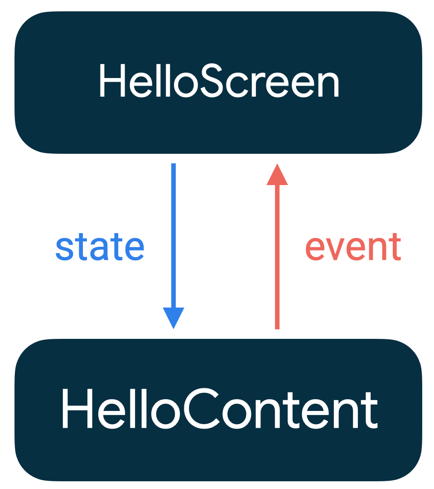

# Compose State

## 목차

- [State and composition](#state-and-composition)
- [State in composbles](#state-in-composables)
- [Other supported types of state](#other-supported-types-of-state)
- [State hoisting](#state-hoisting)

---

변수가 시간에 따라 변할 수 있는 모든 값을 앱의 `State`(상태)라고 합니다.  
모든 Android 앱은 사용자에게 어떤 형태의 '상태'를 보여주며, 다음과 같은 몇가지 예시가 있습니다.

- 네트워크 연결이 끊어졌을 때 나타나는 SnackBar
- 블로그 포스트와 그에 딸린 댓글들
- 사용자가 클릭했을 때 재생되는 버튼의 Ripple 애니메이션
- 사용자가 이미지 위에 그릴 수 있는 스티커

---

## State and composition

> - Compose는 선언형 UI 프레임워크로 UI가 어떻게 보여야 하는지를 기술
> - Compose UI 업데이트 : 상태 업데이트 → ReComposition 발생 → Composition 업데이트 → Composable 재실행

컴포즈는 선언형 UI 프레임워크로 UI가 어떻게 보여야 하는지를 기술합니다.  
이 때문에 컴포즈 UI를 업데이트하는 유일한 방법은 파라미터를 '상태' 값으로 사용하는 동일한 컴포저블을 새로운 인자로 다시 호출하는 것 입니다.

이처럼 어떤 상태가 업데이트 되면 'ReComposition'이 됩니다.
그 결과로 컴포즈의 `TextField`와 같은 컴포저블은 명령형 XML 기반 뷰처럼 자동으로 업데이트되지 않고 새로운 상태 값을 명시적으로 알려줘야 합니다.

```kotlin 
@Composable
private fun HelloContent() {
    Column(modifier = Modifier.padding(16.dp)) {
        Text(
            text = "Hello!",
            modifier = Modifier.padding(bottom = 8.dp),
            style = MaterialTheme.typography.bodyMedium
        )
        OutlinedTextField(
            value = "",
            onValueChange = { },
            label = { Text("Name") }
        )
    }
}
```

위 코드를 실행하고 텍스트를 입력하면 아무런 반응도 일어나지 않음을 알 수 있습니다.   
그 이유는 `TextField`가 자체적으로 업데이트되지 않기 때문입니다.

`TextField`는 `value` 파라미터가 변경될 때 업데이트 됩니다.
이는 컴포즈에서 `Composition`과 `ReComposition`이 어떻게 작동하는지를 알면 이해할 수 있습니다.

- Composition : 컴포즈가 컴포저블을 실행할 때 구축되는 UI의 Description
- Initial composition : 처음으로 컴포저블을 실행하여 `Composition`을 생성하는 것
- ReComposition : 데이터 입력이 변경될 때 `Composition`을 업데이트하기 위해 컴포저블을 다시 실행하는 것

---

## State in composables

> - `remember` 사용 시 `Intial composition` 중 `Composition`에 저장되는 Composable 함수 안에 저장됨
    >
- ReComposition 시 `remember` 객체를 재사용 할 수 있어 성능 향상이 가능
>   - 단, `Composition`에서 Composable 함수가 '제거'되면 거기에 종속된 `remember` 객체도 사라짐
>   - Configuration Change 발생 시 `remember` 객체는 상태 유지 불가능, `rememberSaveable` 객체는 상태 유지 가능
> - `mutableStateOf` 사용 시 `MutableState<T>` 생성, 이는 Compose-Runtime이 '관찰 가능한 상태' 객체
    >
- `MutableState`의 값을 변경하면 이를 관찰하는 모든 Composable에 Compose-Runtime이 자동으로 `ReComposition` 예약

---

### remember API

컴포저블 함수는 `remember` API를 사용하여 객체를 메모리에 저장할 수 있습니다.

`remember`에 의해 메모리에 저장된 값(객체)는 `Initial composition` 중에 `Composition`에 저장됩니다.  
이 후 `ReComposition` 중에 `remember`에 저장된 값을 재사용 할 수 있습니다.  
또한 `remember`는 가변(mutable) 및 불변(immutable) 객체 모두를 저장할 수 있습니다.

`remember`는 컴포저블 함수에 종속되어 `Composition`에 객체를 저장하기에 해당 컴포저블이 `Composition`에서 제거되면 `remember` 객체도 제거 됩니다.

---

### mutableStateOf

`mutableStateOf`는 관찰이 가능한 `MutableState<T>`를 생성하는데, 이는 Compose-Runtime과 통합된 관찰 가능한 타입입니다.

```kotlin
interface MutableState<T> : State<T> {
    override var value: T
}
```

즉, `MutableState`의 값이 변경되면, 이 값을 관찰(사용) 하고 있는 모든 컴포저블이 `ReComposition` 되도록 Compose-Runtime이 자동으로 예약 처리해줍니다.

예시로 `ExpandingCard`의 경우, `expanded` 파라미터가 변경될 때마다, `ExpandingCard`가 `ReComposition` 됩니다.

컴포저블에서 `MutableState` 객체를 선언하는 방법은 다음과 같습니다.  
(추가로 `by` Delegate 문법을 사용하려면 다음과 같은 `import`가 필요합니다.)

```kotlin
import androidx.compose.runtime.getValue
import androidx.compose.runtime.setValue

val mutableState = remember { mutableStateOf(default) }
var value by remember { mutableStateOf(default) }
val (value, setValue) = remember { mutableStateOf(default) }
```

`remember` 객체를 다른 컴포저블의 파라미터로 사용하거나, 어떤 컴포저블이 표시 유뮤를 결정하는 로직의 일부로 사용할 수 있습니다.  
예를 들어, 이름이 비어 있다면 인사말을 표시하지 않기 위해 상태를 `if` 조건문에서 사용할 수 있습니다.

```kotlin
@Composable
fun HelloContent() {
    Column(modifier = Modifier.padding(16.dp)) {

        var name by remember { mutableStateOf("") }

        if (name.isNotEmpty()) {
            Text(
                text = "Hello, $name!",
                modifier = Modifier.padding(bottom = 8.dp),
                style = MaterialTheme.typography.bodyMedium
            )
        }
        OutlinedTextField(
            value = name,
            onValueChange = { name = it },
            label = { Text("Name") }
        )
    }
}
```

`remember` 객체는 `ReComposition`을 거쳐도 상태를 유지하지만, '설정 변경(디바이스 회전)'이 발생되면 상태를 유지하지 못합니다.  
이런 경우 `rememberSaveable`을 사용할 수 있습니다.

`rememberSaveable`은 `Bundle`에 저장될 수 있는 어떠한 값을 자동으로 저장합니다.  
특별한 타입의 데이터를 저장해야 하는 경우, 커스텀 Saver 객체를 통해 저장할 수 있습니다.

`ArrayList<T>` 또는 `mutableListOf()`와 같은 가변 객체를 컴포즈의 상태로 사용하면 잘못된 데이터나 오래된 데이터를 UI로 보게 될 수 있습니다.  
즉, 가변 객체는 관찰이 불가능하기에 컴포즈에 의해 관찰되지 않으며, 상태가 변경 되어도 `ReComposition`이 발생되지 않습니다.
이 대신 관찰 가능한 데이터 홀더(`State<List<T>>`, `listOf()`)를 사용하는 것을 권장하고 있습니다.

---

## Other supported types of state

> - `Flow` or `LiveData` 등 관찰 가능한 타입을 `State<T>`로 변환 가능하며 반드시 Composable 내부에서 변환해야 함
    >
- 외부에서 `State<T>`로 변환한 뒤 Composable로 전달하면, `State<T>`의 변화를 감지하지 못해 `ReComposition`이 발생하지 않음
>   - [produceState](https://developer.android.com/reference/kotlin/androidx/compose/runtime/package-summary#produceState(kotlin.Any,kotlin.coroutines.SuspendFunction1))
      를 사용하여 `State<T>`를 생성할 수 있음
> - Stateful Composable : `remember`를 통해 `State<T>` 객체를 갖는 Composable
> - Stateless Composable : `State<T>`를 가지지 않는 Composable

---

컴포즈는 `State<T>` 저장을 반드시 `MutableState<T>`를 사용해야 하는 것은 아니며, 다른 관찰 가능한 타입들을 지원합니다.  
컴포즈에서 다른 관찰 가능한 타입을 사용하기 전에, `State<T>`가 변경될 때 컴포저블이 자동으로 `ReComposition` 할 수 있도록 `State<T>`로 변환해야 합니다.

컴포즈는 Android 앱에서 일반적으로 사용되는 관찰 가능한 타입으로부터 `State<T>`를 생성하는 함수를 제공합니다.

### Flow

`collectAsStateWithLifeCycle()`은 Android 앱에서 `Flow`를 안전하고 효율적으로 수집되는 권장 방식입니다.  
생명 주기를 고려하여 `Flow`에서 값을 수집하며, `Flow`에서 최근에 방출된 값을 `State` 객체로 변환합니다.

`collectAsState()`는 `collectAsStateWithLifeCycle()`와 유사하게, `Flow`에서 값을 수집하고 이를 `State`로 변환합니다.    
`collectAsStateWithLifeCycle()`는 Android 플랫폼 전용이기에 플랫폼에 구애받지 않는 코드를 작성하려면 `collectAsState()`를 사용하면 됩니다.

### LiveData

`observeAsState()`는 `LiveData`를 관찰하기 시작하고 그 값을 `State`로 변환합니다.

### 주의 사항

컴포즈는 자동으로 `ReComposition을` 하여 UI를 업데이트 합니다.  
따라서 `LiveData`나 다른 관찰 가능한 객체를 `State<T>`로 변환하는 과정은 외부 범위가 아닌 컴포저블 함수 내에서 이루어져야 합니다.

제공되는 `Flow`, `LiveData` 외에도, `produceState` API를 사용하여 `State<T>`를 생성할 수 있습니다.

### Stateful vs Stateless

Stateful 컴포저블은 `remember`를 사용하여 객체를 내부에 저장하여 `State<T>`를 가지는 컴포저블을 말합니다.  
예를 들어 위 예제 중 `HelloContent()`는 내부에서 `name` 상태를 보유하고 수정하기에 Stateful 컴포저블입니다.  
이는 호출자가 `State<T>`를 제어할 필요가 없고, `State<T>`를 스스로 관리할 필요 없이 사용할 수 있도록 합니다.

Stateless 컴포저블은 위와 반대로 `State<T>`를 보유하지 않은 컴포저블을 말합니다.  
Stateless 컴포저블을 만드는 가장 간단한 방법은 'State Hoisting'을 사용하는 것입니다.

---

## State hoisting

> - State hoisting : Stateless Composable로 만들기 위해 `State<T>`를 상위 Composable로 이동시키는 패턴
    >
- Composable안에서 `State<T>`를 생성하지 않고, `value: T`와 `onValueChange: (T) -> Unit` 파라미터로 대체
> - State hoisting 특징
    >
- single source of truth : 동일한 `State<T>` 제공, 일관성 보장
>   - Encapsulated : 'Stateful Composable' 만 `State<T>` 수정 가능, 외부에서 무분별한 수정 방지
>   - Shareable : 하나의 `State<T>`를 여러 Composable에 공유 가능
>   - Interceptable : `State<T>` 변경 전 이벤트 무시 또는 수정 가능
>   - Decoupled : `State<T>` 관리 로직을 `ViewModel`과 같은 다양한 곳에서 할 수 있음
> - 단방향 데이터 흐름 : `State<T>`가 내려가고 `이벤트`가 올라가는 패턴
> - State hoisting 규칙
    >
- UI 트리 구조에서 상태를 사용하는 모든 Composable의 가장 낮은 Composable에 호이스팅 되어야 함
>   - 상태는 변경될 수 있는 가장 높은 Composable까지 호이스팅되어야 함
>   - 같은 이벤트에 변경되는 두 상태는 함께 호이스팅 되어야 함

---

컴포즈에서 'state hoisting'은 컴포저블을 Stateless로 만들기 위해 상태를 컴포저블의 호출자에게 이동시키는 패턴입니다.

컴포즈에서 일반적으로 'state hoisting'을 구현하는 패턴은 컴포저블에서 `State<T>`를 생성하는 대신 2가지 파라미터로 대체하는 것입니다.

- `value: T`: 현재 표시할 값입니다.
- `onValueChange: (T) -> Unit`: 값 변경 요청을 하는 이벤트, `T`는 제안된 새로운 값입니다.

그러나 `onValueChange`로 제한할 필요는 없습니다. 만약 컴포저블이 더 구체적인 이벤트가 필요하다 판단되면,
`ExpandingCard`가 `onExpand`와 `onCollapse`와 같은 람다를 사용하여 정의하는 것처럼 변경하면 됩니다.

이처럼 상태를 끌어올린(state hoisting) 경우 아래와 같은 중요한 특징이 있습니다.

### State hoisting 특징

1. **Single source of truth (단일 공급)** : 중복되지 않은 `State<T>`을 제공하여, 값의 일관성을 보장합니다.

2. **Encapsulated (캡슐화)** : Stateful 컴포저블만이 `State<T>`를 수정할 수 있으므로, 외부에서 무분별한 수정을 방지합니다.

3. **Shareable (공유 가능)** : 끌어올린 `State<T>`는 여러 컴포저블과 공유될 수 있습니다.

4. **Interceptable (가로채기 가능)** : Stateless 컴포저블 호출자는 `State<T>` 변경 전 이벤트를 무시하거나 수정할 수 있습니다.

5. **Decoupled (분리 가능)** : Stateless 컴포저블의 `State<T>` 관리 로직을 `ViewModel`과 같은 다양한 곳에서 할 수 있습니다.

---

아래 예제는 `name`과 `onValueChange`를 `HelloContent()`에서 추출하고, 이를 UI 트리의 상위 레벨로 이동시킵니다.

```kotlin
@Composable
fun HelloScreen() {
    var name by rememberSaveable { mutableStateOf("") }

    HelloContent(
        name = name,
        onNameChange = { name = it }
    )
}

@Composable
fun HelloContent(name: String, onNameChange: (String) -> Unit) {
    Column(modifier = Modifier.padding(16.dp)) {
        Text(
            text = "Hello, $name",
            modifier = Modifier.padding(bottom = 8.dp),
            style = MaterialTheme.typography.bodyMedium
        )

        OutlinedTextField(
            value = name,
            onValueChange = onNameChange,
            label = { Text("Name") }
        )
    }
}
```

이처럼 상태를 끌어올리게 되면, 컴포저블을 더 쉽게 이해할 수 있고, 다양한 상황에서 재사용하거나 테스트하기 쉬워집니다.  
이처럼 `HelloContent`는 상태가 어떻게 저장되는지와 분리됨에 따라, `HelloScreen`을 수정하거나 대체하더라도, `HelloContent`의 구현 방식을 변경할 필요가 없습니다.



`State<T>`가 내려가고 `이벤트`가 올라가는 패턴을 단방향 데이터 흐름(unidirectional data flow)이라고 합니다.

위 경우에 상태는 `HelloScreen`에서 `HelloContent`로 내려가고, 이벤트는 `HelloContent`에서 `HelloScreen`으로 올라갑니다.
이처럼 단방향 데이터 흐름을 따르면, UI에서 `State<T>`를 표시하는 컴포저블과 앱의 `State<T>`를 저장하고 변경하는 부분을 분리할 수 있습니다.

### State hoisting 규칙

상태를 호이스팅할 때, 상태가 어디로 가야하는지 결정하는데 도움이 되는 3가지 규칙이 있습니다.

1. 상태는 그 상태를 사용하는 모든 컴포저블의 가장 낮은 공통 부모 컴포넌트까지 적어도 호이스팅되어야 합니다.
2. 상태는 변경될 수 있는 가장 높은 레벨까지 호이스팅되어야 합니다.
3. 같은 이벤트에 변경되는 두 상태는 함께 호이스팅 되어야 합니다.

---

## Restoring state in Compose

> - `rememberSaveable`은 Android의 `SavedInstanceState` 메커니즘을 이용해 `State<T>`를 유지함
> - `SavedInstanceState` 메커니즘으로 인해 `Bundle`에 추가된 데이터 타입을 자동으로 저장함
> - `rememberSaveable`을 Bundle 외에 저장하는 옵션
>   - `@Parcelize` : 객체를 `Parcelable`로 변환하여 `Bundle`에 추가
>   - `mapSaver` : 객체를 `Bundle`로 변환하여 저장, 복원 시 `Bundle Key`를 통해 `Bundle`에서 객체 복원
>   - `listSaver` : 객체를 `List`로 변환하여 저장, 복원 시 `Key` 대신 인덱스를 `Key`로 사용하여 객체 복원

---

`rememberSaveable` API는 `remember`와 유사하게 동작하여 `ReComposition`시 `State<T>`를 유지합니다.  
이에 더해 Android의 `SavedInstanceState` 메커니즘을 활용해 `Activity` 또는 `Process`가 다시 생성될 때에도 `State<T>`를 유지합니다.

### Ways to store state

`Bundle`에 추가된 모든 데이터 타입은 자동으로 저장됩니다.   
만약 `Bundle`에 추가할 수 없는 것을 저장하고 싶다면 아래와 같은 여러 가지 옵션들이 있습니다.

#### 1. Parcelize

가장 간단한 해결책은 객체에 `@Parcelize` 어노테이션을 추가하는 것입니다.  
이렇게 하면 객체가 `Parcelable`로 변환되어 `Bundle`에 추가될 수 있게 됩니다.

```kotlin
@Parcelize
data class City(val name: String, val country: String) : Parcelable

@Composable
fun CityScreen() {
    var selectedCity = rememberSaveable { mutableStateOf(City(name = "Madrid",country = "Spain")) }
}
```

#### 2. MapSaver

`@Parcelize`가 적용되지 않는 복잡한 객체나 특수한 저장 규칙이 필요한 경우,  
`mapSaver`를 사용하여 객체를 값의 집합으로 변환하는 규칙을 정의하여 `Bundle`에 저장할 수 있습니다. 

```kotlin
data class City(val name: String, val country: String)

val CitySaver = run {
    val nameKey = "Name"
    val countryKey = "Country"
    mapSaver(
        save = { mapOf(nameKey to it.name, countryKey to it.country) },
        restore = { City(it[nameKey] as String, it[countryKey] as String) }
    )
}

@Composable
fun CityScreen() {
    var selectedCity = rememberSaveable(stateSaver = CitySaver) {
        mutableStateOf(City(name = "Madrid", country =  "Spain"))
    }
}
```

#### 3. ListSaver

`Map`의 `Key` 정의를 피하려면, `listSaver`를 사용하여 인덱스를 `Key`로 사용할 수 있습니다.

```kotlin
data class City(val name: String, val country: String)

val CitySaver = listSaver<City, Any>(
    save = { listOf(it.name, it.country) },
    restore = { City(it[0] as String, it[1] as String) }
)

@Composable
fun CityScreen() {
    var selectedCity = rememberSaveable(stateSaver = CitySaver) {
        mutableStateOf(City(name = "Madrid", country =  "Spain"))
    }
}
```

---

## State holders in Compose

> - `State<T>`와 'Composable logic'의 크기가 커지면, 'StateHolder'에게 위임하는 것은 좋은 패턴이 될 수 있음

간단한 'state hoisting'은 컴포저블 함수 자체에서 관리될 수 있습니다.  
그러나 추적해야 할 `State<T>`의 양이 증가하거나 컴포저블 함수에서 수행해야 할 로직이 복잡해지면,   
로직과 `State<T>`를 **StateHolder** 클래스에게 위임하는 것이 좋습니다.

StateHolders(상태 보유자)는 컴포저블의 로직과 상태를 관리합니다.  
또는 StateHolder를 '호이스팅된 상태 객체'로도 부릅니다.

---

## remember 함수 블록 재실행

`remember` API는 `MutableState`와 함께 사용되는 경우가 많습니다.

```kotlin
var name by remember { mutableStateOf("") } 
```

여기서 `remember` 함수를 사용하면 `MutableState` 값이 ReComposition에서도 유지됩니다.

### remember calculation

일반적으로 `remember`는 `calculation` 람다 매개변수를 받습니다.
`remember`가 처음 실행될 때, 이 람다를 호출하고 그 결과를 저장합니다.
ReComposition 도중에 `remember`는 마지막으로 저장된 값을 반환합니다.

상태 캐싱 외에도 `remember`를 사용하여 초기화 하거나 계산하는 데 비용이 많이 드는 Composition 내의 모든 객체나 연산 결과를 저장할 수 있습니다.
이러한 계산을 모든 ReComposition에서 반복하고 싶지 않을 수 있습니다.

아래의 비싼 연산인 `ShaderBrush` 객체를 생성하는 예제를 보시죠.

```kotlin
val brush = remember {
    ShaderBrush(
        BitmapShader(
            ImageBitmap.imageResource(res, avatarRes).asAndroidBitmap(),
            Shader.TileMode.REPEAT,
            Shader.TileMode.REPEAT
        )
    )
}
```

`remember`는 값이 Composition을 떠날 때까지 값을 저장합니다. 하지만, 캐시된 즉, Composable 내부에 저장된 값을 무효화하는 방법이 있습니다.   
`remember`는 `key` 또는 `keys` 매개변수를 받습니다. 이들 중 어떤 것이 변경되면,
다음 ReComposition에서 `remember`는 캐시를 무효화하고 람다 블록 계산을 다시 실행합니다.

아래 예제는 이 메커니즘이 어떻게 작동하는지 보여줍니다.

이 코드에서 `ShaderBrush`가 생성되어 `Box` composable의 `background`로 사용됩니다.   
앞서 설명한 것처럼 `remember`는 `ShaderBrush` 인스턴스를 저장합니다.
이는 `avatarRes`가 선택된 배경 이미지로서 `key1` 매개변수로 `remember`에 전달되기 때문입니다.
만약 `avatarRes`가 변경되면, 브러시는 새 이미지로 recompose되고 `Box`에 다시 적용됩니다.
이는 사용자가 피커에서 다른 이미지를 배경으로 선택했을 때 발생할 수 있습니다.

```kotlin
@Composable
private fun BackgroundBanner(
    @DrawableRes avatarRes: Int,
    modifier: Modifier = Modifier,
    res: Resources = LocalContext.current.resources
) {
    val brush = remember(key1 = avatarRes) {
        ShaderBrush(
            BitmapShader(


                ImageBitmap.imageResource(res, avatarRes).asAndroidBitmap(),
                Shader.TileMode.REPEAT,
                Shader.TileMode.REPEAT
            )
        )
    }

    Box(
        modifier = modifier.background(brush)
    ) {
        /* ... */
    }
}
```

아래 코드에서는 상태가 일반 `state holder class`인 `MyAppState`로 호이스팅됩니다.
이는 `rememberMyAppState` 함수를 통해 클래스 인스턴스를 초기화하는 데 사용됩니다.
이런 함수를 공개하여 ReComposition에서도 유지되는 인스턴스를 생성하는 것은 Compose에서 일반적인 패턴입니다.

`rememberMyAppState`는 `windowSizeClass`를 받아 `remember`의 `key` 매개변수로 사용합니다.
이 매개변수가 변경되면, 앱은 최신 값을 사용하여 `MyAppState`를 다시 생성해야 합니다.
이는 사용자가 스마트폰을 회전하는 등의 경우에 발생할 수 있습니다.

```kotlin
@Composable
private fun rememberMyAppState(
    windowSizeClass: WindowSizeClass
): MyAppState {
    return remember(windowSizeClass) {
        MyAppState(windowSizeClass)
    }
}

@Stable
class MyAppState(
    private val windowSizeClass: WindowSizeClass
) { /* ... */ }
```