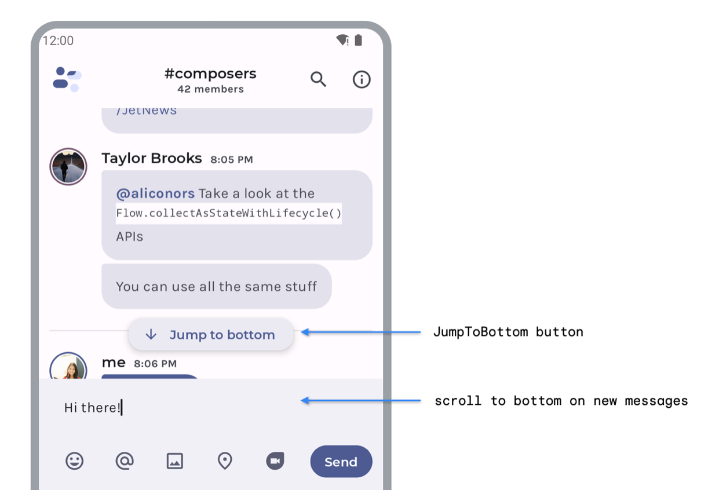
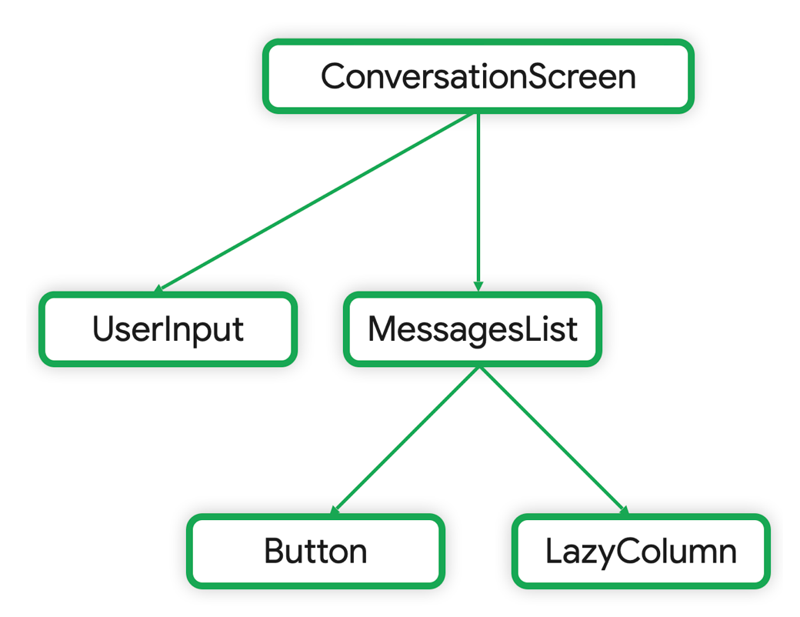

# Where to hoist state

- [Best practice](#best-practice)
- [Types of UI state and UI logic](#types-of-ui-state-and-ui-logic-)


## Best practice

> - 'UI State'는 이를 사용하는 모든 Composable들이 공통되며 가까운 조상에 호이스팅하는 것이 좋음
> - 상태 소유자('UI State'를 갖는 Composable)는 소비자('UI State'를 사용하는 Composable)에게 '불변 상태'와 '상태를 수정하는 이벤트'를 제공해야 함
> - 비즈니스 로직이 관여하는 'UI State'는 `ViewModel`에서 호이스팅 될 수 있음

UI에 사용되는 `State<T>`를 사용하는 모든 컴포저블들의 가장 가까운 공통 조상에 `State<T>`를 끌어올리는(hoist) 것이 좋으며,
이를 읽고 쓰는 모든 컴포저블들에게 가장 가까운 곳에 위치해야 합니다.

상태 소유자(State owner)는 변하지 않는 상태(ImmutableState)와 `State<T>`를 수정하기 위한 이벤트를 소비자(상태를 사용하는 컴포저블)에게 공개해야 합니다.

또한 가장 가까운 공통 상위 컴포저블은 컴포저블 외부에도 위치할 수 있습니다.  
예를 들어 비즈니스 로직이 관여하는 경우 `ViewModel`에서 `State<T>`를 끌어올릴 수 있습니다.

---

## Types of UI state and UI logic 

> - UI State : UI를 설명하는 properties
>   - Screen UI state : 화면에 표시 할 데이터를 나타내며, 일반적으로 다른 계층('Domain', 'Data')과 연결됨
>   - UI element state : UI 요소의 속성을 나타내며, StateHolderClass 또는 Composable의 속성(글꼴, 사이즈, 색상 등)을 나타냄 
> - logic : 앱의 로직은 비즈니스 로직과 UI 로직으로 나뉨
>   - 비즈니스 로직 : 앱이 필요한 '데이터'를 얻기 위한 구현
>   - UI 로직 : 화면에 'UI State'를 어떻게 표시할 것인지와 관련이 있음

### UI State

'UI State'는 UI를 설명하는 속성으로 2가지 종류가 있습니다.

- **Screen UI State** : '화면에 표시해야 할 데이터'를 나타냅니다. 
  - 예를 들어 `NewsUiState` 클래스는 UI를 렌더링하기 위해 필요한 뉴스 기사와 기타 정보를 포함할 수 있습니다.
  - `NewsUiState`는 일반적으로 '앱의 Data'를 포함하기에 다른 계층과 연결됩니다.

- **UI element state** : UI 요소가 어떻게 렌더링되는지에 영향을 주는 UI 요소 자체의 속성을 나타냅니다.
  - UI 요소는 표시되거나 숨겨질 수 있으며, '특정 글꼴', '글꼴 크기', '글꼴 색상' 등을 가질 수 있습니다.
  - 'Android'의 `View`는 `Textview`와 같이 `Text`에 대한 `getText` 및 `setText`를 제공하여 상태를 수정하거나 조회하는 등, 상태를 자체적으로 관리합니다.
  - 컴포즈에서는 `State<T>`가 컴포저블 외부에 있으며, 호출하는 컴포저블 또는 상태 소유자(state holder)로 `State<T>`를 끌어올릴 수 있습니다.
    이에 대한 예시로 `Scaffold` 컴포저블에 대한 `ScaffoldState`가 있습니다.

### logic

앱 로직은 비즈니스 로직과 UI 로직으로 나눌 수 있습니다.

- **비즈니스 로직** : 앱에 필요한 '데이터'를 얻기 위한 구현입니다.
  - 예를 들어 뉴스 탭에서 기사를 '즐겨찾기' 하는 이벤트에서 '즐겨찾기'를 기록하는 로직은 보통 DB에 저장하고 이러한 로직들은 Domain 또는 Data 계층에 위치합니다.
  - 상태 소유자(state holder)는 Domain 또는 Data 계층들에서 제공하는 메서드를 호출하여 로직을 위임합니다.

- **UI 로직** : 화면에 'UI State'를 어떻게 표시할 것인지와 관련이 있습니다.
  - 카테고리를 선택했을 때 적절한 검색 창 힌트를 얻는 것
  - 목록에서 특정 아이템으로 스크롤하는 것
  - 버튼을 클릭하여 특정 화면으로의 네비게이션 로직

---

## UI logic

> - 다른 Composable이 `State<T>`를 제어할 필요가 없거나, `State<T>`와 'UI logic'이 단순한 경우 Composable 안에서 관리하는 것도 좋음
> - 여러 Composable에서 'UI element state'를 공통으로 사용하면 가장 가까운 공통 Composable에 호이스팅 하는 것이 좋음
>   - 하위 Composable에서 `State<T>`를 파라미터로 사용 시, 기본 값을 적용하면 UI Test와 Preview에 유용 
> - Composable이 1~N개의 `State<T>`를 포함하는 복잡한 UI 로직을 다룰 때, 'StateHolderClass'로 위임하는 것은 좋은 패턴임
>   - 'StateHolderClass'은 Composable-Lifecycle을 따르기에 `Composition` 안에서 생성 및 저장
>   - `rememberNavController()`, `rememberLazyListState()`와 같이 상위 수준 Composable의 복잡성을 낮추기 위해 사용 

---

UI 로직이 `State<T>`를 사용할 때 UI 생명 주기에 따라 `State<T>`에 스코프를 지정해줘야 합니다. 

이를 위해서 적절한 수준의 컴포저블 안에 `State<T>`를 호이스팅 하거나,  
UI 생명 주기와 맞게 스코프가 지정된 'StateHolder'에서 이를 수행할 수 있습니다.

### Composable as state owner

`State<T>`와 로직이 단순한 경우 UI 로직과 'UI element state'를 컴포저블 내부에 두는 것도 좋은 방식입니다.  
또한 `State<T>`를 필요에 따라 호이스팅 할 수 있는 조건을 갖출 수 있습니다.

### No state hoisting needed

항상 `State<T>`를 호이스팅 할 필요는 없습니다.  
다른 컴포저블이 `State<T>`를 제어할 필요가 없는 경우 컴포저블 내부에 유지할 수 있습니다.

```kotlin
@Composable
fun ChatBubble(message: Message) {
    var showDetails by rememberSaveable { mutableStateOf(false) }

    ClickableText(
        text = AnnotatedString(message.content),
        onClick = { showDetails = !showDetails }
    )

    if (showDetails) Text(message.timestamp)
}
```

위 코드에서 `showDetails`는 **UI element state** 입니다.

이 상태는 이 컴포저블 안에서만 사용되며, 적용되는 로직이 매우 간단합니다.  
따라서 이 경우에 상태를 끌어올리는 것은 큰 이점을 가져다 주지 않으므로, 내부에 유지하는 것이 좋습니다.

이렇게 함으로써 컴포저블은 'StateOwner'이며, `State<T>`의 일관성을 유지할 수 있습니다.

### Hoisting within composable

만약 'UI element state'를 다른 컴포저블과 공유하고 여러 곳에서 UI 로직에 적용해야 한다면, 더 상위 컴포저블로 호이스팅 할 수 있습니다.
이는 컴포저블의 재사용성을 높이고 간편한 테스트를 할 수 있게 합니다.

다음은 두 가지 기능을 구현한 채팅 앱 예시입니다.



- `JumpToBottom` 버튼은 메시지 목록을 맨 아래로 '스크롤'합니다. `Button`은 리스트 상태에 대한 UI 로직을 수행합니다.
- `MessagesList`는 사용자가 새 메시지를 보낸 후 목록을 자동으로 아래로 '스크롤'합니다. `UserInput`은 리스트 상태에 대한 UI 로직을 수행합니다.

이런 경우, 메시지 리스트의 '스크롤 위치 상태'는 `JumpToBottom`과 `MessageList` 컴포저블 양쪽 모두에서 사용되므로,  
이 '스크롤 위치 상태'는 두 컴포저블의 공통 조상에 호이스팅 되어야 합니다.

위 채팅 앱의 컴포저블 구조를 보면 다음과 같습니다.



`LazyColumn`의 `LazyListState`는 `ConversationScreen`으로 호이스팅 되어,  
`State<T>`를 필요로 하는 모든 컴포저블에서 UI 로직을 수행하고 사용되게 할 수 있습니다.


코드를 보면 다음과 같습니다.

```kotlin
@Composable
private fun ConversationScreen() {
    val scope = rememberCoroutineScope()
  
    val lazyListState = rememberLazyListState()
  
    MessageList(
      scope = scope,
      message = message,
      lazyListState = lazyListState
    )
    
    UserInput(
        onMessageSent = { 
            scope.launch { lazyListState.scrollToItem(0)} 
        }
    )
}

@Composable
private fun MessageList(
    scope: CoroutineScope = rememberCoroutineScope(),
    messages: List<Message>,
    lazyListState: LazyListState = rememberLazyListState()
) {
    LazyColumn(state = lazyListState) {
        items(
            item = messages,
            key = { message -> message.id}
        ) { message ->
            Message(message)
        }
    }
  
  JumpToBottom(
      onClick = { 
          scope.launch { lazyListState.scrollToItem(0) }
      }
  )
}
```

`lazyListState`는 필요한 UI 로직을 적용하기 위해 컴포저블 구조에서 필요한 만큼 높은 위치로 호이스팅 됩니다.  
또한 이 'UI element state'는 컴포저블에서 초기화되기에, `Composition`에 저장되어 생명 주기를 따릅니다.

`lazyListState`는 `MessageList` 컴포저블에서 기본 값으로 `rememberLazyListState()`로 정의되어 있습니다.  
이는, 컴포즈에서 흔한 패턴으로 컴포저블의 재사용을 높이고 유연하게 만들어 줍니다.  

대표적으로, 컴포저블을 테스트하거나 `Preview`에 사용하는 것과 같이 상태를 제어할 필요가 없는 다른 컴포저블에서 사용되게 할 수 있습니다.


### Plain state holder class as state owner

컴포저블이 하나 또는 여러 상태를 포함하는 복잡한 UI 로직을 다룰 때, 책임을 'StateHolderClass'로 위임하여 사용해야 합니다.

이렇게 함으로써 컴포저블의 로직을 분리하고 테스트와 유지 보수를 쉽게 할 수 있습니다.  
이런 접근 방식은 관심사 분리 원칙을 지킵니다. (컴포저블은 UI 요소를 출력하는 역할, 'StateHolderClass'는 UI 로직과 'UI element state' 관리)

'StateHolderClass'는 컴포저블 호출자에게 편리한 함수를 제공하여, 호출자가 스스로 UI 로직을 작성할 필요가 없도록 합니다.  
또한 'StateHolderClass'들은 컴포저블의 생명주기를 따르기에 `Composition` 내에서 생성되고 기억됩니다.   
이에 따라 `rememberNavController()` 또는 `rememberLazyListState()`와 같은 컴포즈에서 제공하는 타입의 사용이 가능한 것 입니다.

`LazyListState`는 컴포즈에서 구현된 'StateHolderClass'의 예시로, `LazyColumn` 또는 `LazyRow`의 UI 복잡성을 제어하는데 사용됩니다.

```kotlin
@Stable
class LazyListState constructor(
    firstVisibleItemIndex: Int = 0,
    firstVisibleItemScrollOffset: Int = 0
) : ScrollableState {
    
    private val scrollPosition = LazyListScrollPosition(
        firstVisibleItemIndex, firstVisibleItemScrollOffset
    )

    suspend fun scrollToItem(/*...*/) { /*...*/ }

    override suspend fun scroll() { /*...*/ }

    suspend fun animateScrollToItem() { /*...*/ }
}
```

`LazyListState`는 `LazyColumn`의 상태를 캡슐화하고 '스크롤 위치'를 저장합니다.  
또한 주어진 아이템으로 스크롤하는 것과 같이 스크롤 위치를 수정하는 메서드를 외부에 제공합니다.

이처럼, 컴포저블의 책임이 증가함에 따라 'StateHolder'의 필요성도 증가됩니다.  
책임은 UI 로직에서 발생할 수 있고, 단순히 추적해야 할 `State<T>`의 수에 따라 달라질 수 있습니다.

또 다른 일반적인 패턴읜 앱의 'RootComposable'의 복잡성을 처리하기 위해,   
'StateHolderClass'를 사용하여 앱의 'NavigationState'와 'WindowSize' 등을 캡슐화 할 수 있습니다.

---

## 비지니스 로직

Composable과 plain state holder class가 UI 로직과 UI Element State를 관리합니다.

이와 같이 screen level의 state holder가 존재하는데 이는 다음 역할을 담당합니다.

- 다른 부분에 위치한 애플리케이션의 비즈니스 로직(Domain 및 Data Layer 등)에 대한 접근을 제공합니다.
- 특정 화면에서의 표시를 위해 Data를 준비하는 것이며, 이는 화면 UI State가 됩니다.

### state 소유자로 ViewModel 사용

`ViewModel`의 이점은 화면에서 비즈니스 로직에 대한 접근을 제공하고, 화면에 표시할 데이터를 준비하는데 적합합니다.

UI 상태를 `ViewModel`에서 호이스팅하면, 그 상태는 Composition 밖으로 벗어납니다.


`ViewModel`은 Composition의 일부로 저장되지 않습니다. 이는 프레임워크에 의해 제공되며, 
`Activity`, `Fragment`, `navigation graph`, `destination of navigation graph`와 같은 `ViewModelStoreOwner`에 범위가 지정됩니다.

따라서, `ViewModel`은 UI 상태에 대한 **가장 가까운 공통 조상**이며 신뢰할 수 있는 정보 출처가 됩니다.

### Screen UI State

Screen UI state는 비즈니스 규칙을 적용하여 생성된 데이터를 의미합니다.   
Screen UI state는 일반적으로 특정 화면에 표시되는 정보를 관리하며, 그것이 사용자에게 보여지는 방식을 정의합니다.  

Screen level state holder는 Screen UI state를 관리하는 역할을 합니다. 
이는 주로 `ViewModel`에서 수행되며, 이를 통해 UI State는 앱의 비즈니스 로직과 분리되어 보다 재사용성이 높은 코드를 작성할 수 있습니다.

예를 들어, 아래 채팅 앱의 `ConversationViewModel`는 Screen UI State를 제공하고 이를 변경하는 이벤트를 노출하고 있습니다.

```kotlin
class ConversationViewModel(
    channelId: String,
    messagesRepository: MessagesRepository
) : ViewModel() {

    val messages = messagesRepository
        .getLatestMessages(channelId)
        .stateIn(
            scope = viewModelScope,
            started = SharingStarted.WhileSubscribed(5_000),
            initialValue = emptyList()
        )

    // Business logic
    fun sendMessage(message: Message) { /* ... */ }
}
```
Composable은 `ViewModel`에서 관리하는 Screen UI State를 사용하므로,   
비즈니스 로직에 접근하기 위해 Screen-Level Composable에 `ViewModel` 인스턴스를 주입해야 합니다.

아래 예제는 `ViewModel`이 Screen-Level Composable에서 어떻게 사용되는지 보여줍니다.   
여기서 `ConversationScreen()`은 `ViewModel`에서 Screen UI State를 가져옵니다.

```kotlin
@Composable
private fun ConversationScreen(
    conversationViewModel: ConversationViewModel = viewModel()
) {

    val messages by conversationViewModel.messages.collectAsStateWithLifecycle()

    ConversationScreen(
        messages = messages,
        onSendMessage = { message: Message -> conversationViewModel.sendMessage(message) }
    )
}

@Composable
private fun ConversationScreen(
    messages: List<Message>,
    onSendMessage: (Message) -> Unit
) {

    MessagesList(messages, onSendMessage)
    /* ... */
}
```

### UI Element State

비즈니스 로직이 해당 데이터를 읽거나 쓰는 경우, UI Element State를 Screen Level State Holder로 가져올 수 있습니다.

계속해서 채팅 앱을 예로들어 보죠.

사용자가 `@`와 `힌트`를 입력하면 그룹 채팅에 `사용자 제안`을 표시합니다.   
`사용자 제안`은 Data Layer에서 데이터를 불러오며, 이 데이터를 불러오는 로직은 비즈니스 로직으로 간주됩니다.


이 기능을 구현하는 `ViewModel`은 다음과 같이 구성됩니다:

```kotlin
class ConversationViewModel(/*...*/) : ViewModel() {

    // 상향된 상태
    var inputMessage by mutableStateOf("")
        private set

    val suggestions: StateFlow<List<Suggestion>> =
        snapshotFlow { inputMessage }
            .filter { hasSocialHandleHint(it) }
            .mapLatest { getHandle(it) }
            .mapLatest { repository.getSuggestions(it) }
            .stateIn(
                scope = viewModelScope,
                started = SharingStarted.WhileSubscribed(5_000),
                initialValue = emptyList()
            )

    fun updateInput(newInput: String) {
        inputMessage = newInput
    }
}
```

`inputMessage`는 `TextField` 상태를 저장하는 변수입니다. 사용자가 새로운 입력을 타이핑 할 때마다, 
앱은 `사용자 제안`을 생성하기 위해 비즈니스 로직을 호출합니다.

`suggestions`는 화면 UI 상태이며, `StateFlow`로부터 수집하여 Compose UI에서 사용됩니다.

### 주의사항

Compose에서 UI Element State를 `ViewModel`로 옮길 때는 각별한 주의가 필요합니다.  
특히, 일부 UI Element의 State Holder는 `State`를 변경하는 메서드를 제공하며, 이 중 일부는 애니메이션을 제어하는 `suspend` 함수입니다.
이런 함수들은 Composition에 범위가 지정되지 않은 `CoroutineScope`에서 호출하면 `예외`를 발생시킵니다.

예를 들어, 앱의 서랍(drawer) 컨텐츠가 동적으로 변경되고, 사용자가 서랍을 닫은 후, 데이터 계층에서 가져온 새로운 데이터로 서랍 내용을 새로 고침해야 하는 상황을 생각해 봅시다. 
이 경우, 해당 UI Element와 관련된 UI 및 비즈니스 로직을 모두 호출할 수 있도록 서랍 상태를 `ViewModel`로 호이스팅하는 것이 좋습니다.

그런데 문제는, Compose UI의 `DrawerState`의 `close()` 메서드를 호출할 때 `viewModelScope`를 사용하면, 
"MonotonicFrameClock이 이 `CoroutineContext`에서 사용할 수 없다"는 메시지와 함께 `IllegalStateException`이 발생한다는 것입니다. 

이것은 애니메이션을 제어하는 `suspend` 함수가 Composition에 종속된 `CoroutineContext`에서만 정상적으로 작동한다는 것을 의미합니다.

이 문제를 해결하기 위해서는, Composition에 범위가 지정된 `CoroutineScope`를 사용해야 합니다. 
이렇게 하면 `suspend` 함수가 필요로 하는 MonotonicFrameClock을 `CoroutineContext`에 제공할 수 있습니다.

따라서 `ViewModel`에서 코루틴의 `CoroutineContext`를 Composition에 범위가 지정된 것으로 전환하는 것이 좋습니다.  
이를 통해 `LazyListState.animateScrollTo()`와 `DrawerState.close()` 등의 함수를 안전하게 호출할 수 있습니다.

이를 구현하는 방법은 아래의 코틀린 코드 예시를 참조하세요.

```kotlin
class ConversationViewModel(/*...*/) : ViewModel() {

    val drawerState = DrawerState(initialValue = DrawerValue.Closed)

    private val _drawerContent = MutableStateFlow(DrawerContent.Empty)
    val drawerContent: StateFlow<DrawerContent> = _drawerContent.asStateFlow()

    fun closeDrawer(uiScope: CoroutineScope) {
        viewModelScope.launch {
            withContext(uiScope.coroutineContext) { // Use instead of the default context
                drawerState.close()
            }
            // Fetch drawer content and update state
            _drawerContent.update { content }
        }
    }
}

// in Compose
@Composable
private fun ConversationScreen(
    conversationViewModel: ConversationViewModel = viewModel()
) {
    val scope = rememberCoroutineScope()

    ConversationScreen(onCloseDrawer = { conversationViewModel.closeDrawer(uiScope = scope) })
}
```

여기서는 `viewModelScope.launch`를 사용하여 코루틴을 시작하고, 
`withContext(uiScope.coroutineContext)`를 사용하여 Composition에 범위 지정된 `CoroutineScope`로 `Context`를 전환합니다.

이렇게 하면 `drawerState.close()`와 같은 애니메이션 `suspend` 함수를 안전하게 호출할 수 있습니다.
또한, 서랍(drawer) 컨텐츠를 새로 고침하는 비즈니스 로직도 이 곳에서 호출할 수 있습니다.