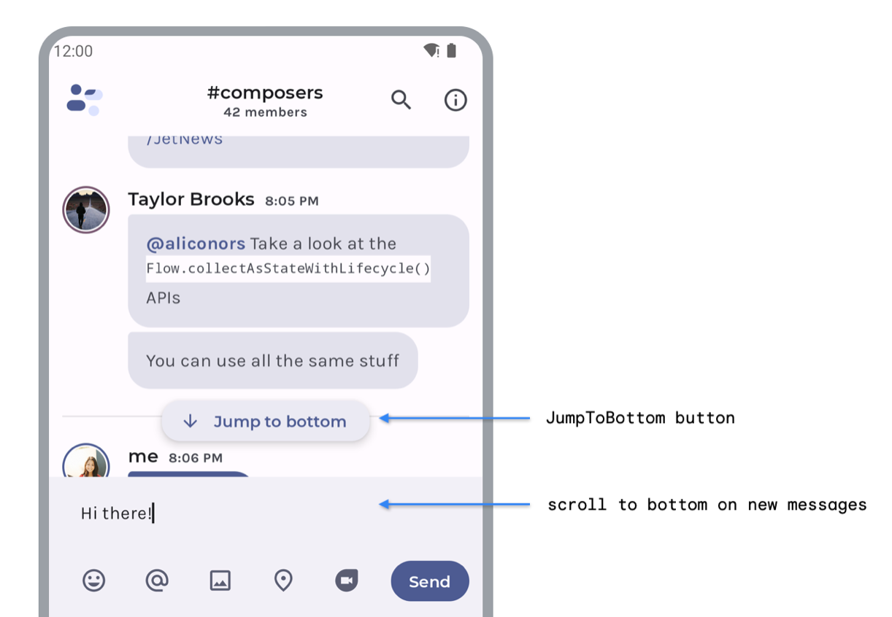
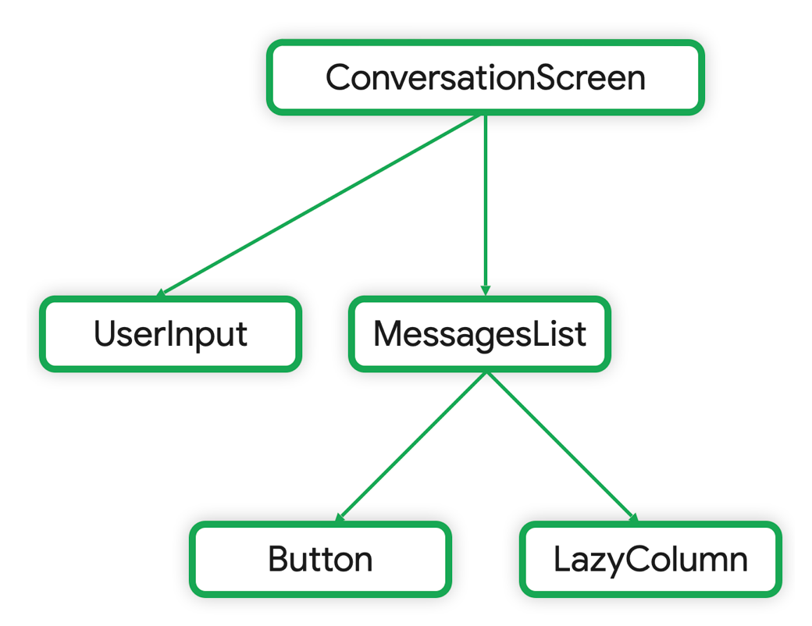
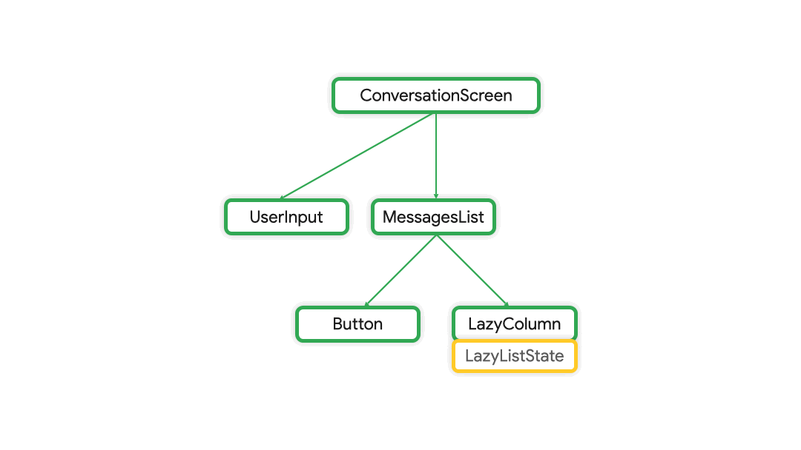
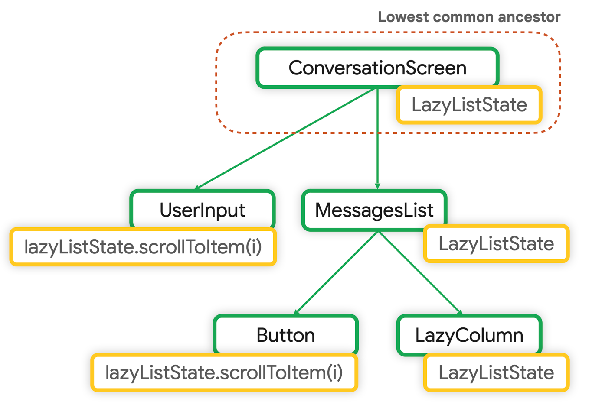
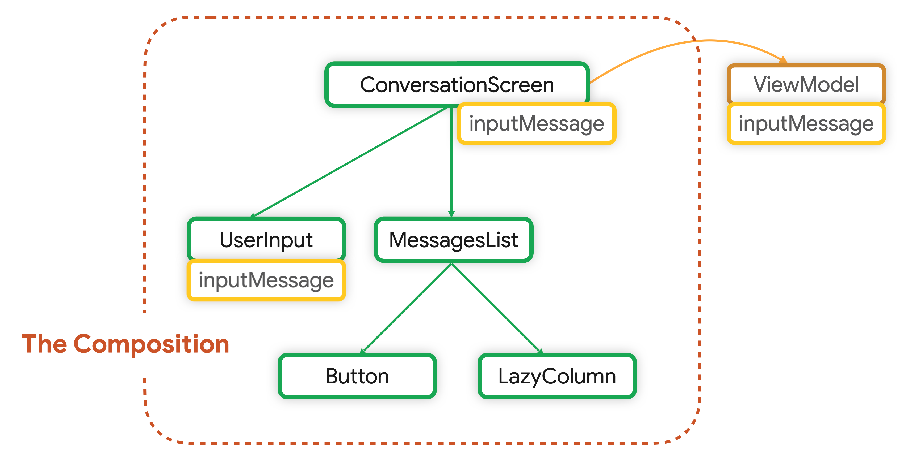

# State Hoist 범위

상태가 UI를 어떻게 표현할지 결정하는 로직에 필요한지, 아니면 앱이 어떻게 동작해야 하는지 결정하는 로직에 필요한지에 따라 Hoist의 위치가 달라집니다.

| State   | 설명                                                        |
|---------|-----------------------------------------------------------|
| UI 로직   | 상태를 가지고 있는 컴포넌트는 UI를 렌더링하거나 사용자 입력을 처리하는 데 사용되는 컴포넌트   |
| 비즈니스 로직 | 상태를 가지고 있는 컴포넌트는 앱의 핵심 기능을 수행하거나 앱의 전반적인 동작을 관리하는 컴포넌트 |

## 모범 사례

UI 상태를 읽고 쓰는 모든 Composable들의 가장 가까운 공통되는 조상에 UI 상태를 위치시키는것이 좋으며,
이는 읽고 쓰는 모든 Composable들에서 가장 가까운 곳에 위치해야 합니다.

상태 소유자(즉, Composable 함수 or ViewModel에서 Hoist하는 State 등)는
`immutable State`와 `상태를 변경하는 이벤트`를 소비자(즉, 구독을 하고있는 Composable)에게 제공해야 합니다.

---

## UI 상태와 UI 로직의 종류

### UI State

UI 상태는 UI를 묘사하는 `Property`입니다. UI 상태에는 두 가지 종류가 있습니다:

#### Screen UI State

기기 Display에 표현해야 할 UI 상태를 의미합니다.

`NewsUiState` 클래스를 가정해보면 UI를 렌더링하는 데 필요한 '뉴스 기사'와 '기타 정보'를 포함할 수 있습니다.  
위 상태는 앱의 `Data`를 포함하고 있기에 일반적으로 다른 계층의 레이어와 연결됩니다.

#### UI Element State

UI Element(요소)의 고유한 속성을 의미 합니다. 이 상태는 그들이 **어떻게 렌더링 되는지**에 영향을 미칩니다.

UI 요소는 '보이거나 숨겨질 수 있고', '특정 글꼴', '글꼴 크기', '글꼴 색상'을 가질 수 있습니다.   
Android에서는 `View`가 그 자체로 상태를 관리하며, 상태를 수정하거나 쿼리하는 메서드를 제공합니다.  
이의 예시로는 `TextView`의 `get` 및 `set` 메서드가 있습니다.

Compose에서는 상태는 Composable 외부에 있으며, 상태를 Composable이나 State Holder로 호이스팅할 수도 있습니다.   
이의 예시로는 `Scaffold` composable에 대한 `ScaffoldState`가 있습니다.

### 로직

Application 로직은 비즈니스 로직 또는 UI 로직일 수 있습니다.

#### 비지니스 로직

비즈니스 로직은 앱 데이터에 대한 제품 요구 사항의 구현입니다.  
예를 들어, 사용자가 버튼을 누르면 뉴스 앱에서 기사를 북마크하는 것입니다.  
북마크를 파일이나 데이터베이스에 저장하는 이 로직은 일반적으로 DomainLayer 또는 DataLayer에 위치합니다.   
상태 소유자는 위 Domain, Data 레이어가 제공하는 메서드를 호출하여 이 로직을 위임합니다.

#### UI 로직

UI 로직은 화면에 UI 상태를 어떻게 표시하는지와 관련이 있으며 다음과 같은 예가 있습니다.
- 사용자가 카테고리를 선택했을 때 올바른 검색 창 힌트를 얻는 것
- 목록에서 특정 아이템으로 스크롤
- 사용자가 버튼을 클릭했을 때 특정 화면으로의 탐색 로직

---

## UI 로직

UI 로직이 상태를 사용하고 싶을 때는 UI의 생명 주기를 따라야 하며, 이를 위해서 상태를 적절한 레벨의 Composable에 호이스팅해야 합니다.
이에 대한 대안으로 UI 생명 주기에 Scope가 지정된 [Plain State Holder Class](https://developer.android.com/topic/architecture/ui-layer/stateholders#ui-logic)에서 이를 수행할 수 있습니다.

### Composable이 상태를 관리

상태와 로직이 단순한 경우 Composable 내부에 UI 로직과 UI 요소 상태를 두는것도 좋은 방식입니다. 
필요에 따라 Composable 내부에 상태를 두거나 호이스팅 할 수 있습니다.

### 필요하지 않은 State Hoisting 

상태 호이스팅을 항상 할 필요는 없습니다. 
다른 Composable이 그 상태를 제어할 필요가 없는 경우 상태는 Composable 내부에 두어도 괜찮습니다. 

다음 클릭 시 확장되고 축소되는 Composable을 보시죠

```kotlin
@Composable
fun ChatBubble(
    message: Message
) {
    var showDetails by rememberSaveable { mutableStateOf(false) } // UI 요소 확장 상태 정의

    ClickableText(
        text = AnnotatedString(message.content),
        onClick = { showDetails = !showDetails } // 간단한 UI 로직 적용
    )

    if (showDetails) {
        Text(message.timestamp)
    }
}
```

`showDetails` 변수는 UI 요소의 내부 상태입니다. 이는 이 Composable 내부에서만 읽히고 수정되며, 이에 적용되는 로직은 단순합니다.  
따라서 위와 같은 경우에는 호이스팅의 큰 이점이 없어 내부에서 처리할 수 있습니다.

> UI Element State를 Composable 내부에 유지 할 수 있습니다.   
> 이는 상태와 그에 적용하는 로직이 단순하고 UI Layer의 다른 Composable들이 상태를 필요로 하지 않는 경우 괜찮습니다.   
> 일반적으로 애니메이션 상태의 경우 사용될 수 있습니다.

### Composable 내부에서 호이스팅
UI Element State를 다른 Composable과 공유하여 다른 곳에서도 UI 로직을 적용한다면, UI 계층 구조에서 상위로 상태를 호이스팅 할 수 있습니다.   
이는 Composable 재사용을 가능하게 하며 테스트도 간편합니다.

다음은 두 가지 기능을 구현한 채팅 앱 예시입니다.



- `JumpToBottom` 버튼은 메시지 목록을 맨 아래로 '스크롤'합니다.
- `MessagesList` 목록은 사용자가 새 메시지를 보낸 후 맨 아래로 '스크롤'합니다.

각 항목들은 '스크롤'을 움직이는 UI 로직이 필요함에 따라 '목록 상태'에 대해서 UI 로직을 수행함을 알 수 있습니다.

위 채팅 앱의 Composable 계층 구조를 보시면 다음과 같습니다.



`LazyColumn` 상태는 `ConversationScreen`에 표시됩니다. 이에 따라 다음을 알 수 있습니다.
1. `UserInput`과 `Button`에 `LazyListState`라는 목록을 관리하는 상태를 넘겨 UI 로직 수행
2. UI 로직에 필요한 `LazyListState` 목록 상태를 모든 Composable에서 읽을 수 있음



[들어가서 자세한 코드를 보시면]((https://github.com/android/snippets/blob/e9e6e1fc71b9a6fb77277126ad44e985deea992d/compose/snippets/src/main/java/com/example/compose/snippets/state/StateHoistingSnippets.kt#L85-L123))
`LazyListState`는 적용해야 하는 UI 로직에 따라 필요한 만큼 높이 호이스팅됩니다.   
이는 Composable에서 초기화되므로, 해당 Composable의 생명 주기에 따라 Composition에 저장됩니다.

`LazyListState`가 `MessagesList` 메서드에서 `rememberLazyListState()`의 기본 값으로 정의되어 있습니다.  
이는, Compose에서는 흔히 볼 수 있는 패턴입니다. 이러한 패턴으로 인해 Composable이 더 유연하고 재사용성이 높아집니다.

> 상태를 가장 가까운 공통 조상(Lowest Common Ancestor)에 호이스팅하고, 상태를 필요로 하지 않은 Composable에는 전달 하지마세요.



### plain state holder class를 상태 소유자로 사용

Composable이 UI Element에 하나 or 여러 상태 필드를 포함하는 복잡한 UI 로직을 포함하고 있는 경우,   
`State Holder`인 plain state holder class에 책임을 위임하여 사용해야 합니다.

이러한 접근법은 '관심사 분리 원칙'을 지키며 Composable의 로직을 격리하여 더 쉽게 테스트할 수 있고, 복잡성을 줄일 수 있습니다.
    
- Composabe : UI Element를 내보내는 것을 담당
- State Holder : UI 로직과 UI Element 상태를 포함

Compose에서 제공되는 plain state holder class에는 다음과 같은 특징이 있습니다.
- 기본적으로 제공되는 로직이 있어 일반 Composable 함수는 제공되는 로직을 사용하면 되기에 직접 코드를 작성할 필요가 없습니다.
- Composable 생명주기를 따르기 때문에 Composition에서 생성되고 기억됩니다.
- Compose 라이브러리에서 제공하는 `rememberNavController()` 또는 `rememberLazyListState()`와 같은 타입을 사용 수 있습니다.

예시로 `LazyColumn` 또는 `LazyRow`의 UI 복잡성을 제어하기 위해 Compose에서 구현된 `LazyListState` plain state holder class가 있습니다.

```kotlin
@Stable
class LazyListState constructor(
    firstVisibleItemIndex: Int = 0,
    firstVisibleItemScrollOffset: Int = 0
) : ScrollableState {
    
    private val scrollPosition = LazyListScrollPosition(
        firstVisibleItemIndex, firstVisibleItemScrollOffset
    )

    suspend fun scrollToItem(/*...*/) { /*...*/ }

    override suspend fun scroll() { /*...*/ }

    suspend fun animateScrollToItem() { /*...*/ }
}
```

`LazyListState`는 `LazyColumn`의 상태를 캡슐화하고, UI Element를 위한 `scrollPosition`을 저장합니다.   
또한 주어진 항목으로 스크롤하는 등 스크롤 위치를 수정하는 방법을 제공합니다.

애플리케이션의 복잡성을 관리하는 데 중요한 역할을 하는 'plain state holder class'는 
글로벌하거나 애플리케이션 수준의 상태를 캡슐화하고, N개의 Composable에서 참조하거나 업데이트해야 하는 복잡한 로직을 캡슐화합니다. 
이러한 클래스는 앱의 Root Composable에서 '네비게이션 상태'나 '기기 방향' 같은 앱 전체의 상태를 관리하는 것을 단순화 할 수 있습니다.

이런 클래스는 Compose에서 제공하는 `remember()` 함수를 사용하여 만들어지고, Composable 생명주기에 따라 생존합니다.
만약 Activity 또는 Process가 다시 생성된 후에도 상태를 유지되게 하려면 `rememberSaveable()`을 사용하면 됩니다.

이러한 클래스는 앱의 Root Composable 뿐만 아니라 다른 Composable에서도 사용될 수 있습니다.
이렇게 하면 여러 Composable에서 동일한 로직을 반복 작성하는 대신 한 곳에 집중할 수 있으므로 코드의 재사용성이 향상됩니다.

이상적으로, state holder class는 모든 상태 변경 로직을 캡슐화하고, Composable은 오직 UI를 그리는 데 집중하게 할 수 있습니다.
이렇게 하면 Composable은 간결하고 가독성이 좋아지며, 테스트와 유지 보수가 더 쉬워집니다.

---

## 비지니스 로직

Composable과 plain state holder class가 UI 로직과 UI Element State를 관리합니다.

이와 같이 screen level의 state holder가 존재하는데 이는 다음 역할을 담당합니다.

- 다른 부분에 위치한 애플리케이션의 비즈니스 로직(Domain 및 Data Layer 등)에 대한 접근을 제공합니다.
- 특정 화면에서의 표시를 위해 Data를 준비하는 것이며, 이는 화면 UI State가 됩니다.

### state 소유자로 ViewModel 사용

`ViewModel`의 이점은 화면에서 비즈니스 로직에 대한 접근을 제공하고, 화면에 표시할 데이터를 준비하는데 적합합니다.

UI 상태를 `ViewModel`에서 호이스팅하면, 그 상태는 Composition 밖으로 벗어납니다.



`ViewModel`은 Composition의 일부로 저장되지 않습니다. 이는 프레임워크에 의해 제공되며, 
`Activity`, `Fragment`, `navigation graph`, `destination of navigation graph`와 같은 `ViewModelStoreOwner`에 범위가 지정됩니다.

따라서, `ViewModel`은 UI 상태에 대한 **가장 가까운 공통 조상**이며 신뢰할 수 있는 정보 출처가 됩니다.

### Screen UI State

Screen UI state는 비즈니스 규칙을 적용하여 생성된 데이터를 의미합니다.   
Screen UI state는 일반적으로 특정 화면에 표시되는 정보를 관리하며, 그것이 사용자에게 보여지는 방식을 정의합니다.  

Screen level state holder는 Screen UI state를 관리하는 역할을 합니다. 
이는 주로 `ViewModel`에서 수행되며, 이를 통해 UI State는 앱의 비즈니스 로직과 분리되어 보다 재사용성이 높은 코드를 작성할 수 있습니다.

예를 들어, 아래 채팅 앱의 `ConversationViewModel`는 Screen UI State를 제공하고 이를 변경하는 이벤트를 노출하고 있습니다.

```kotlin
class ConversationViewModel(
    channelId: String,
    messagesRepository: MessagesRepository
) : ViewModel() {

    val messages = messagesRepository
        .getLatestMessages(channelId)
        .stateIn(
            scope = viewModelScope,
            started = SharingStarted.WhileSubscribed(5_000),
            initialValue = emptyList()
        )

    // Business logic
    fun sendMessage(message: Message) { /* ... */ }
}
```
Composable은 `ViewModel`에서 관리하는 Screen UI State를 사용하므로,   
비즈니스 로직에 접근하기 위해 Screen-Level Composable에 `ViewModel` 인스턴스를 주입해야 합니다.

아래 예제는 `ViewModel`이 Screen-Level Composable에서 어떻게 사용되는지 보여줍니다.   
여기서 `ConversationScreen()`은 `ViewModel`에서 Screen UI State를 가져옵니다.

```kotlin
@Composable
private fun ConversationScreen(
    conversationViewModel: ConversationViewModel = viewModel()
) {

    val messages by conversationViewModel.messages.collectAsStateWithLifecycle()

    ConversationScreen(
        messages = messages,
        onSendMessage = { message: Message -> conversationViewModel.sendMessage(message) }
    )
}

@Composable
private fun ConversationScreen(
    messages: List<Message>,
    onSendMessage: (Message) -> Unit
) {

    MessagesList(messages, onSendMessage)
    /* ... */
}
```