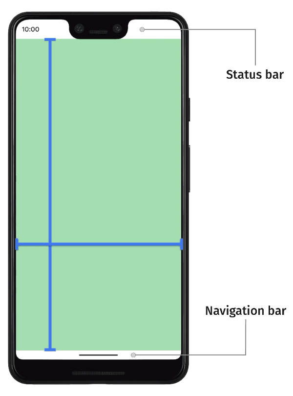

# Window insets in compose

> - 'edge-to-edge'로 가는 것은 '앱 컨텐츠'가 'Status Bar'와 'Navigation Bar' 뒤로 확장되는 것을 의미함
> - `WindowInsets`을 통해 'App UI'가 'System UI'에 의해 가려지지 않고 표현되도록 할 수 있음
>   - 키보드가 나타날 때 'App UI'를 키보드 위로 옮기기
>   - 'Status Bar' 아래로 확장된 이미지, 텍스트가 가려지지 않도록 상단에 여백 추가 처리

---

Android 플랫폼은 'Status Bar', 'Navigation Bar'와 같은 'System UI'를 그리는 역할을 합니다.  
이 'System UI'는 사용자가 어떤 앱을 사용하든 항상 표시됩니다.

컴포즈는 'Foundation' 계층의 `WindowInsets`를 통해 앱이 올바른 영역에 그려지도록 할 수 있습니다.  
즉, 'System UI'에 의해 'App UI'가 가려지지 않도록, 'System UI'에 대한 정보를 통해 'App UI'가 올바른 영역에 그려지도록 할 수 있습니다.



기본적으로 'App UI'는 'System UI' 내에서 배치되도록 제한됩니다.  
이는 '앱의 컨텐츠'가 'System UI'에 의해 가려지지 않도록 보장합니다.

그러나, 'Sytem UI' 영역에 'App UI'를 표현하는 것이 '앱의 컨텐츠 표현 확장성'과 '더 매끄러운 UX'를 제공할 수 있기에 권장됩니다.  
이는 앱이 'System UI'와 함께 애니메이션을 수행할 수 있게 하며, 특히 소프트웨어 키보드를 보이거나 숨길 때 유용합니다.

이처럼 'System UI' 뒤에 '앱 컨텐츠'를 보여주는 것을 'edge-to-edge'로 가는 것이라고 합니다.  
'edge-to-edge'로 가는 방식을 사용할 때는, `WindowInsets` API를 활용하여 컨텐츠가 'System UI'에 가려지지 않도록 해야 합니다. 

## Inset fundamentals

> - 'Inset'은 각 'System UI 요소'의 크기와 위치를 제공 
>   - 'Inset'은 Pixel 단위로 'Screen'의 상하좌우 각 측면에서 'System UI'가 얼마나 확장되는지를 지정
> - Compose는 'App UI'가 가려지지 않도록 보장하는 Safe Inset Type 제공
>   - `WindowInsets.safeDrawing` : 스크린에서 'System UI'가 '앱 컨텐츠'를 가리는 것을 방지
>   - `WindowInsets.safeGestures` : 앱 내에서 수행되는 제스처와 시스템 제스처가 충돌하는 것을 방지
>   - `WindowInsets.safeContent` : 위 2가지 기능을 결합, 컨텐츠가 시각적으로나 제스처적으로 'System UI'와 중복되지 않도록 함

앱이 'edge-to-edge'로 갈 때, 중요한 컨텐츠와 상호작용이 'System UI'에 가려지지 않도록 보장되어야 합니다.  
예를 들어, 버튼이 'Navigation Bar' 뒤에 배치되면 사용자가 클릭할 수 없을 수 있습니다.

'System UI'의 크기와 위치에 대한 정보는 'Inset'들을 통해 지정됩니다.  
즉, 각각의 'System UI' 요소의 크기와 위치를 설명하는 'Inset Type'이 존재합니다.  
예를 들어, 'Status Bar Inset'은 'Status Bar'의 크기와 위치를 제공하고, 'Navigation Bar Inset'은 'Navigation Bar'의 크기와 위치를 제공합니다.

'Inset' 값은 pixel 단위로, 'Screen'에서 'StatusBar', 'NavigationBar', '기타 System UI 요소' 까지의 거리를 각각 '상하좌우'로 나타냅니다.  
따라서 개발자는 'Inset'을 활용하여 'App UI'와 해당 'Sysytem UI'가 겹치지 않도록 적절한 여백을 설정할 수 있습니다.

Android 내부 'Inset Type'들은 [WindowInsets을 통해 사용이 가능](https://developer.android.com/jetpack/compose/layouts/insets#inset-fundamentals)합니다.

아래 3가지 타입들은 '앱 컨텐츠'가 가려지지 않도록 보장하는 'Safe Inset Type'들입니다.

- `WindowInsets.safeDrawing`
- `WindowInsets.safeGestures`
- `WindowInsets.safeContent`

위 3가지 타입들은 'Platform Inset'을 기반으로 '앱 컨텐츠'를 다양한 방식으로 보호합니다.

`WindowInsets.safeDrawing`은 'System UI'에 의해 가려져셔는 안되는 컨텐츠를 그리는 것을 방지하는데 사용됩니다.  
즉, 스크린에서 'System UI'가 '앱 컨텐츠'를 가리는 것을 방지하여 항상 사용자에게 컨텐츠가 보여지는 것을 보장합니다.

`WindowInsets.safeGestures`는 앱 내에서 사용자가 수행하는 제스처와 시스템 제스처가 충돌하는 것을 방지합니다.  
즉, 사용자가 화면 '하단에서 위로 스와이프'할 때, 이러한 제스처가 시스템 제스처(앱 드로어를 여는 제스처)와 충돌하지 않도록 합니다.

`WindowInsets.safeContent`는 `WindowInsets.SafeDrawing`과 `WindowInsets.SafeGestures`의 기능을 결합하여 
컨텐츠가 시각적으로나 제스처적으로 'System UI'와 중복되지 않도록 합니다. 
즉, '앱 컨텐츠'가 'System UI' 뒤로 그려지거나 시스템 제스처와 충돌하는 것을 모두 방지합니다. 

---

## Insets setup

> - `WindowCompat.setDecorFitsSystemWindows` : '앱 컨텐츠'가 'System UI' 뒤에 표시되도록 요청 
> - `android:windowSoftInputMode="adjustResize"` : 소프트웨어 키보드가 화면에 나타날 때 그 크기만큼 UI가 조정되도록 요청

'앱 컨텐츠'의 그리는 위치를 전적으로 제어하려면 다음 설정을 해야합니다.  
만약 이 단계를 거치지 않으면 앱이 'System UI' 뒤에 검은색이나 단색을 그리거나, 소프트웨어 키보드와 동기화되어 애니메이션이 되지 않을 수 있습니다.

1. `Activity.onCreate()`에서 `WindowCompat.setDecorFitsSystemWindows(window, false)`를 호출합니다.   
    이 호출은 앱이 'System UI' 뒤에 표시되도록 요청합니다. 그러면 앱이 'Inset'을 사용하여 UI를 조정하는 방법을 제어하게 됩니다.

2. `AndroidManifest.xml`의 `Activity` 항목에서 `android:windowSoftInputMode="adjustResize"`를 설정합니다.  
    이 설정은 앱이 소프트웨어 IME의 크기를 'Inset'으로 받아들이게 하여, IME가 앱에 나타나거나 사라질 때 컨텐츠를 적절하게 채우고 배치할 수 있게 합니다.

```xml
<!-- in your AndroidManifest.xml file: -->
<activity
  android:name=".ui.MainActivity"
  android:label="@string/app_name"
  android:windowSoftInputMode="adjustResize"
  android:theme="@style/Theme.MyApplication"
  android:exported="true"/>
```

3. 앱 테마에서 'StatusBar', 'NavigationBar' 등 시스템 바와 아이콘의 색상을 투명으로 조정합니다.

```xml
<style name="Theme.MyApplication" parent="Theme.Material.DayNight.NoActionBar">
    <!--Other app theme properties-->
    <item name="android:statusBarColor">@android:color/transparent</item>
    <item name="android:navigationBarColor">@android:color/transparent</item>
</style>
```

---

## Compose APIs

> - `Activity`로 모든 'Inset' 처리 제어가 넘어가면, Compose API를 통해 'Inset' 변화에 맞춰 레이아웃 자동 조정 가능
>   - 앱 모든 컨텐츠에 'Inset'을 적용하는 것 보단, `Activity` 또는 Composable 단위의 'Inset' 적용 권장
>   - 모든 'Inset Type'은 Android API 21 이상부터 IME 애니메이션과 함께 자동으로 처리
> - 'Inset'을 활용한 Composable 레이아웃 조정 방법
>   - 'Padding Modifier' : `Modifier.widnowInsetsPadding`을 통해 `WindowInset`을 Composable의 'Padding'으로 적용
>   - 'Inset Size Modifier' : 특정 방향에서 나타나는 'System UI'에 대한 `Inset Size`를 통해 Composable 크기 조정
> - 'Inset Padding Modifier'는 패딩으로 적용된 'Inset'의 일부를 자동으로 '소비'
> - 'Inset Size Modifier'는 크기를 직접 변경하기 때문에, 'Inset'을 '소비'하지 않음 단, 이미 사용한 'Inset'은 재사용하지 않음
> - `Composition` 단계가 끝난 후 ~ `Layout` 단계 시작 전에 'Inset' 값이 업데이트 됨
>   - 'Padding Modifier', 'Inset Size Modifier'는 'Inset' 값을 `Layout` 단계까지 사용하지 않도록 지연시킴으로써 최신 'Inset' 값을 사용하도록 보장

`Activity`가 모든 'Inset'의 처리를 제어하게 되면, Compose API를 사용하여 컨텐츠가 가려지지 않도록 함과 동시에 상호 작용이 가능한 요소를 'System UI'와 겹치지 않도록 할 수 있습니다.
또한 이러한 API는 'Inset' 변화에 맞춰 레이아웃을 동기화하여 자동으로 조정할 수 있도록 돕습니다.

아래는 앱 전체 컨텐츠에 'Inset'을 적용하는 가장 기본적인 방법 입니다.

```kotlin
override fun onCreate(savedInstanceState: Bundle?) {
    super.onCreate(savedInstanceState)

    WindowCompat.setDecorFitsSystemWindows(window, false)

    setContent {
        Box(
            modifier = Modifier.safeDrawingPadding()
        ) {
            // the rest of the app
        }
    }
}
```

위 코드는 `WindowsInsets.safeDrawing`을 앱의 모든 컨텐츠에 `Padding`으로 적용하는 예시입니다.

이렇게 하면 상호 작용 UI 요소가 'System UI'와 겹치지 않도록 보장할 수 있지만, 동시에 앱의 모든 부분이 'System UI' 뒤에 그려지지는 것을 방지함으로써, 'edge-to-edge'까지 컨텐츠를 확장하는 효과를 내지 못합니다.
따라서, 앱이 기기 전체 화면을 사용하도록 하려면, 화면별 또는 컴포넌트 별 'Inset'을 적용하는 방식으로 더 세밀하게 조정해야 합니다.

모든 'Inset Type'은 API 21부터 지원되는 IME 애니메이션과 함께 자동으로 처리됩니다.  
이는 'Inset'을 활용하여 레이아웃 구성 시, 'Inset'이 변경될 때 해당 레이아웃이 자동으로 그 변경에 맞춰 애니메이션되도록 함을 의미합니다.

이러한 'Inset'을 활용하여 컴포저블 레이아웃을 조정 시 2가지 방법이 존재합니다.

1. 'Padding Modifier' 사용
2. 'Inset Size Modifier' 사용

### Padding Modifier

`Modifier.widnowInsetsPadding`는 개발자가 지정한 `WindowInset`을 컴포저블 요소에 패딩으로 적용할 수 있게 해줍니다.  
이는 `Modifier.padding`과 유사하게 동작하여, 요소에 안전한 여백을 추가하여 'System UI'에 의해 컨텐츠가 가려지지 않도록 합니다.

`WindowInsets.safeDrawing`을 사용하여 `Modifier.widnowInsetsPadding`을 적용하는 경우,  
'App UI'가 'System UI'에 의해 가려지지 않도록 상하좌우 모든 측면에 SafeDrawing 영역을 패딩으로 추가합니다.  
이는 특히 전체 화면을 사용하는 앱 또는 화면의 경계까지 컨텐츠를 표시하고자 할 때 유용합니다.

컴포즈는 일반적으로 사용되는 'Inset Type'들을 빠르게 적용할 수 있도록 여러 유틸 메서드들을 제공합니다.  
`Modifier.safeDrawingPadding()`과 같은 메서드들은 `Modifier.windowInsetsPadding(WindowInsets.safeDrawing)`과 동등합니다.

---

### Inset Size Modifier

특정 방향의 'System UI'에 의해 정의된 'Inset Size'만큼 컴포넌트의 크기를 조정 할 수 있습니다.  
예를 들어, 'StatusBar', 'NavigationBar'의 높이와 같은 값을 컴포넌트의 높이 또는 너비로 설정하여 'System UI'에 의해 가려지지 않도록 할 수 있습니다.

- `Modifier.windowInsetsTopHeight()` : `WindowInsets`의 'Top'에 대한 'Size' 적용
- `Modifier.windowInsetsBottomHeight()` : `WindowInsets`의 'Bottom'에 대한 'Size 적용  
- `Modifier.windowInsetsLeftWidth()` : `WindowInsets`의 'Left'에 대한 'Size' 적용
- `Modifier.windowInsetsRightWidth()` : `WindowInsets`의 'Right'에 대한 'Size' 적용

추가로 소프트웨어 키보드가 나타났을 때, 컴포저블 레이아웃 사이즈 변경을 위해서 'Inset'을 통해 `Spacer` 크기를 조절하는 예제입니다.

```kotlin
LazyColumn(
    Modifier.imePadding()
) {
    // Other content
    item {
        Spacer(
            Modifier.windowInsetsBottomHeight(
                WindowInsets.systemBars
            )
        )
    }
}
```

---

### Inset consumption

'Inset Padding Modifier'(`windowInsetsPadding`, `safeDrawingPadding`)는 패딩으로 적용된 'Inset'의 일부를 자동으로 '소비'합니다.  

'Composition Tree'로 더 깊이 들어갈 때, 중첩된 'Inset Padding Modifier'와 'Inset Size Modifier'는 외부의 'Inset Padding Modifier'에 의해 이미 일부 'Inset'이 소비되었다는 것을 인지하고,
동일한 'Inset' 부분을 한 번 이상 사용하지 않도록 합니다. 만약 여러번 사용하게 되면 추가 공간이 너무 많이 발생할 수 있기 때문입니다.
 
'Inset Size Modifier'는 크기를 직접 변경하기 때문에, 'Inset'을 '소비'하지 않습니다.  
다만, 이미 'Inset'을 1번 사용했다면 동일한 'Inset'을 다시 사용하지 않습니다.

이처럼 'Inset Padding Modifier'를 중첩하여 사용하면 자동으로 각 컴포저블에 적용된 패딩의 양이 변경됩니다.

다음 예제를 보면, `LazyColumn`은 `Modifier.imePadding`에 의해 크기가 조정되고 있습니다.  
`LazyColumn` 내부에서 마지막 아이템은 'SystemBar'의 하단 높이와 같게 설정됩니다.

```kotlin
LazyColumn(
    Modifier.imePadding()
) {
    // Other content
    item {
        Spacer(
            Modifier.windowInsetsBottomHeight(
                WindowInsets.systemBars
            )
        )
    }
}
```

IME가 닫혔을 때, `imePadding()`은 IME가 높이가 없기에 패딩을 적용하지 않습니다.  
`imePadding()`이 패딩을 적용하지 않기에 'Inset'이 소비되지 않으며, `Spacer`의 높이는 'SystemBar'의 하단 크기가 됩니다.

IME가 열리면, 'IME Inset'은 IME 크기에 맞춰 애니메이션되며, `imePadding()`은 IME가 열리는 동안 `LazyColumn`의 크기를 조정하기 위해 하단 패딩을 적용하기 시작합니다.
`imePadding()`이 하단 패딩을 적용하기 시작하면, 그 만큼의 'Inset'을 '소비'하기 시작합니다.  
따라서, `Spacer`의 높이는 줄어들기 시작합니다. 왜냐하면 'System Bar'를 위한 공간의 일부가 이미 `imePadding()`에 의해 적용되었기 때문입니다.
`imePadding()`은 'System bar' 보다 큰 하단 패딩을 적용하면, `Spacer`의 높이는 '0'이 됩니다.

IME가 열렸다가 닫히면, 변화는 역순으로 발생합니다.
IME가 완전히 사라질 때까지, `imePadding()`이 'System bar'의 바닥 부분보다 적게 적용되기 시작하면서 
`Spacer`는 '0'에서 확장을 시작하고, 최종적으로 `Spacer`는 'System Bar'의 하단 높이만큼 확장되어 자리를 차지하게 됩니다.

['imePadding()' Animation 확인](https://developer.android.com/static/images/jetpack/compose/layouts/insets/edge-to-edge-lazy-column-textfields.mp4)

이러한 동작들은 `Modifier.windowInsetsPadding` 간의 통신을 통해 이루어지게 됩니다.
이 'Modifier'들은 계층 구조에서 서로 얼마만큼의 'Inset'을 소비했는지 알고 있어, 동일한 'Inset'을 여러 번 소비하여 너무 많은 공간이 생기는 것을 방지합니다.

`Modifier.consumedWindowInsets(insets: WindowInsets)` 역시 `Modifier.windowInsetsPadding`과 동일한 방식으로 'Inset'을 소비하지만, 
소비된 'Inset'을 패딩으로 적용하진 않습니다. 이는 'Size Inset Modifier'와 결합하여, 이미 특정 'Size Inset Modifier'가 '소비'되었다는 것을 같은 레벨의 컴포저블에게 알리는 데 유용합니다.

```kotlin
Column(Modifier.verticalScroll(rememberScrollState())) {
    Spacer(Modifier.windowInsetsTopHeight(WindowInsets.systemBars))

    Column(
        Modifier.consumeWindowInsets(
            WindowInsets.systemBars.only(WindowInsetsSides.Vertical)
        )
    ) {
        // content
        Spacer(Modifier.windowInsetsBottomHeight(WindowInsets.ime))
    }

    Spacer(Modifier.windowInsetsBottomHeight(WindowInsets.systemBars))
}
```

`Modifier.consumedWindowInsets(paddingValues: PaddingValues)`는 `WindowInsets` 인자를 받는 버전과 매우 유사하게 동작하지만, 임의의 `PaddingValues`를 '소비'하기 위해 사용됩니다.
이는 'Inset Padding Modifier'가 아닌 다른 메커니즘, 예를 들어 일반 `Modifier.padding`이나 고정 높이의 `Spacer`를 통해 `padding` 또는 `spacing`이 제공될 때까지 자식 컴포넌트에게 이를 알리는데 유용합니다.

```kotlin
Column(Modifier.padding(16.dp).consumeWindowInsets(PaddingValues(16.dp))) {
    // content
    Spacer(Modifier.windowInsetsBottomHeight(WindowInsets.ime))
}
```

---

### Insets and Compose phases

컴포즈는 'Inset'의 관리에 있어 AndroidX Core API를 활용하여 기본 플랫폼 API와 연동합니다.

'Inset'의 값은 `Composition` 단계가 끝난 후 ~ `Layout` 단계 전 이 사이에 값이 업데이트 됩니다.  

- `Composition` 단계에서 'Inset' 값을 읽으면 실제로는 바로 이전 프레임의 'Inset' 값을 사용하게 됩니다.
- `Layout` 단계에서 `Inset`의 값은 이 단계가 시작되기 전에 최신화되므로, `Layout` 단계에서 'Inset'을 사용하면 최신의 값을 사용할 수 있습니다.

지금까지 설명한 컴포즈에서 제공하는 `Modifier`는 'Inset' 값을 `Layout` 단계까지 사용하지 않도록 지연시킵니다.  
이러한 방식으로, 'Inset' 값이 업데이트되는 프레임과 동일한 프레임에서 'Inset' 값을 사용하여 UI가 정확하게 렌더링되도록 보장합니다.
